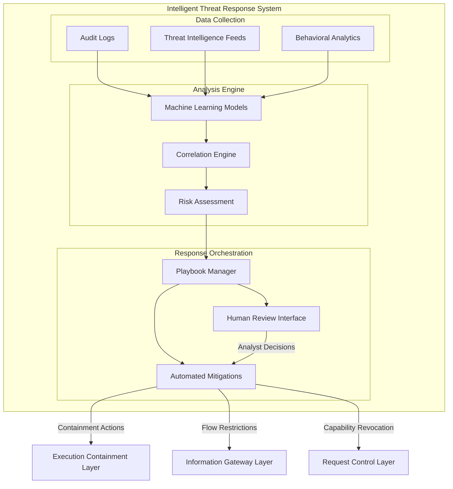
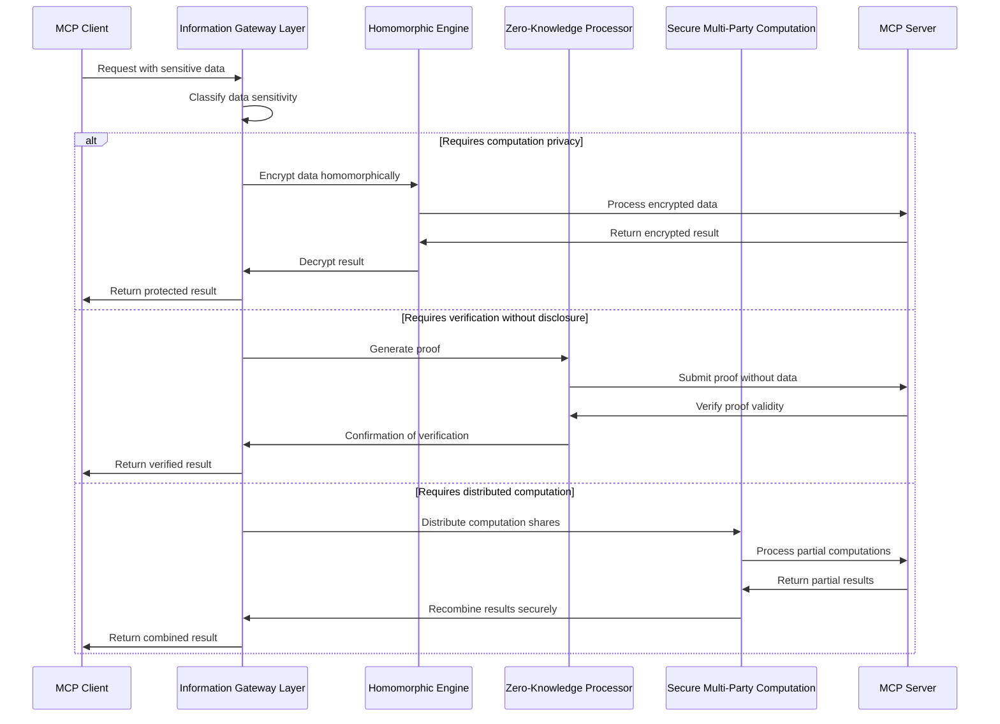
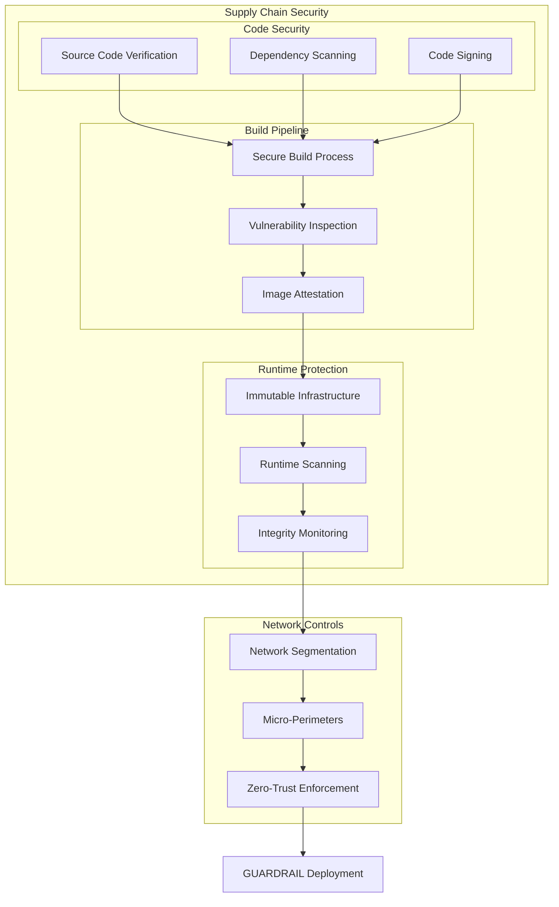
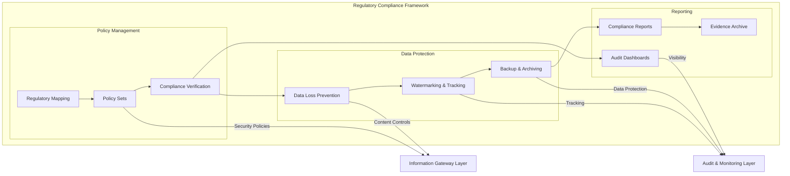
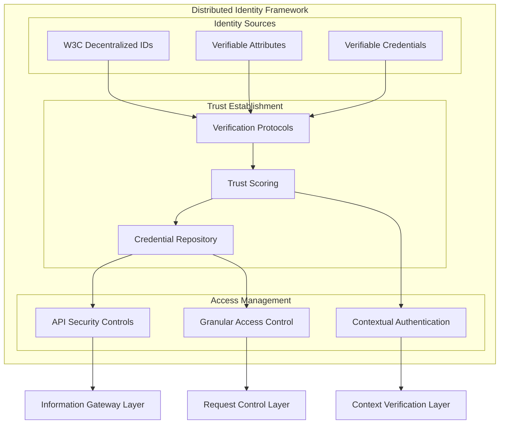
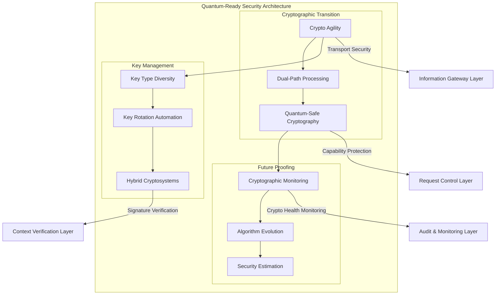

# Further Innovations for GUARDRAIL: Expanded Synthesis

Building on my previous synthesis and incorporating the additional suggestions, I can identify several promising innovation clusters that could significantly enhance GUARDRAIL's security capabilities while maintaining its architectural integrity.

## 1. Intelligent Threat Response System

Combining threat intelligence, behavioral analysis, and automated incident response creates an opportunity for a more sophisticated security response mechanism:

**Key Innovations:**
- **Contextual Threat Intelligence**: Dynamically adjust security policies based on threat landscape relevance to the specific MCP application domain
- **Continuous Behavioral Modeling**: Learn normal patterns across multiple dimensions (timing, volume, content types, access patterns) and detect subtle deviations
- **Graduated Response Framework**: Implement increasing security measures proportional to threat confidence, from monitoring to isolation
- **Customizable Playbooks**: Allow security teams to define response strategies for different scenarios with automation triggers
- **Human-in-the-Loop Interface**: Provide security analysts with clear visibility and intervention capabilities for high-impact decisions

This system would transform GUARDRAIL from reactive to proactive, identifying and mitigating threats before they cause significant damage.

## 2. Advanced Cryptographic Protection Suite

Combining homomorphic encryption, zero-knowledge proofs, secure multi-party computation, and quantum-safe cryptography creates comprehensive protection for sensitive data:

**Key Innovations:**
- **Selective Cryptographic Application**: Apply appropriate cryptographic techniques based on data classification and processing requirements
- **Privacy-Preserving Analytics**: Enable model training and inference without exposing raw data
- **Cryptographic Policy Engine**: Define when and how cryptographic protections are applied through declarative policies
- **Post-Quantum Transition Framework**: Gradually migrate cryptographic operations to quantum-resistant algorithms with backward compatibility
- **Cryptographic Attestation**: Provide verifiable proof that cryptographic protections were correctly applied

This suite would protect data not just in transit and at rest, but also during processing, addressing a critical gap in many security frameworks.

## 3. Comprehensive Supply Chain Security

Combining supply chain security, container security, and network segmentation creates a robust foundation for secure deployments:

**Key Innovations:**
- **Verifiable Deployment Pipeline**: Cryptographically attest to the integrity of each step in the deployment process
- **Runtime Attestation Integration**: Connect runtime integrity verification with GUARDRAIL's Context Verification Layer
- **Dynamic Network Segmentation**: Adjust network isolation based on threat intelligence and observed behavior
- **TEE Integration**: Leverage Trusted Execution Environments for critical GUARDRAIL components
- **Policy-Driven Container Security**: Define and enforce security policies at container creation and runtime

This approach would ensure GUARDRAIL operates on a trustworthy foundation, addressing threats that might compromise the security framework itself.

## 4. Regulatory Compliance Framework

Integrating compliance features, data loss prevention, and backup/recovery creates a comprehensive compliance solution:

**Key Innovations:**
- **Regulation-to-Policy Translator**: Automatically generate GUARDRAIL security policies from regulatory requirements
- **Content-Aware DLP**: Apply sophisticated content analysis to identify and protect sensitive information types
- **Digital Watermarking**: Track the provenance and handling of sensitive data throughout its lifecycle
- **Compliance-Driven Automation**: Implement automated workflows for regulatory requirements like data retention, deletion, and access controls
- **Evidence Collection**: Automatically gather and preserve compliance evidence during normal operations

This framework would simplify regulatory compliance without sacrificing security, making GUARDRAIL particularly valuable in regulated industries.

## 5. Distributed Identity and Access Management

Combining decentralized identity, API security, and the previously proposed dynamic trust assessment:

**Key Innovations:**
- **Self-Sovereign Identity Integration**: Allow users and services to maintain control over their identities while providing verifiable proofs
- **Adaptive Authentication**: Adjust authentication requirements based on risk assessments and behavior patterns
- **Cross-Domain Trust Federation**: Establish and verify trust relationships across organizational boundaries
- **API-Centric Security Model**: Implement comprehensive API security with rate limiting, input validation, and semantic validation
- **Progressive Trust Building**: Allow entities to build trust over time through consistent behavior and credential verification

This approach would modernize GUARDRAIL's identity and access model, making it more resilient, privacy-preserving, and adaptable to complex organizational structures.

## 6. Quantum-Ready Security Architecture

Preparing GUARDRAIL for the post-quantum era while maintaining current functionality:

**Key Innovations:**
- **Crypto-Agility Framework**: Design all cryptographic interfaces to allow algorithm substitution without architecture changes
- **Hybrid Cryptosystems**: Implement both classical and post-quantum algorithms to maintain security during transition
- **Quantum Threat Monitoring**: Track developments in quantum computing to adjust security posture accordingly
- **Long-Term Data Protection**: Identify and specially protect data that requires long-term confidentiality
- **Cryptographic Parameter Estimation**: Automatically adjust key sizes and parameters based on security estimates

This architecture would ensure GUARDRAIL remains secure as quantum computing advances, without requiring disruptive changes when quantum threats materialize.

## Integration Strategy and Prioritization

To effectively implement these innovations in GUARDRAIL, I recommend:

1. **Risk-Based Prioritization**:
   - Begin with the Intelligent Threat Response System as it enhances detection and response capabilities
   - Next implement the Comprehensive Supply Chain Security to secure the foundation
   - Follow with other innovations based on specific threat models

2. **Modular Implementation**:
   - Develop each innovation as an extension to the existing GUARDRAIL architecture
   - Create clear interfaces between components to allow independent evolution
   - Enable selective activation of features based on deployment requirements

3. **Performance Considerations**:
   - Identify performance-critical paths and optimize accordingly
   - Implement resource-intensive operations (like advanced cryptography) with configurable trade-offs
   - Create performance profiles for different deployment scenarios

4. **Practical Deployment Path**:
   - Develop reference implementations for each innovation
   - Create migration guides for existing GUARDRAIL deployments
   - Provide configuration templates for common use cases

These innovations would transform GUARDRAIL into a next-generation security framework capable of addressing current and future threats in LLM ecosystems while maintaining practical deployability and performance.