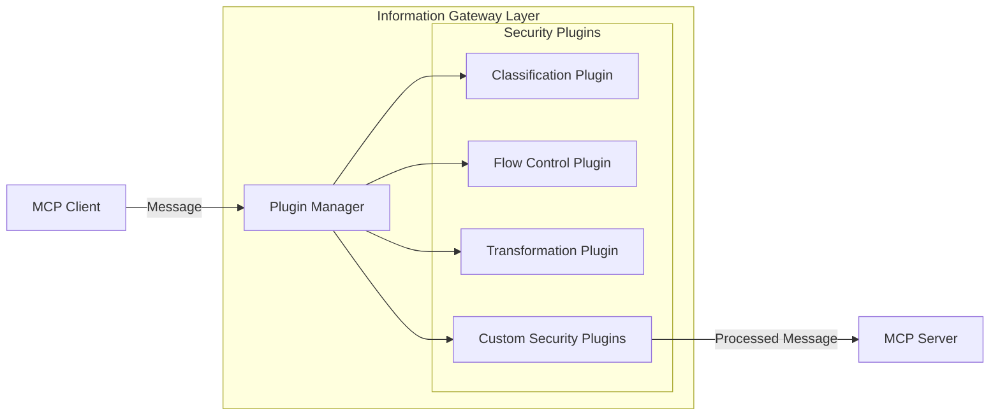
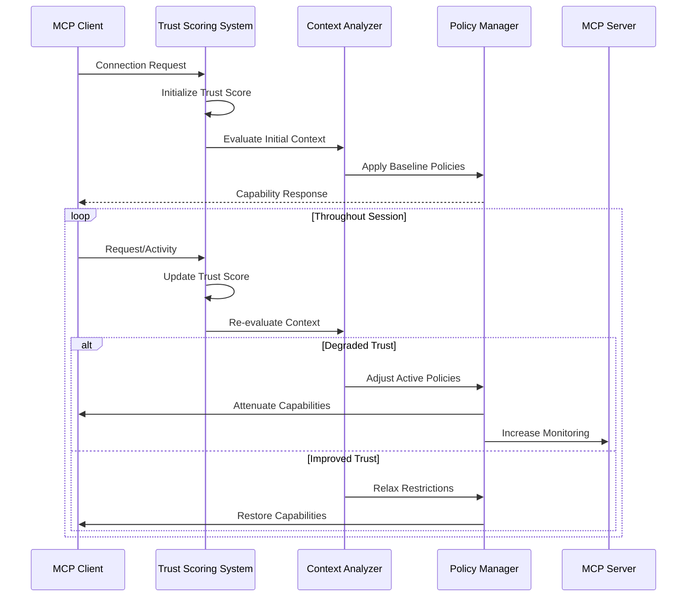
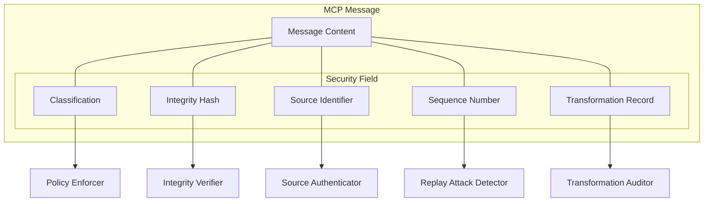
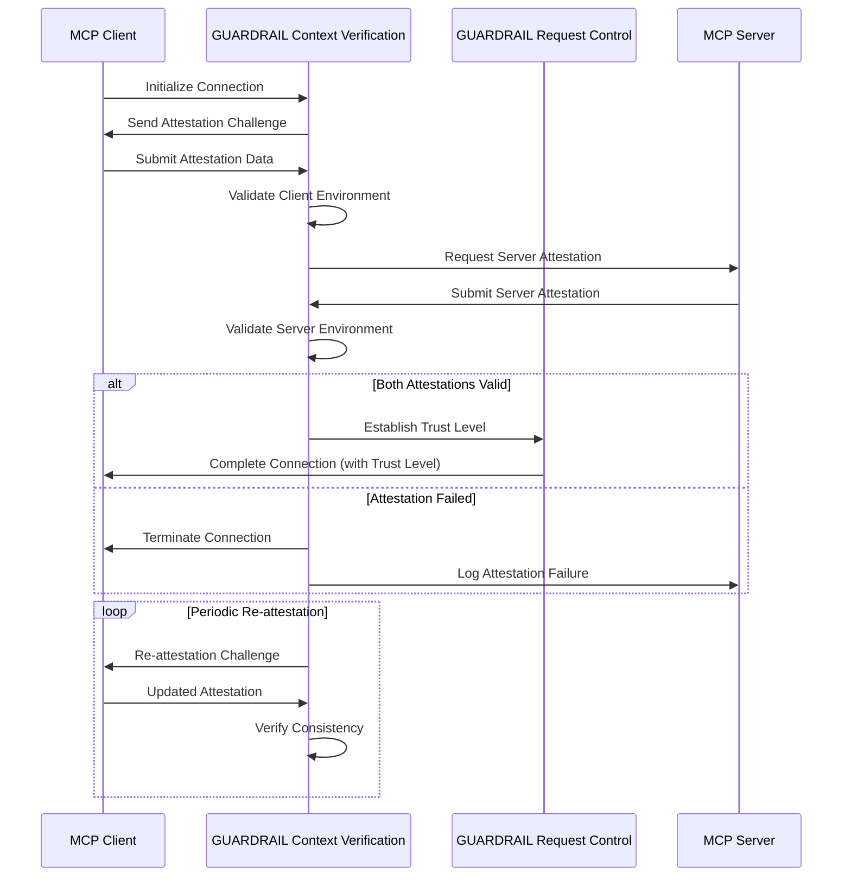
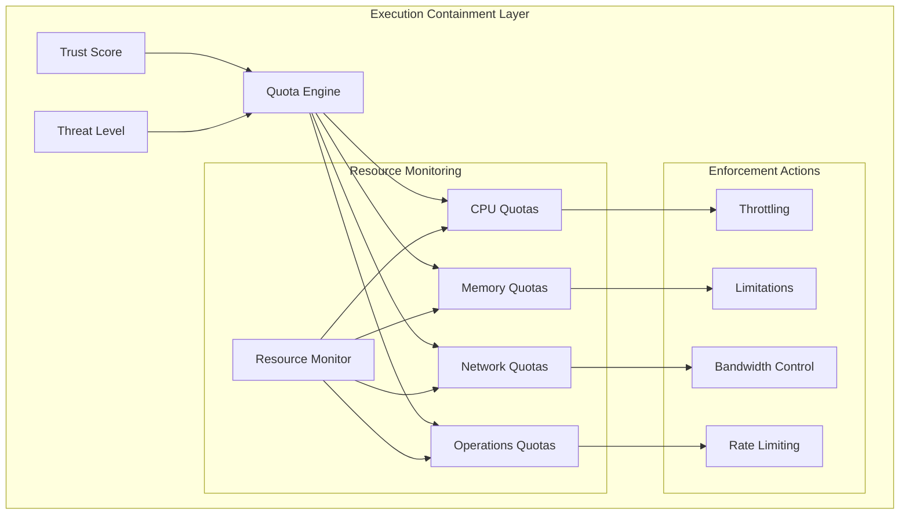
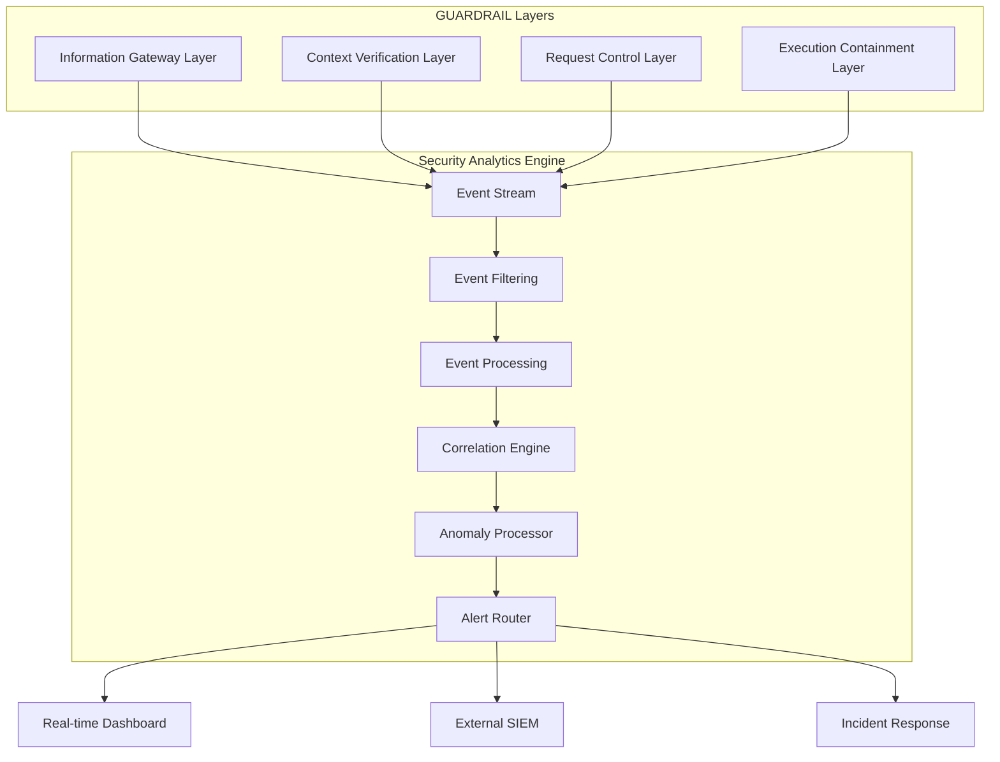
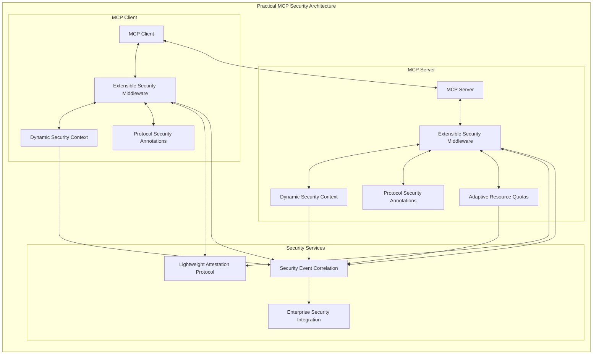

These diagrams represent the practical security architecture I've proposed for MCP environments. Let me explain how they work together:

1. **Extensible Security Middleware Architecture**: This shows how security plugins can be integrated into the MCP communication flow, with a Plugin Manager orchestrating different security functions like classification, flow control, and transformations.

2. **Dynamic Security Context Workflow**: Illustrates how trust scoring evolves throughout a session, with capability adjustments based on observed behavior - a key zero-trust principle implemented pragmatically.

3. **Protocol-Level Security Annotations**: Shows how MCP messages can be enhanced with security metadata like classification and integrity verification without redesigning the entire protocol.

4. **Lightweight Attestation Protocol**: Demonstrates the challenge-response verification process between clients and servers, including the initial verification and ongoing re-attestation.

5. **Adaptive Resource Quotas**: Shows how resource limitations (CPU, memory, network, operations) can be dynamically adjusted based on trust score and threat levels.

6. **Security Event Correlation and Reporting**: Illustrates how security events from different layers flow into a centralized analytics engine for filtering, correlation, and alerting.

7. **MCP Security Integration Architecture**: Provides an overview of how these components work together in a complete security architecture.

This approach is more practical than the full GUARDRAIL framework because:

- Each component can be implemented independently
- Organizations can adopt only the parts they need
- It works with existing MCP implementations with minimal changes
- Performance impact is proportional to security requirements
- It maintains compatibility while enhancing security

The modular nature means developers can start with basic security annotations and the dynamic context, then add more sophisticated components like attestation and event correlation as their security requirements mature.

Would you like me to elaborate on any specific aspect of this architecture?