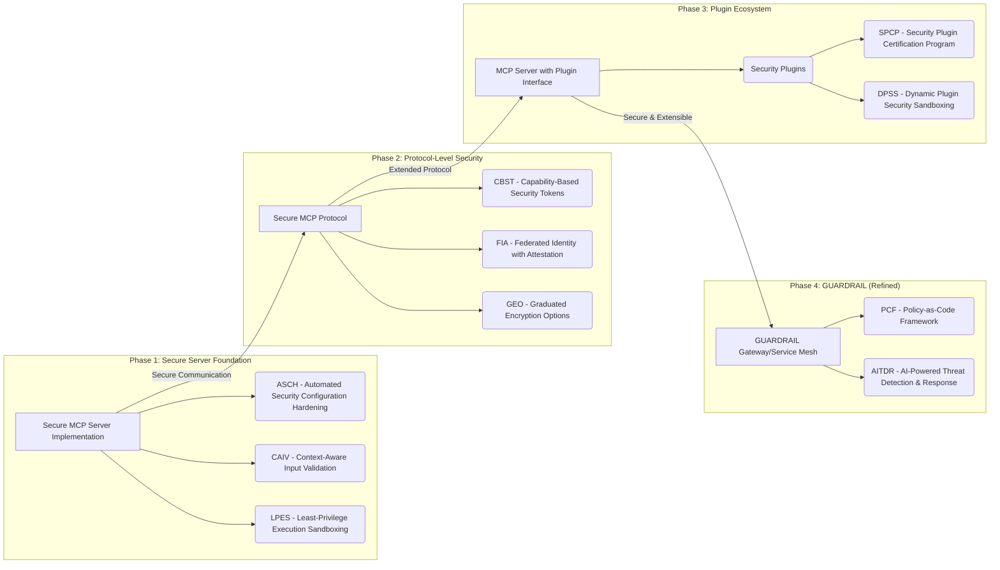
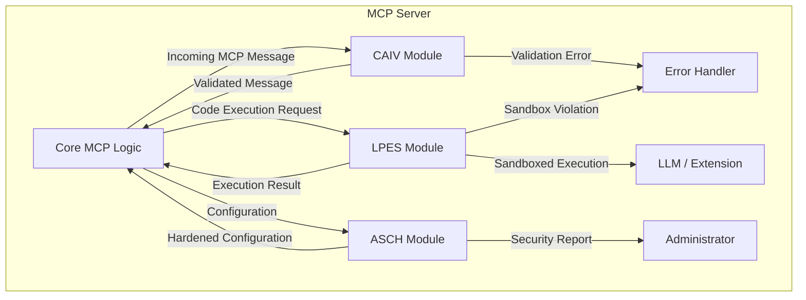
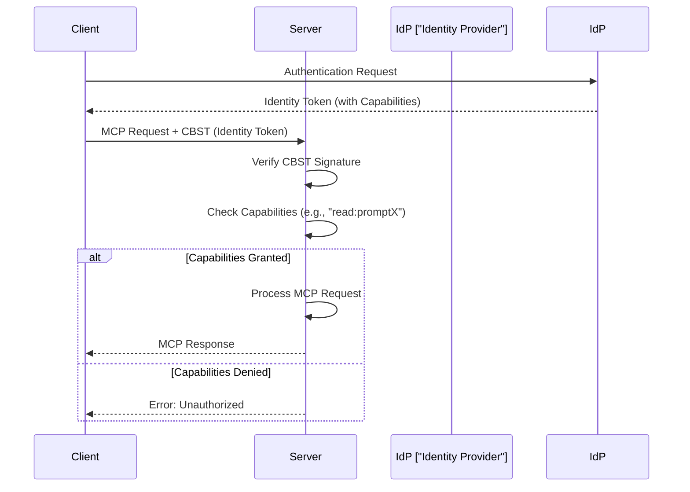
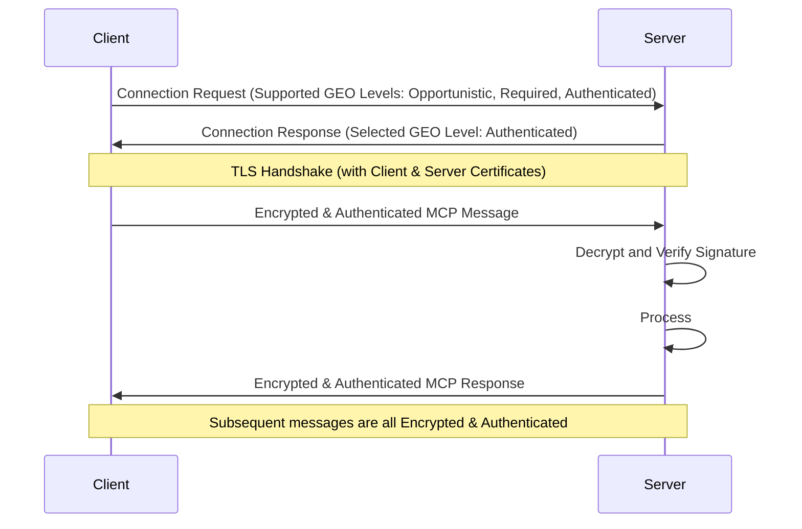
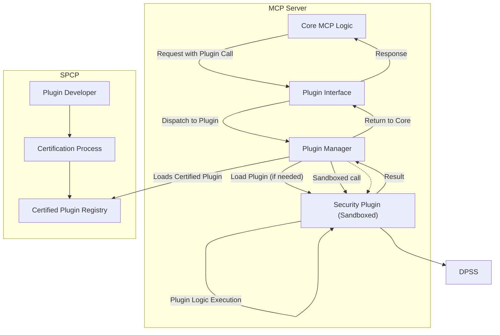
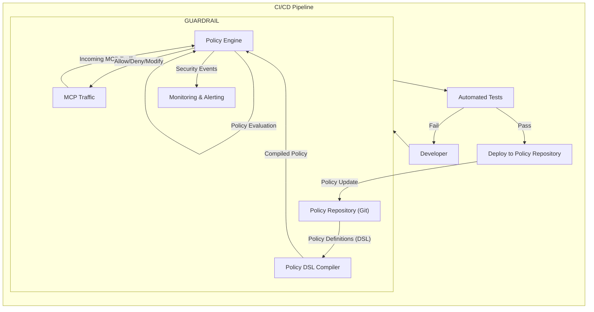
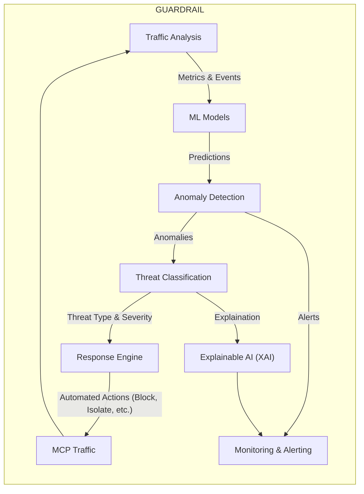

**Overall Phased Approach**

**Phase 1: Secure Server Foundation - Detail**

**Phase 2: Protocol-Level Security - Detail (CBST Example)**

**Phase 2: Protocol Level Security - Graduated Encryption Options (GEO) Example**

**Phase 3: Plugin Ecosystem - Detail**

**Phase 4: GUARDRAIL (Refined) - Detail (PCF Example)**

**Phase 4: GUARDRAIL (Refined) - Detail (AITDR Example)**

These Mermaid diagrams provide a visual representation of the proposed innovations across the different phases of MCP security evolution. They emphasize the modularity, flexibility, and practicality of the approach, highlighting how each innovation contributes to a more secure and robust MCP ecosystem.  They also show how the innovations integrate with existing technologies and practices (e.g., CI/CD, federated identity, sandboxing). This should provide a clearer understanding of how the proposed security model would function in practice.
