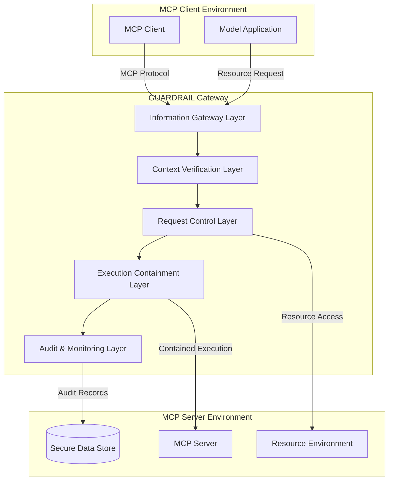
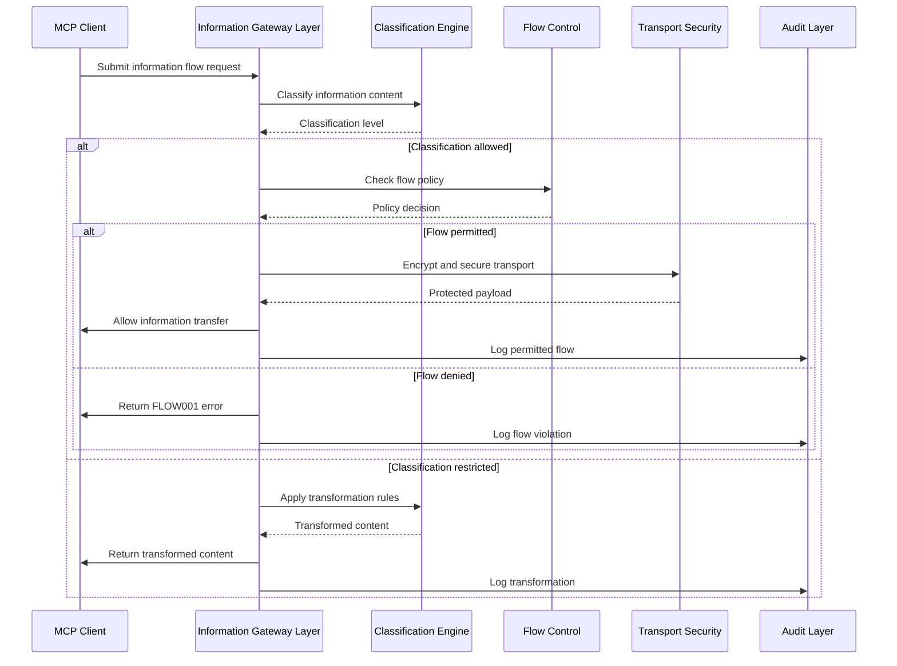
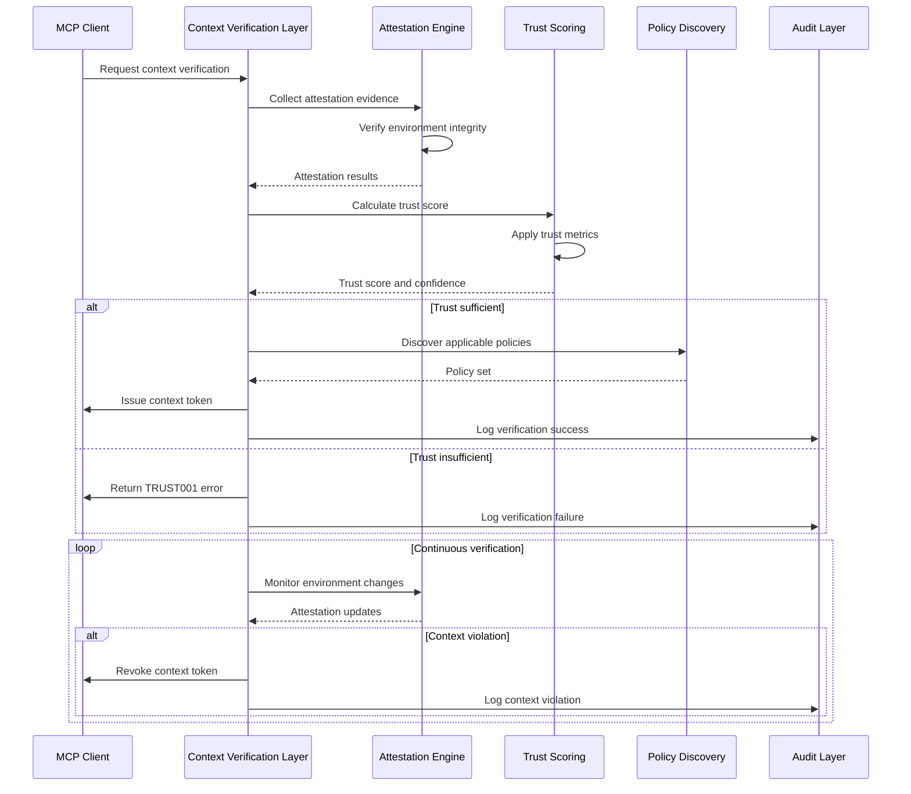
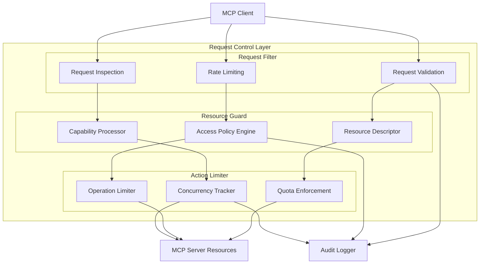
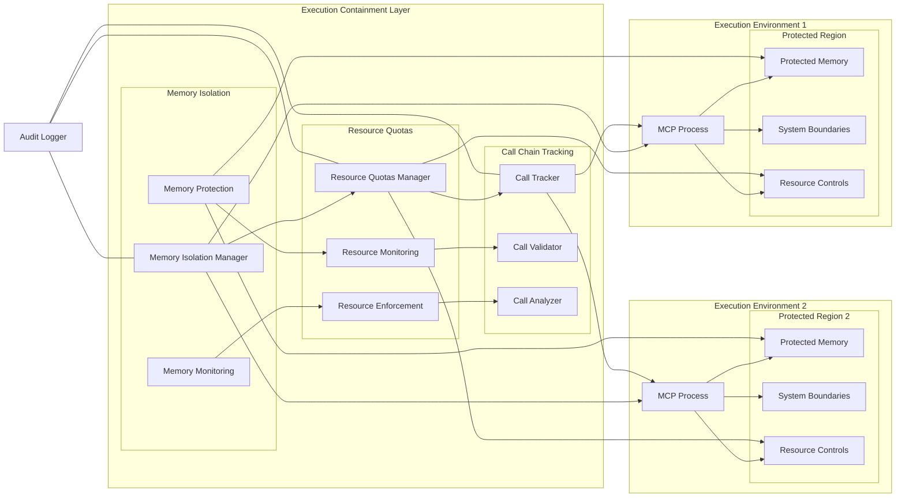
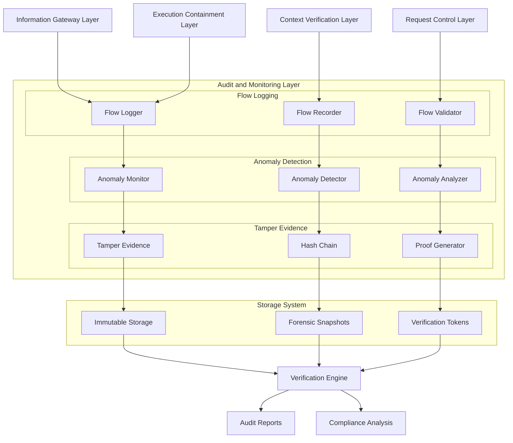
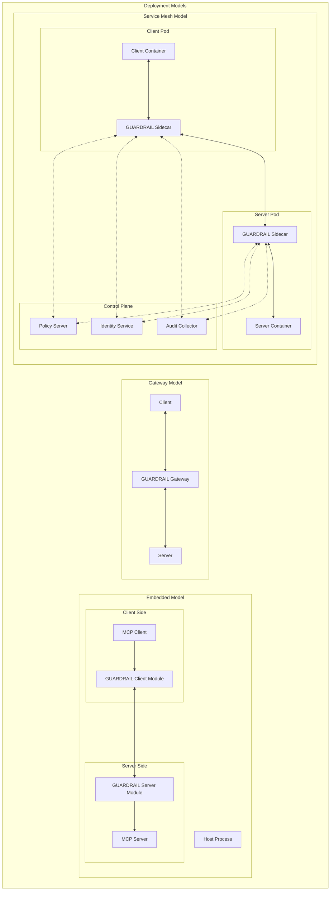
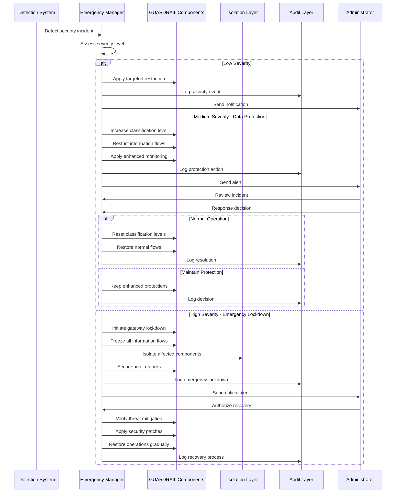

# GUARDRAIL Architecture and Workflow Diagrams

I'll create a series of Mermaid diagrams that visualize the GUARDRAIL framework's architecture and key workflows. These will help illustrate how the different components interact to provide comprehensive security for MCP environments.

## 1. GUARDRAIL Gateway Architecture Overview

**Description:**
This diagram illustrates the hierarchical structure of the GUARDRAIL Gateway, showing how it mediates between MCP clients and servers through multiple security layers.

**Key Components:**
- **MCP Client Environment**: Contains MCP clients and applications that initiate connections and requests.
- **GUARDRAIL Gateway**: The core security infrastructure organized in hierarchical layers:
  - **Information Gateway Layer (IGL)**: Manages information flow, classification, and transport security.
  - **Context Verification Layer (CVL)**: Verifies execution environment integrity and establishes trust.
  - **Request Control Layer (RCL)**: Enforces access control based on capability tokens and permissions.
  - **Execution Containment Layer (ECL)**: Creates isolated execution environments with resource limitations.
  - **Audit & Monitoring Layer (AML)**: Records all information flows and security events in tamper-evident logs.
- **MCP Server Environment**: Contains servers, resources, and data stores protected by the gateway.

This architecture implements defense-in-depth by requiring requests to successfully traverse multiple security layers before reaching MCP server resources, with each layer enforcing distinct security controls.

## 2. Information Flow Control Workflow

**Description:**
This sequence diagram demonstrates how GUARDRAIL's Information Gateway Layer controls the flow of information based on classification levels and flow policies.

**Workflow Steps:**
1. **Information Classification**:
   - MCP Client submits information for transfer
   - Classification Engine determines sensitivity level
   - Classification levels include PUBLIC, INTERNAL, SENSITIVE, and RESTRICTED

2. **Flow Policy Enforcement**:
   - Flow Control component checks if the transfer is permitted
   - Policies define allowed flows between sources and destinations
   - Decisions are based on classification, source, destination, and context

3. **Content Transformation**:
   - Restricted content may be transformed rather than blocked
   - Transformations include redaction, anonymization, or summarization
   - Transformed content preserves utility while protecting sensitive information

4. **Secure Transport**:
   - Permitted flows are protected using transport security
   - Encryption ensures confidentiality during transit
   - Integrity protections prevent tampering

This workflow ensures that all information flows are explicitly authorized, appropriately protected, and fully audited, implementing the principle of data minimization.

## 3. Context Verification Process

**Description:**
This sequence diagram illustrates how GUARDRAIL verifies the trustworthiness of execution environments and establishes security contexts.

**Workflow Steps:**
1. **Attestation Collection**:
   - Client requests context verification
   - Attestation Engine collects evidence of environment integrity
   - Evidence includes hardware attestation, software measurements, and runtime behavior

2. **Trust Calculation**:
   - Trust Scoring component evaluates collected evidence
   - Multiple trust metrics are combined with appropriate weights
   - A confidence level is assigned to the trust assessment

3. **Policy Discovery**:
   - For sufficiently trusted environments, applicable policies are discovered
   - Policies are matched based on environment type, classification level, and trust score
   - A context token is issued encapsulating the verification result

4. **Continuous Verification**:
   - Environment is continuously monitored for changes
   - Attestation is periodically refreshed
   - Context tokens are revoked if violations are detected

This zero-trust approach ensures that execution contexts are explicitly verified before being trusted, with ongoing validation throughout their lifecycle.

## 4. Request Control and Resource Guard

**Description:**
This flowchart shows how GUARDRAIL's Request Control Layer manages access to resources through filtering, guarding, and limiting mechanisms.

**Key Components:**
1. **Request Filter**:
   - **Request Validation**: Verifies the structure and content of incoming requests
   - **Rate Limiting**: Prevents request flooding and DoS attacks
   - **Request Inspection**: Examines request content for policy violations

2. **Resource Guard**:
   - **Resource Descriptor**: Defines resource properties and protection requirements
   - **Access Policy Engine**: Evaluates access rules against request context
   - **Capability Processor**: Verifies capability tokens and permissions

3. **Action Limiter**:
   - **Quota Enforcement**: Ensures resource usage stays within allocated limits
   - **Operation Limiter**: Restricts the types and frequency of operations
   - **Concurrency Tracker**: Manages simultaneous operation counts

**Interactions:**
- Client requests pass through multiple validation stages
- Resource access is controlled by explicit capability verification
- All access decisions and actions are logged for audit purposes

This capability-based access control system implements the principle of least privilege, ensuring that operations are explicitly authorized and constrained by appropriate limits.

## 5. Execution Containment Mechanisms

**Description:**
This flowchart illustrates how GUARDRAIL's Execution Containment Layer creates secure environments for MCP processes and enforces resource boundaries.

**Key Components:**
1. **Memory Isolation**:
   - **Memory Isolation Manager**: Establishes protected memory regions
   - **Memory Protection**: Enforces access control on memory regions
   - **Memory Monitoring**: Detects unauthorized access attempts

2. **Resource Quotas**:
   - **Resource Quotas Manager**: Allocates resource limits to processes
   - **Resource Monitoring**: Tracks resource utilization in real-time
   - **Resource Enforcement**: Prevents quota violations

3. **Call Chain Tracking**:
   - **Call Tracker**: Records the sequence of function calls
   - **Call Validator**: Verifies the legitimacy of call patterns
   - **Call Analyzer**: Identifies suspicious behavior

4. **Execution Environments**:
   - Isolated processes with their own protected memory
   - Strictly enforced system boundaries
   - Measured and limited resource allocation

This containment architecture ensures that MCP processes operate within well-defined boundaries, preventing unauthorized resource access and containing potential security breaches.

## 6. Audit and Monitoring System

**Description:**
This flowchart depicts GUARDRAIL's Audit and Monitoring Layer, showing how security events are recorded, analyzed, and preserved with tamper-evidence.

**Key Components:**
1. **Flow Logging**:
   - **Flow Logger**: Captures information flow events
   - **Flow Recorder**: Stores standardized audit records
   - **Flow Validator**: Verifies the completeness of records

2. **Anomaly Detection**:
   - **Anomaly Monitor**: Continuously observes system behavior
   - **Anomaly Detector**: Identifies deviations from normal patterns
   - **Anomaly Analyzer**: Assesses the significance of anomalies

3. **Tamper Evidence**:
   - **Tamper Evidence**: Adds cryptographic protection to records
   - **Hash Chain**: Organizes records in a verifiable sequence
   - **Proof Generator**: Creates cryptographic proofs of integrity

4. **Storage and Verification**:
   - Immutable storage preserves records securely
   - Forensic snapshots capture system state
   - Verification tokens enable independent validation

This comprehensive audit system ensures that all security-relevant events are reliably recorded and protected from tampering, providing accountability and supporting incident investigations.

## 7. GUARDRAIL Deployment Models

**Description:**
This flowchart compares the three deployment models for GUARDRAIL, illustrating how the security components are arranged in each architecture.

**Deployment Models:**
1. **Embedded Model**:
   - GUARDRAIL components are integrated directly into the host process
   - Client and server modules communicate within the same application
   - Provides security with minimal external dependencies
   - Suitable for standalone applications or development environments

2. **Gateway Model**:
   - GUARDRAIL functions as a standalone security gateway
   - All MCP traffic passes through the centralized gateway
   - Provides comprehensive policy enforcement at network boundaries
   - Ideal for enterprise environments with strict security requirements

3. **Service Mesh Model**:
   - GUARDRAIL components are deployed as sidecars in Kubernetes pods
   - Each client and server has its own dedicated security instance
   - A central control plane manages policies and coordinates security
   - Optimized for cloud-native and microservices architectures

Each model offers the same core security guarantees but with different deployment characteristics, allowing organizations to choose the approach that best fits their infrastructure and requirements.

## 8. Emergency Response and Security Incident Handling

**Description:**
This sequence diagram details GUARDRAIL's escalating response procedures for security incidents of varying severity.

**Workflow Steps:**
1. **Incident Detection**:
   - Detection System identifies a security violation
   - Emergency Manager assesses severity level
   - Response is scaled according to threat assessment

2. **Low Severity Response**:
   - Targeted restrictions on specific operations
   - Security event logged for analysis
   - Administrator notification for awareness

3. **Medium Severity - Data Protection**:
   - Information classification levels are increased
   - Stricter flow controls are implemented
   - Enhanced monitoring is activated
   - After review, normal operations may be restored or protections maintained

4. **High Severity - Emergency Lockdown**:
   - Gateway enters full lockdown mode
   - All information flows are temporarily frozen
   - Affected components are isolated
   - Audit records are secured for forensic analysis
   - Recovery requires explicit authorization
   - Operations are restored gradually after threat mitigation

This graduated response system ensures proportional reactions to security incidents, protecting information assets while minimizing disruption to legitimate operations.

Would you like me to explain any of these diagrams in more detail or create additional diagrams for specific aspects of the GUARDRAIL framework?