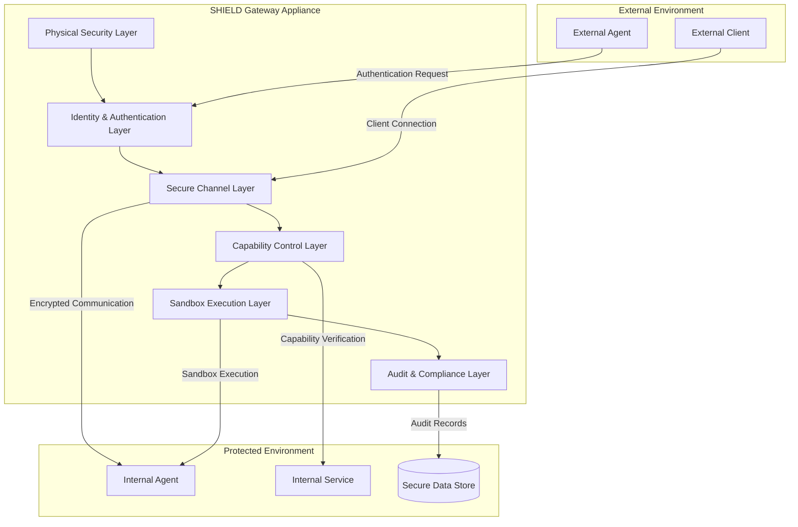

I'll create a series of Mermaid diagrams depicting the SHIELD gateway appliance architecture and workflows. These diagrams will help visualize the technical components and interactions within the system.

I've created a comprehensive set of Mermaid diagrams that visualize the SHIELD gateway appliance's internal technical architecture and workflows:

1. **SHIELD Gateway Architecture Overview**: Shows the hierarchical layers of the gateway and how they interact with external and internal components.

2. **Identity and Authentication Workflow**: Illustrates the process of agent identity verification, including credential validation and revocation checks.

3. **Secure Channel Establishment**: Depicts the protocol for establishing and maintaining secure communication channels between agents.

4. **Capability Control Workflow**: Shows how the capability-based access control system verifies and enforces permissions for operations.

5. **Sandbox Execution Environment**: Visualizes the internal structure of the sandbox layer, showing how agent isolation and resource controls are implemented.

6. **Cross-Sandbox Transfer Protocol**: Illustrates the process for securely transferring agents between different sandbox environments.

7. **Audit Chain and Verification**: Shows the construction and verification of the immutable audit chain using Merkle trees.

8. **Emergency Response Procedures**: Depicts the escalation levels and corresponding actions for security incidents, from low severity to critical emergency shutdowns.

These diagrams provide a visual representation of how the different components of the SHIELD gateway interact and the security workflows that protect agent communications. Would you like me to explain any specific diagram in more detail or create additional diagrams focusing on other aspects of the system?

# Detailed Descriptions of SHIELD Gateway Architecture Diagrams

## 1. SHIELD Gateway Architecture Overview

This diagram illustrates the hierarchical structure of the SHIELD Gateway Appliance, showing how it mediates between external entities and protected internal resources.

**Key Components:**
- **External Environment**: Contains External Agents and External Clients that request access to protected resources.
- **SHIELD Gateway Appliance**: The core security infrastructure organized in hierarchical layers:
  - **Physical Security Layer (PS)**: The foundation that provides hardware-level security protections including TPM/TEE integration and secure boot mechanisms.
  - **Identity & Authentication Layer (IAL)**: Manages agent identities and verifies authentication claims using quantum-resistant cryptography.
  - **Secure Channel Layer (SCL)**: Establishes and maintains encrypted communication channels with perfect forward secrecy.
  - **Capability Control Layer (CCL)**: Enforces access control based on capability tokens and permissions.
  - **Sandbox Execution Layer (SEL)**: Creates isolated execution environments for running agent code safely.
  - **Audit & Compliance Layer (ACL)**: Records all security-relevant events in tamper-evident logs.
- **Protected Environment**: Contains Internal Agents, Internal Services, and Secure Data Stores that are protected by the gateway.

**Flow Dynamics:**
- External Agents authenticate through the Identity Layer
- External Clients establish secure connections through the Channel Layer
- The gateway enforces capability verification before allowing access to internal services
- All activities are continuously monitored and recorded in the audit system

This architecture implements defense-in-depth by requiring requests to successfully traverse multiple security layers before reaching protected resources, with each layer enforcing distinct security controls.

## 2. SHIELD Identity and Authentication Workflow

This sequence diagram details the process of authenticating an External Agent attempting to access the SHIELD system.

**Workflow Steps:**
1. **Initial Authentication Request**:
   - External Agent presents its AgentID and credentials to the Identity & Authentication Layer (IAL)
   - These credentials include quantum-resistant signatures and capability claims

2. **Validation Process**:
   - IAL checks the revocation status against Certificate Revocation Lists (CRL)
   - If not revoked, IAL requests key verification from Key Management Service (KMS)
   - KMS validates the cryptographic signature using stored public keys

3. **Decision Points**:
   - If credentials are valid and signature is verified:
     - IAL issues a time-limited authentication token
     - A successful authentication event is logged
   - If credentials are invalid, revoked, or signature fails:
     - IAL returns specific error codes (AUTH001, AUTH002, or AUTH003)
     - Authentication failure is logged with detailed context

4. **Audit Trail**:
   - All authentication attempts (successful or failed) are recorded
   - Audit records include the agent identity, timestamp, and outcome

This workflow implements zero-trust principles by requiring explicit verification of every authentication attempt, with no implicit trust. The use of quantum-resistant cryptography ensures future-proofing against quantum computing threats.

## 3. SHIELD Secure Channel Establishment

This sequence diagram illustrates how secure communication channels are established and maintained between External Agents and the SHIELD system.

**Workflow Steps:**
1. **Channel Initialization**:
   - External Agent sends a ChannelInit request with proposed crypto parameters
   - Secure Channel Layer (SCL) verifies the authentication token with Identity Layer
   - Upon validation, SCL generates secure session keys using quantum-resistant algorithms

2. **Active Session Management**:
   - After channel establishment, agents exchange encrypted messages
   - SCL decrypts and validates each message before forwarding
   - Messages with invalid signatures or MACs trigger error responses
   - Session keys are periodically regenerated according to rekeying policy

3. **Error Handling**:
   - Invalid messages trigger CH003 errors and are logged
   - Authentication failures terminate the channel establishment process
   - All session activities are recorded in the audit system

4. **Security Features**:
   - Perfect forward secrecy ensures past communications remain secure
   - Sessions have defined lifetimes and are regularly rekeyed
   - Sequence numbers prevent replay attacks
   - Encrypted payloads protect data confidentiality

This protocol ensures that all communications within the SHIELD system maintain confidentiality, integrity, and authenticity, even in adversarial network environments. The channel establishment process validates both agent identities before allowing substantive communication.

## 4. SHIELD Capability Control Workflow

This sequence diagram demonstrates how the capability-based access control system enforces permissions for operations requested by agents.

**Workflow Steps:**
1. **Operation Request**:
   - Agent presents a capability token to the Capability Control Layer (CCL)
   - CCL verifies the token's cryptographic signature to ensure authenticity

2. **Capability Validation**:
   - If signature is valid, CCL checks capability type and constraints
   - CCL validates that the requested operation is authorized by the token
   - CCL checks for expiration, delegation depth, and other constraints

3. **Operation Execution**:
   - For valid capabilities, the request is forwarded to the Capability Provider
   - The result is returned to the agent after successful execution
   - All operations are logged with capability details

4. **Delegation Handling**:
   - Agents may request delegation of capabilities to other agents
   - CCL verifies the "delegatable" flag on the capability
   - If allowed, an attenuated capability is created with additional constraints
   - Delegation creates an auditable chain of capability transfers

5. **Error Responses**:
   - Invalid signatures trigger CRY003 errors
   - Insufficient capabilities trigger CAP001 errors
   - Unauthorized delegation attempts trigger CAP002 errors

This capability-based security model implements the principle of least privilege and enables fine-grained access control with delegatable permissions. The system ensures that all access decisions are explicitly authorized, verified, and recorded.

## 5. SHIELD Sandbox Execution Environment

This flowchart details the architecture of the Sandbox Execution Layer that provides secure, isolated environments for running agent code.

**Key Components:**
1. **Sandbox Manager**:
   - Controls the lifecycle of sandboxes and agents
   - Allocates resources and enforces isolation boundaries
   - Implements resource quotas and restrictions

2. **Resource Monitor**:
   - Tracks resource utilization across sandboxes
   - Detects anomalous resource usage patterns
   - Enforces resource limits and prevents exhaustion attacks

3. **Integrity Verifier**:
   - Validates code integrity before execution
   - Monitors runtime behavior for security violations
   - Detects attempts to bypass security controls

4. **Individual Sandboxes**:
   - Implemented as containers or VMs with strong isolation
   - Each sandbox contains an Agent Runtime environment with:
     - Resource Controls: CPU, memory, storage limits
     - System Call Filters: Restricted OS interactions
     - Network Controls: Limited connectivity based on policy

**Interactions:**
- Capability Control Layer authorizes sandbox operations
- Sandbox Manager oversees multiple sandboxes
- All sandbox activities are recorded in the Audit Layer
- Integrity violations trigger security responses

This architecture ensures that malicious or compromised agents cannot escape their sandbox environments to affect other agents or the underlying system. The multi-layered controls provide defense-in-depth to contain security breaches.

## 6. SHIELD Cross-Sandbox Transfer Protocol

This sequence diagram illustrates the process for securely transferring agents between different sandbox environments while maintaining security.

**Workflow Steps:**
1. **Transfer Initiation**:
   - Source Sandbox requests agent transfer to Sandbox Manager
   - Sandbox Manager requests attestation from Attestation Service
   - Attestation Service provides cryptographic proof of source sandbox integrity

2. **Destination Verification**:
   - Sandbox Manager verifies destination requirements
   - Checks include security level and required capabilities
   - Destination Sandbox confirms readiness to accept the agent

3. **Agent Preparation**:
   - Source Sandbox prepares agent for transfer
   - Agent state is serialized and encrypted
   - A secure transfer package is created with integrity protections

4. **Transfer Execution**:
   - Agent package is transferred to destination
   - Destination verifies package integrity
   - A new secure environment is created in the destination
   - Agent state is deserialized and restored

5. **Completion and Verification**:
   - Transfer completion is confirmed to Sandbox Manager
   - All transfer activities are logged in the Audit Layer
   - Source sandbox resources are released

6. **Error Handling**:
   - Unsuitable destinations cause transfer rejection
   - Expired transfer tokens trigger SB001 errors
   - All failures are logged with detailed context

This protocol ensures that agent transfers maintain security continuity, preventing state tampering during transfer operations. The attestation mechanism verifies that both source and destination environments meet security requirements.

## 7. SHIELD Audit Chain and Verification

This flowchart illustrates the architecture of the Audit and Compliance Layer, showing how security events are recorded in a tamper-evident audit chain.

**Key Components:**
1. **Audit Record Generation**:
   - Audit Record Generator: Creates standardized audit records
   - Audit Verifier: Validates record integrity
   - Audit Signer: Cryptographically signs records

2. **Merkle Tree Construction**:
   - Merkle Tree Builder: Organizes audit records in a tamper-evident structure
   - Root Hash Calculator: Generates cryptographic summaries
   - Consistency Proof Generator: Creates proofs for verification

3. **Storage and Distribution**:
   - Immutable Storage: Preserves audit records securely
   - Distributed Verification Nodes: Support decentralized validation

4. **Verification Process**:
   - Consistency Proof Verifier: Validates Merkle tree integrity
   - Signature Verifier: Checks cryptographic signatures
   - Tamper Detection: Identifies unauthorized modifications

**Data Flow:**
- Security events from all SHIELD layers feed into the Audit Generator
- Records are signed, organized into Merkle trees, and stored immutably
- Verification processes continuously validate the integrity of the audit chain
- Distributed nodes provide redundancy and independent verification

This architecture ensures that audit records cannot be modified after creation, providing a reliable forensic trail for security incidents and compliance verification. The Merkle tree structure allows efficient verification of the entire audit history.

## 8. SHIELD Emergency Response Procedures

This sequence diagram details the escalating response procedures for security incidents detected within the SHIELD system.

**Workflow Steps:**
1. **Incident Detection**:
   - Detection System identifies a security violation
   - Emergency Manager assesses severity level
   - Response is scaled according to threat level

2. **Low Severity Response**:
   - Targeted restrictions are implemented
   - Security event is logged
   - Administrator notification is sent

3. **Medium Severity - Agent Quarantine**:
   - Agent capabilities are revoked
   - Agent is moved to isolated quarantine zone
   - Connections are blocked
   - Administrator receives alert
   - After review, agent is either restored or terminated

4. **High Severity - Emergency Shutdown**:
   - Emergency shutdown is initiated
   - All active tokens are revoked
   - All sessions are terminated
   - Audit records are secured
   - Critical alert is sent to administrators
   - Recovery process requires explicit authorization
   - System undergoes verification before phased restart

**Key Decision Points:**
- Severity assessment determines response level
- Administrator review for medium severity incidents
- Explicit authorization required for recovery from high severity incidents
- Threat elimination verification before system restoration

This escalating response framework ensures proportional reactions to security incidents, minimizing disruption for minor issues while providing robust protection against serious threats. The procedure includes clear recovery paths with appropriate verification steps.

