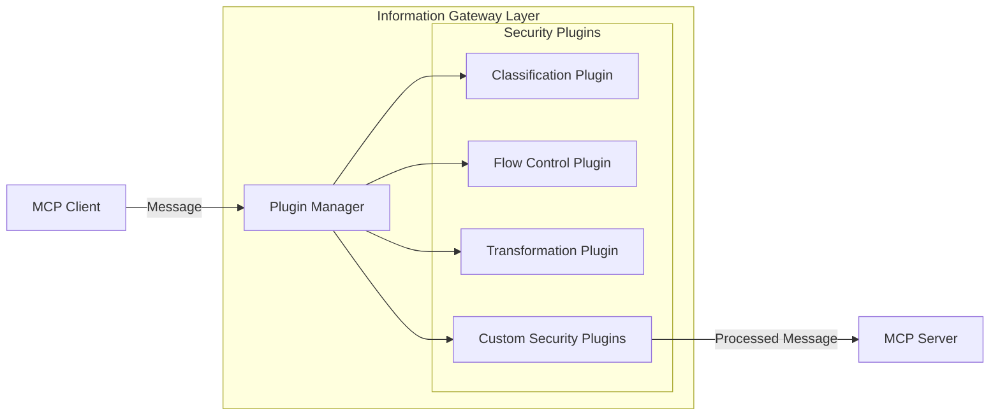
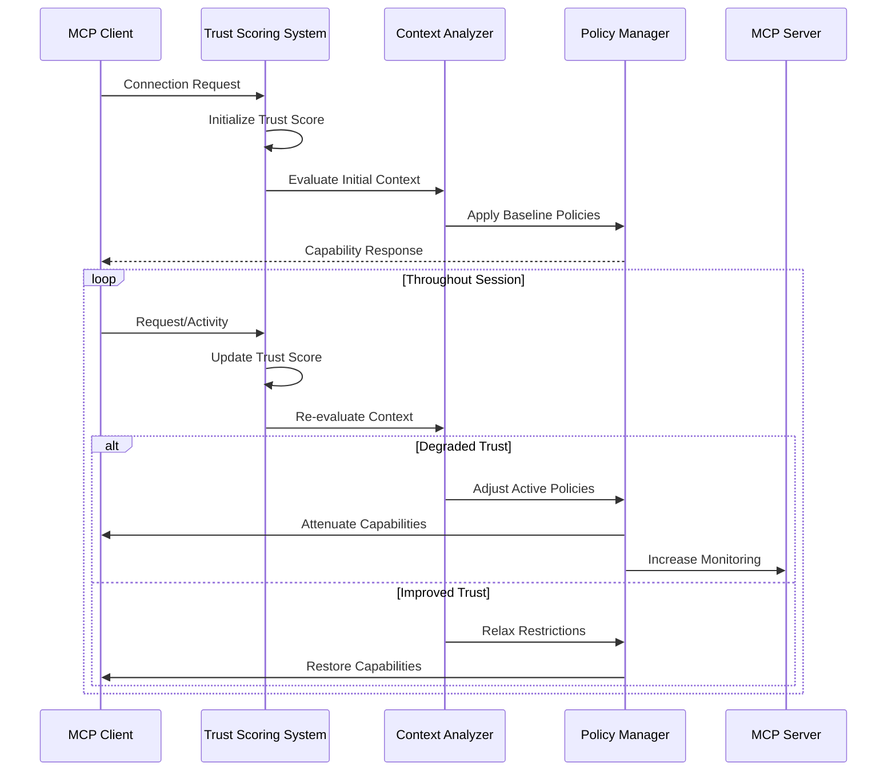
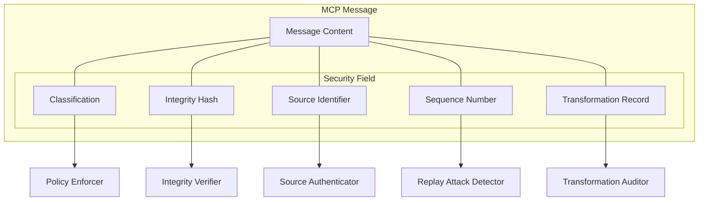
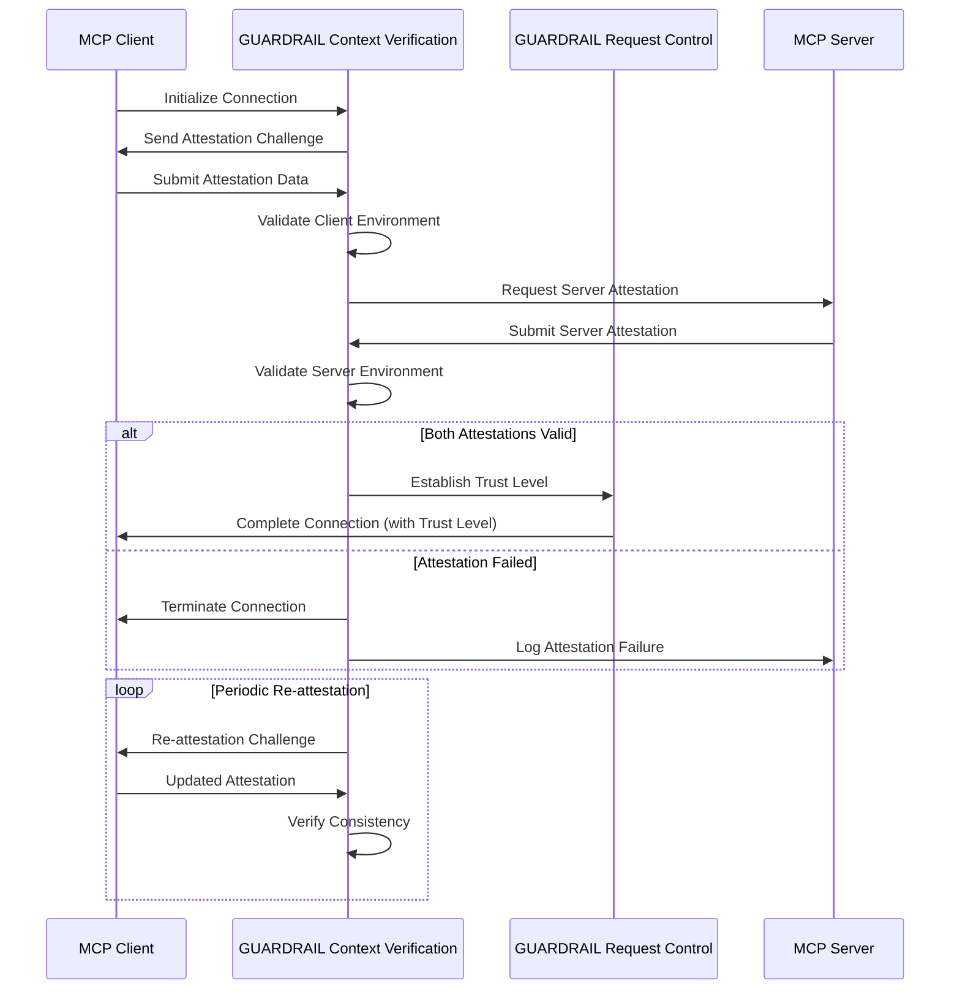
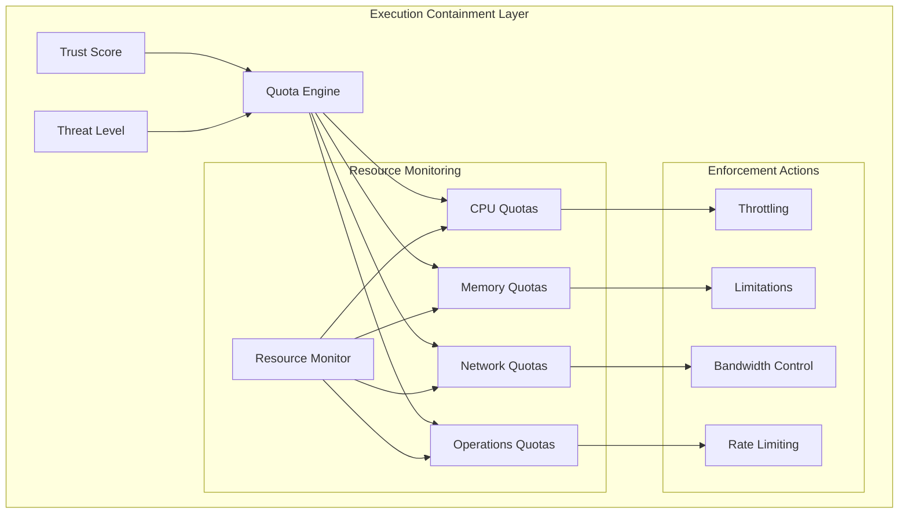
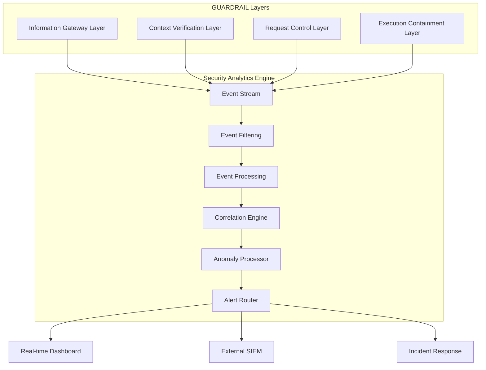

# Synthesizing New Innovations for GUARDRAIL

After reviewing the critical feedback and proposed enhancements for MCP security, I can identify several promising innovations that could be synthesized with the GUARDRAIL framework to further strengthen its capabilities. These innovations address practical implementation concerns and enhance GUARDRAIL's adaptability in real-world deployment scenarios.

## Key Innovations to Incorporate into GUARDRAIL

### 1. Pluggable Security Architecture

The Extensible Security Middleware (ESM) concept could be integrated into GUARDRAIL's Information Gateway Layer to provide greater flexibility and customization:

**Implementation Strategy:**
- Define a standard plugin interface with lifecycle hooks (initialize, validate, transform, finalize)
- Create a plugin registry and discovery mechanism
- Implement configuration-driven plugin loading and chaining
- Develop a set of core plugins implementing GUARDRAIL's existing capabilities

This would allow organizations to extend GUARDRAIL with custom security logic without modifying the core framework.

### 2. Dynamic Trust and Threat Assessment

Incorporating the Dynamic Security Context (DSC) concept would make GUARDRAIL more responsive to changing security conditions:

**Implementation Strategy:**
- Develop a mathematical model for calculating and updating trust scores based on behavioral patterns
- Create a threat level classification system with clear thresholds and transitions
- Implement capability attenuation mechanisms that activate automatically at different threat levels
- Build a session state management system that persists trust information securely

This would make GUARDRAIL's security posture adaptable rather than static, responding to suspicious activities by dynamically adjusting protections.

### 3. Protocol-Embedded Security Metadata

The Mandatory Message Classification and Tagging (MMCT) concept would strengthen GUARDRAIL by making security properties explicit at the protocol level:

**Implementation Strategy:**
- Extend GUARDRAIL to work with MCP message format specifications
- Implement automated classification based on content analysis
- Develop cryptographic integrity verification tied to session keys
- Create sequence tracking mechanisms to prevent replay attacks
- Build a transformation audit trail system

This would make security properties intrinsic to every message exchanged in the system, rather than managed externally.

### 4. Mutual Attestation Protocol

The Lightweight Attestation Protocol (LAP) could strengthen GUARDRAIL's Context Verification Layer with standardized attestation mechanisms:

**Implementation Strategy:**
- Create standardized attestation message formats within GUARDRAIL
- Implement challenge-response mechanisms to ensure freshness
- Develop verification logic for various client/server environments
- Build automated re-attestation scheduling based on risk factors
- Create attestation revocation capabilities for compromised environments

This would ensure both endpoints in a connection meet security requirements continuously throughout their interaction.

### 5. Adaptive Resource Control

Integrating Adaptive Resource Quotas (ARQ) would enhance GUARDRAIL's Execution Containment Layer with dynamic restrictions:

**Implementation Strategy:**
- Develop mathematical models for quota adjustments based on trust scores
- Create resource monitoring systems that track usage in real-time
- Implement graduated enforcement mechanisms from soft limits to hard cutoffs
- Build recovery paths for restoring normal operation after threats subside

This would make GUARDRAIL's resource protection mechanisms responsive to security conditions, tightening restrictions when suspicious activity is detected.

### 6. Enhanced Security Analytics

The Security Event Correlation and Reporting (SECR) concept could significantly enhance GUARDRAIL's Audit and Monitoring Layer:

**Implementation Strategy:**
- Define a comprehensive security event taxonomy and schema
- Create efficient event collection and filtering mechanisms
- Implement stream processing for real-time event analysis
- Develop correlation rules to detect complex attack patterns
- Build integration capabilities with external security systems

This would transform GUARDRAIL from a passive logging system to an active security intelligence platform.

## Integration Strategy

To effectively integrate these innovations into GUARDRAIL, we recommend:

1. **Phased Implementation**: Begin with the most critical enhancements (protocol-embedded security metadata and dynamic trust assessment) before moving to more complex features.

2. **Backward Compatibility**: Where possible, maintain compatibility with existing GUARDRAIL implementations through feature flags and optional modules.

3. **Reference Implementations**: Develop concrete examples for each innovation showing how they integrate with GUARDRAIL and MCP environments.

4. **Test Harnesses**: Create comprehensive test suites that verify the security properties of each enhancement under various threat scenarios.

5. **Documentation**: Provide detailed specifications and best practices for implementing and extending the enhanced GUARDRAIL framework.

These innovations will transform GUARDRAIL from a static security framework into an adaptive, intelligent security system capable of responding to emerging threats in real-time while remaining practical to deploy in diverse MCP environments.