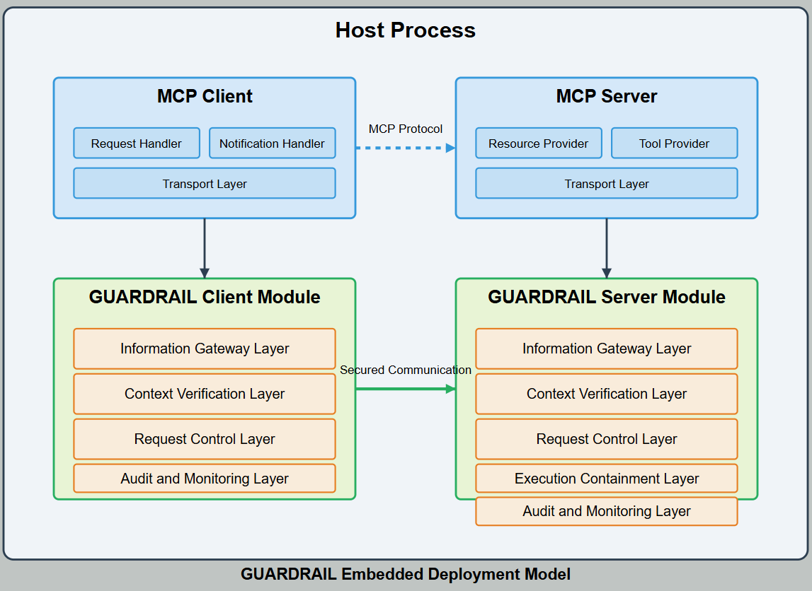
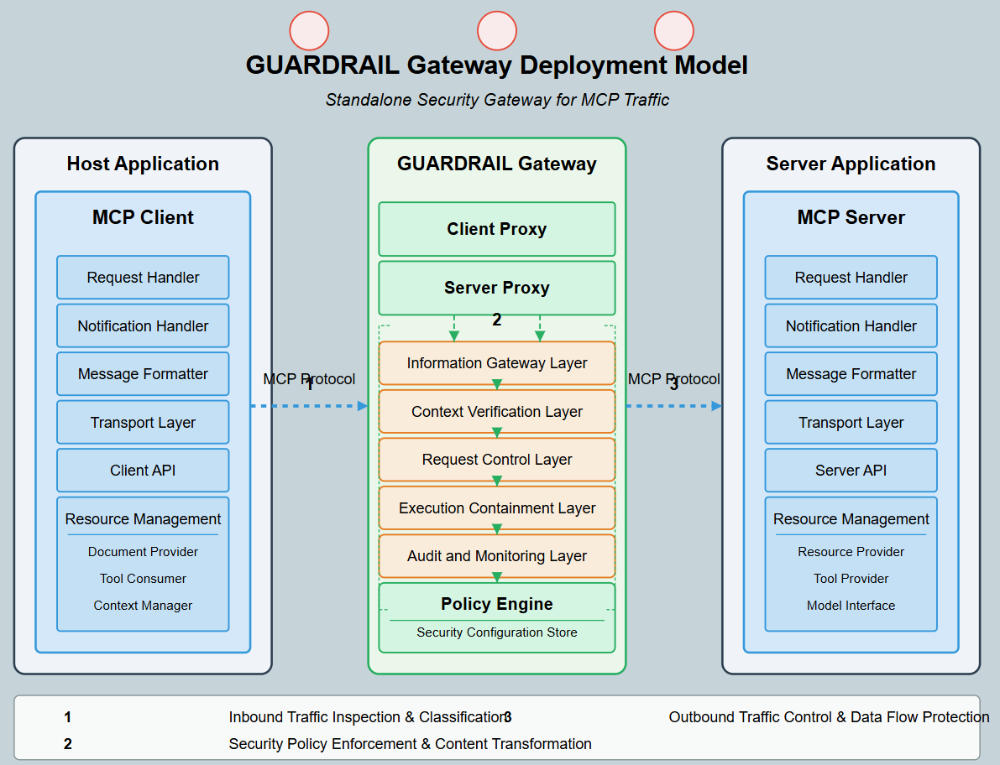
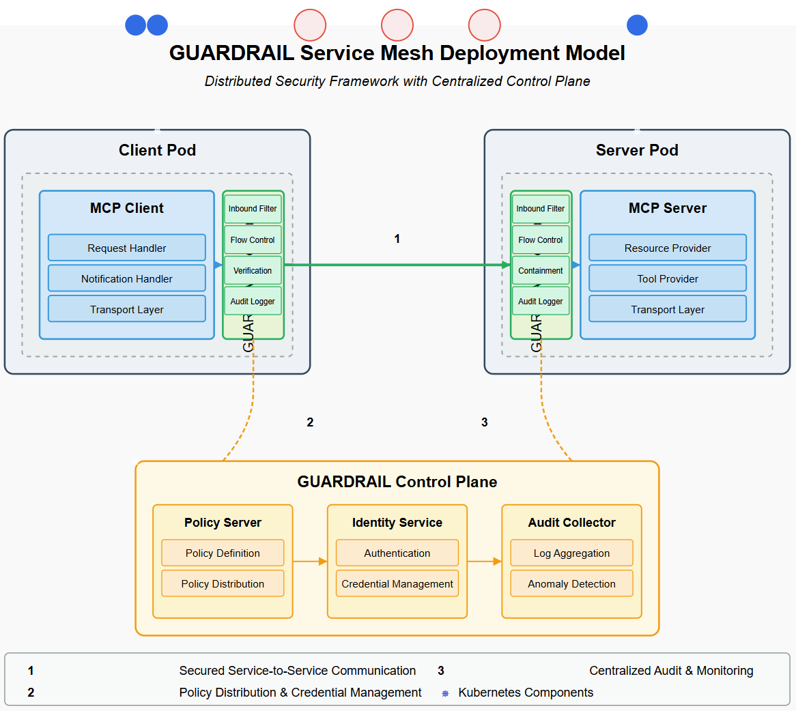
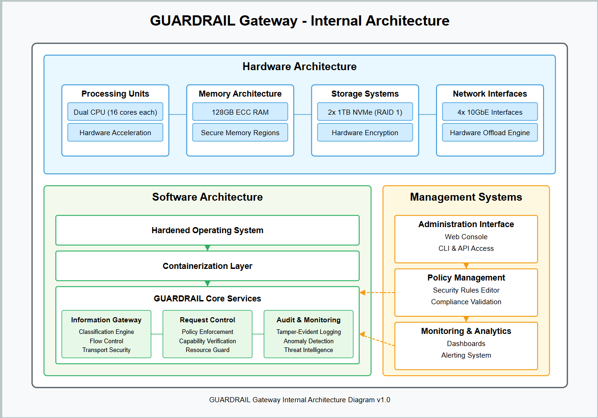
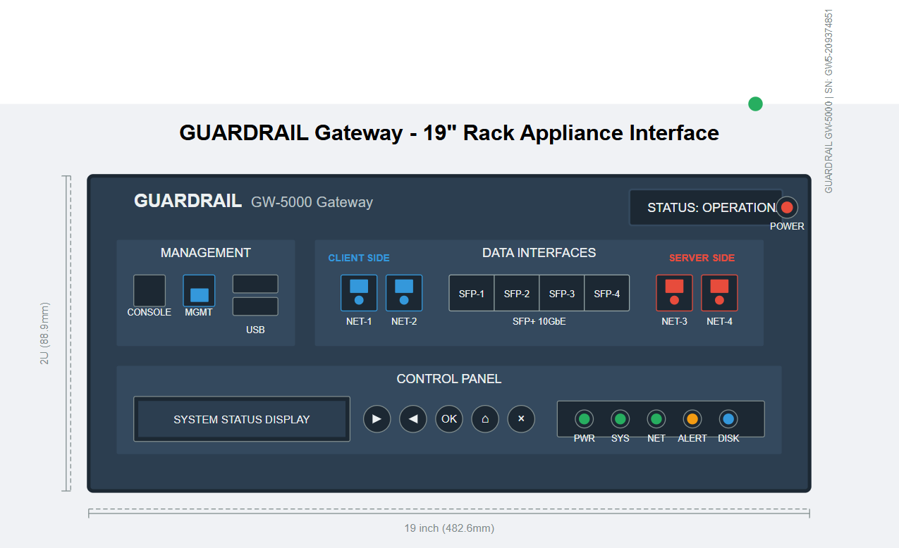
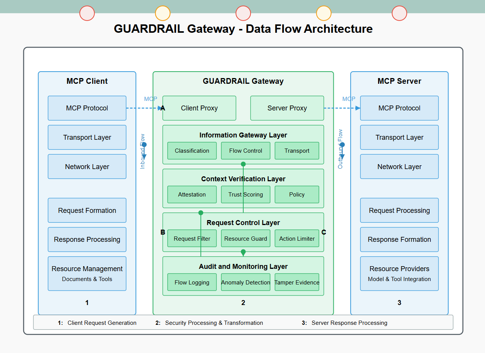
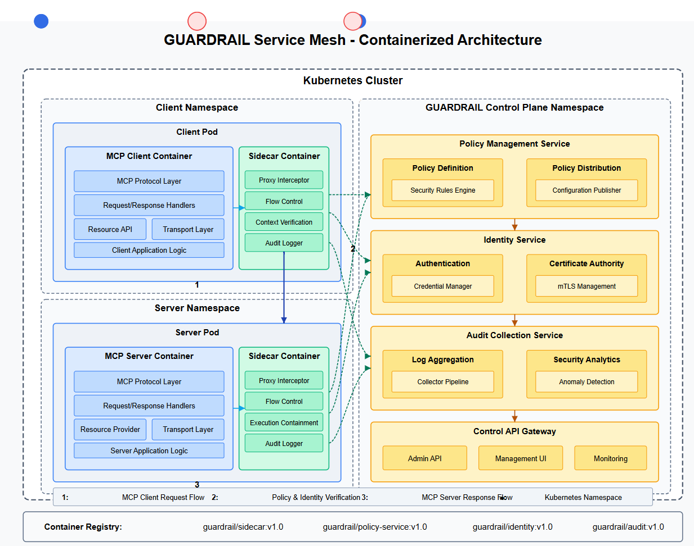

# GUARDRAIL: Security Framework for Large Language Model Applications

## Executive Summary

GUARDRAIL is a comprehensive security framework designed to protect Large Language Model (LLM) application ecosystems, particularly those built using the Model Context Protocol (MCP). It addresses critical security vulnerabilities inherent in LLM applications, focusing on preventing data exfiltration, data infiltration, unauthorized access, and resource abuse. GUARDRAIL provides a modular, layered, and extensible architecture, offering robust protection without sacrificing performance or usability. It prioritizes *practical, incremental adoption*, allowing developers to enhance security progressively.

## Project Status

GUARDRAIL is currently in active development. This repository contains the architectural design, technical specifications, and implementation documentation. Production-ready code components and reference implementations will be released incrementally. This README serves as the central hub for understanding the project.

## Table of Contents

- [GUARDRAIL: Security Framework for Large Language Model Applications](#guardrail-security-framework-for-large-language-model-applications)
  - [Executive Summary](#executive-summary)
  - [Project Status](#project-status)
  - [Table of Contents](#table-of-contents)
  - [1. Introduction ](#1-introduction-)
  - [2. Core Principles ](#2-core-principles-)
  - [3. Architecture Overview ](#3-architecture-overview-)
    - [3.1 Security Layers ](#31-security-layers-)
    - [3.2 Deployment Models ](#32-deployment-models-)
  - [4. Key Benefits ](#4-key-benefits-)
  - [5. Integration with MCP ](#5-integration-with-mcp-)
  - [6. Practical Security Innovations ](#6-practical-security-innovations-)
    - [6.1 Extensible Security Middleware (ESM) ](#61-extensible-security-middleware-esm-)
    - [6.2 Dynamic Security Context (DSC) ](#62-dynamic-security-context-dsc-)
    - [6.3 Protocol-Level Security Annotations ](#63-protocol-level-security-annotations-)
    - [6.4 Lightweight Attestation Protocol (LAP) ](#64-lightweight-attestation-protocol-lap-)
    - [6.5 Adaptive Resource Quotas (ARQ) ](#65-adaptive-resource-quotas-arq-)
    - [6.6 Security Event Correlation and Reporting (SECR) ](#66-security-event-correlation-and-reporting-secr-)
  - [7. Visualizations and Diagrams ](#7-visualizations-and-diagrams-)
  - [8. Detailed Documentation ](#8-detailed-documentation-)
  - [9. Emergency Response Framework ](#9-emergency-response-framework-)
  - [10. License ](#10-license-)

## 1. Introduction <a name="introduction"></a>

Large Language Models (LLMs) are rapidly transforming various industries, but their power and complexity introduce significant security risks. The Model Context Protocol (MCP) aims to standardize communication between LLM applications and services. GUARDRAIL addresses the inherent security challenges by providing a comprehensive and *incrementally adoptable* security framework specifically tailored for MCP and other LLM application ecosystems.  It is designed to be practical and easy to integrate, starting with simple enhancements and progressing to more advanced security measures.

## 2. Core Principles <a name="core-principles"></a>

GUARDRAIL is built on the following core principles:

1.  **Information Flow Control:** Strict policies govern the movement of information, preventing unauthorized data exfiltration and infiltration. This includes data classification and fine-grained control over data access.
2.  **Contextual Security:** Security decisions are made based on the *dynamic* execution context, including continuous trust assessment.
3.  **Transport-Agnostic Protection:** Security guarantees are provided *regardless* of the underlying transport mechanism.
4.  **Least-Privilege Execution:** All components operate with the *minimum* necessary permissions, granted just-in-time and revoked when no longer needed.
5. **Zero Trust:** No component or user is inherently trusted. Continuous verification is required.

## 3. Architecture Overview <a name="architecture-overview"></a>

### 3.1 Security Layers <a name="security-layers"></a>

GUARDRAIL implements a multi-layered architecture, with each layer providing distinct security controls.  These layers can be implemented *incrementally*, starting with the most critical.

```mermaid
flowchart TB
    subgraph "MCP Client Environment"
        MC[MCP Client]
    end

    subgraph "GUARDRAIL"
        direction TB
        IGL[Information Gateway Layer]
        CVL[Context Verification Layer]
        RCL[Request Control Layer]
        ECL[Execution Containment Layer]
        AML[Audit & Monitoring Layer]

        IGL --> CVL
        CVL --> RCL
        RCL --> ECL
        ECL --> AML
    end

    subgraph "MCP Server Environment"
        MS[MCP Server]
    end

    MC -- "MCP Protocol" --> IGL
    ECL -- "Contained Execution" --> MS
```

*   **Information Gateway Layer (IGL):**  Manages information flows, content classification, flow policy enforcement, and transport security. *This is a primary focus for initial implementations.*
*   **Context Verification Layer (CVL):** Establishes trust through attestation and client/server verification. *Can be added after the IGL is established.*
*   **Request Control Layer (RCL):** Implements fine-grained access control, request filtering, and action limiting. *Adds another layer of defense on top of context verification.*
*   **Execution Containment Layer (ECL):** Ensures code execution within secure, isolated boundaries (e.g., using containers or sandboxes). *This is for more advanced deployments with higher security needs.*
*   **Audit and Monitoring Layer (AML):** Provides visibility into system operations and security events.  *Essential for monitoring and incident response.*

### 3.2 Deployment Models <a name="deployment-models"></a>

GUARDRAIL can be deployed in several configurations:

1.  **Embedded Model:** GUARDRAIL components are integrated directly into the host process (both client and server). This is suitable for standalone applications or development/testing environments.

2.  **Gateway Model:** GUARDRAIL operates as a standalone security gateway, mediating *all* MCP traffic. This is ideal for enterprise deployments with strict security requirements.

3.  **Service Mesh Model:** GUARDRAIL components are deployed as sidecars within a Kubernetes environment (or similar). This is best suited for cloud-native and microservices architectures.

```mermaid
flowchart TB
    subgraph "Deployment Models"
        direction LR

        subgraph "Embedded Model"
            direction TB
            HC[Host Process]

            subgraph "Client Side"
                MCC[MCP Client]
                GC[GUARDRAIL Client Module]

                MCC --> GC
            end

            subgraph "Server Side"
                MCS[MCP Server]
                GS[GUARDRAIL Server Module]

                GS --> MCS
            end

            GC <---> GS
        end

        subgraph "Gateway Model"
            direction TB
            CL[Client]
            GW[GUARDRAIL Gateway]
            SV[Server]

            CL <---> GW
            GW <---> SV
        end

        subgraph "Service Mesh Model"
            direction TB

            subgraph "Client Pod"
                CP[Client Container]
                CS[GUARDRAIL Sidecar]

                CP <---> CS
            end

            subgraph "Server Pod"
                SP[Server Container]
                SS[GUARDRAIL Sidecar]

                SS <---> SP
            end

            subgraph "Control Plane"
                PS[Policy Server]
                IS[Identity Service]
                AS[Audit Collector]
            end

            CS <---> SS
            CS <-..-> PS
            CS <-..-> IS
            CS <-..-> AS
            SS <-..-> PS
            SS <-..-> IS
            SS <-..-> AS
        end
    end
```

## 4. Key Benefits <a name="key-benefits"></a>

GUARDRAIL provides:

1.  **Comprehensive Information Flow Control:** Prevents unauthorized data exfiltration and infiltration.
2.  **Contextual Security:** Security adapts to the execution environment.
3.  **Compatibility:** Works with existing MCP implementations.
4.  **Attack Prevention:** Protects against common LLM-specific vulnerabilities (e.g., prompt injection, resource abuse).
5.  **Auditability:** Provides visibility into information flows for investigations and compliance.
6.  **Incremental Adoption:** Allows organizations to start with basic security and add more layers as needed.

## 5. Integration with MCP <a name="integration-with-mcp"></a>

GUARDRAIL is designed for seamless integration with MCP. It provides wrapper classes for MCP Clients and Servers and can also hook in at a lower level, using the ESM.

```typescript
// Client Integration Example
import { Client } from "@modelcontextprotocol/sdk/client";
import { GuardrailClient } from "@guardrail/sdk/client";

// Initialize standard MCP client
const mcpClient = new Client({
  name: "example-client",
  version: "1.0.0"
});

// Wrap with Guardrail protection (Basic)
const client = new GuardrailClient(mcpClient, {
  security: {
    classification_level: "INTERNAL", // Start with basic classification
    // Add more options later as needed.
  }
});

// Normal MCP operations now protected by Guardrail
await client.connect(transport);
```

## 6. Practical Security Innovations <a name="practical-security-innovations"></a>

GUARDRAIL incorporates key innovations designed for *practical implementation and incremental adoption*. These are the building blocks of a secure MCP ecosystem.

### 6.1 Extensible Security Middleware (ESM) <a name="extensible-security-middleware-esm"></a>

The ESM provides a pluggable architecture *within* MCP client and server implementations, allowing for customized security processing of MCP messages. It sits between the MCP protocol layer and the transport layer.

```mermaid
flowchart LR
    subgraph "MCP Client/Server"
        direction TB
        MP[MCP Protocol Layer]
        ESM[Extensible Security Middleware]
        TL[Transport Layer]

        MP -- "MCP Message" --> ESM
        ESM -- "Processed Message" --> TL
    end

    subgraph "ESM Internals"
        direction TB
        PM[Plugin Manager]
        subgraph "Security Plugins"
            SP1[Validation Plugin]
            SP2[Classification Plugin]
            SP3[Encryption Plugin]
            SP4[Custom Plugins...]
        end
        PM --> SP1
        PM --> SP2
        PM --> SP3
        PM --> SP4
    end
    MC[MCP Client/Server] -- "Config" --> PM
```

*   **Key Features:**
    *   **Pluggable Modules:** Security functions are implemented as modules (e.g., `validate`, `transform`, `preSend`, `postReceive`).
    *   **Module Chaining:** Modules can be chained in a configurable sequence.
    *   **Asynchronous Operation:** Avoids blocking the main MCP thread.
    *   **Context-Aware:** Modules access the MCP context and the Dynamic Security Context (DSC).
    *   **Policy-Driven:** Module behavior is controlled by declarative policies.

*   **Benefits:** Flexibility, extensibility, performance, and testability.

### 6.2 Dynamic Security Context (DSC) <a name="dynamic-security-context-dsc"></a>

The DSC is a *shared, mutable* object that maintains security-relevant information about an MCP connection. It enables *adaptive security* based on observed behavior.

```mermaid
sequenceDiagram
    participant Client as MCP Client
    participant Server as MCP Server
    participant DSC as Dynamic Security Context
    participant ESM as Extensible Security Middleware

    Client->>Server: MCP Request
    activate Server
    Server->>DSC: Get Initial DSC (Trust Score, etc.)
    activate DSC
    DSC-->>Server: Initial DSC Data
    deactivate DSC
    Server->>ESM: Process Request (Pre-Processing)
    activate ESM

    loop Security Checks
        ESM->>DSC: Update DSC (e.g., Trust Score)
        activate DSC
        DSC-->>ESM: Updated DSC Data
        deactivate DSC
        ESM->>ESM: Apply Policies based on DSC
    end

    ESM-->>Server: Modified MCP Request
    deactivate ESM

    Server->>Server: Process Request (Application Logic)

    Server->>ESM: Process Response (Post-Processing)
    activate ESM
      loop Security Checks
        ESM->>DSC: Update DSC (e.g., Audit Event)
        activate DSC
        DSC-->>ESM: Updated DSC Data
        deactivate DSC
        ESM->>ESM: Apply Policies based on DSC
    end
    ESM-->>Server: Modified MCP Response

    Server->>Client: MCP Response
    deactivate Server
```

*   **Key Features:**
    *   **Trust Score:** A numerical representation of trustworthiness, adjusted by events.
    *   **Threat Level:** A categorical indicator of risk (e.g., "low," "medium," "high").
    *   **Capability Attenuation:** Capabilities can be dynamically restricted.
    *   **Session Data:** Securely stores session-specific information.
    *   **Event History:** Maintains a history of security-relevant events.

* **Benefits:** Adaptive security, zero-trust foundation, fine-grained control, improved resilience.

### 6.3 Protocol-Level Security Annotations <a name="protocol-security"></a>

This introduces *optional* security metadata fields *within* the MCP message structure itself.

```json
{
  "jsonrpc": "2.0",
  "method": "someMethod",
  "params": {
    "data": "..."
  },
  "security": { // OPTIONAL security metadata
    "classification": "INTERNAL", // e.g., PUBLIC, INTERNAL, SENSITIVE
    "integrity": "sha256:...",  // Hash of message content
    "source": "client:123",       // Identifier of sender
    "sequence": 42,              // Sequence number
    "transformations": [        // OPTIONAL array of transformations
        "redacted:pii"
    ]
  },
  "id": 1
}
```
```mermaid
flowchart LR
    subgraph "MCP Message"
        MSG[Message Content]

        subgraph "Security Field"
            CL[Classification]
            INT[Integrity Hash]
            SRC[Source Identifier]
            SEQ[Sequence Number]
            TR[Transformation Record]
        end
    end

    MSG --- CL
    MSG --- INT
    MSG --- SRC
    MSG --- SEQ
    MSG --- TR

    CL --> PL[Policy Enforcer]
    INT --> IV[Integrity Verifier]
    SRC --> SA[Source Authenticator]
    SEQ --> RA[Replay Attack Detector]
    TR --> TA[Transformation Auditor]
```

*   **Key Features:**
    *   `classification`: Sensitivity level of the message content.
    *   `integrity`: Cryptographic hash to verify message integrity.
    *   `source`: Identifies the sender.
    *   `sequence`: Prevents replay attacks.
    *   `transformations` (optional): Describes transformations applied to the message.

*   **Benefits:** Increased transparency, simplified security processing, improved interoperability, and defense in depth.

### 6.4 Lightweight Attestation Protocol (LAP) <a name="lap-new"></a>

LAP provides a mechanism for MCP clients and servers to *verify each other's identity and environment integrity*. It's built on top of MCP, using custom message types.

```mermaid
sequenceDiagram
    participant Client as "MCP Client"
    participant Server as "MCP Server"

    Client->>Server: initialize Request
    Server-->>Client: initialize Response + attestation_challenge (nonce)

    Client->>Server: attest_client Request {<br>    os: "...",<br>    mcp_sdk_version: "...",<br>    esm_modules: [...],<br>    signature: "...", // Signature over the above data + nonce<br>    nonce: "..." // Server's nonce<br>}
    Server->>Server: Verify client attestation

    Server->>Client: attest_server Response {<br>    os: "...",<br>    mcp_sdk_version: "...",<br>    esm_modules: [...],<br>    signature: "...",<br>    client_nonce: "..." // Client's original nonce (if provided)<br>}

    Client->>Client: Verify server attestation

```

*   **Key Features:**
    *   **Mutual Attestation:** Both client and server verify each other.
    *   **Challenge-Response:** Uses nonces to prevent replay attacks.
    *   **Environment Information:** Exchanges OS, SDK version, and loaded ESM modules.
    *   **Cryptographic Signatures:** Ensures authenticity of attestation data.
    *   **Periodic Re-attestation:**  Can be performed periodically.
    *   **Trust Score Integration:**  Results affect the DSC trust score.

*   **Benefits:** Enhanced trust, reduced attack surface, and improved security posture.

### 6.5 Adaptive Resource Quotas (ARQ) <a name="arq-new"></a>

ARQ allows MCP servers to *dynamically adjust resource quotas* (CPU, memory, network, requests/second) for each client, based on the DSC.

```mermaid
flowchart LR
    subgraph "MCP Server"
        DSC[Dynamic Security Context]
        RQ[Resource Quota Manager]
        RM[Resource Monitor]
        MC[MCP Client]

        DSC -- "Trust Score & Threat Level" --> RQ
        MC -- "Resource Usage" --> RM
        RM -- "Current Usage" --> RQ
        RQ -- "Quota Limits" --> MC
        MC -- "MCP Requests" --> MS[MCP Server Logic]
        RQ --"Enforce Limits"--> MS
    end
```

*   **Key Features:**
    *   **Baseline Quotas:** Default quotas for each resource.
    *   **Dynamic Adjustment:** Quotas adjusted in real-time based on the DSC.
    *   **Per-Client Quotas:** Tracked individually for each client.
    *   **Graduated Enforcement:** Throttling and rate limiting.
    *   **Feedback to Clients:** Clients informed about their quotas.

*   **Benefits:** Resource protection, adaptive security, fairness, and improved stability.

### 6.6 Security Event Correlation and Reporting (SECR) <a name="secr-new"></a>

SECR builds upon MCP's notification system to create a comprehensive security event reporting and analysis framework.

```mermaid
flowchart TB
    subgraph "MCP Client/Server"
        ESM[Extensible Security Middleware]
        DSC[Dynamic Security Context]
        ARQ[Adaptive Resource Quotas]
        LAP[Lightweight Attestation Protocol]

        ESM -- "Security Events" --> SECR[Security Event Correlation & Reporting]
        DSC -- "Security Events" --> SECR
        ARQ -- "Security Events" --> SECR
        LAP -- "Security Events" --> SECR
    end

    subgraph "External Systems"
        SIEM[SIEM/SOAR]
        DB[(Security Event Database)]
        AA[Alerting & Analytics]
    end

        SECR -- "Filtered Events" --> SIEM
    SECR -- "Aggregated Events" --> DB
    SECR -- "Correlated Events & Alerts" --> AA
```

*   **Key Features:**
    *   **Standardized Event Formats:** Common schema for security events (e.g., `event.security.authentication.failed`).
    *   **Event Filtering and Routing:** Subscribe to specific event types.
    *   **Event Correlation:** Identifies patterns of suspicious activity.
    *   **External Integration:** Exports events to SIEM/SOAR systems.
    *   **Auditing and Reporting:** Centralized view of security events.

*   **Benefits:** Improved visibility, faster incident response, proactive threat hunting, and compliance reporting.

## 7. Visualizations and Diagrams <a name="visualizations-and-diagrams"></a>

The following diagrams provide visual representations of GUARDRAIL's architecture, deployment models, and internal components:

- **Embedded Deployment Model:**
  

- **Gateway Deployment Model:**
  

- **Service Mesh Deployment Model:**
  

- **Gateway - Internal Architecture:**
  

- **Gateway - 19" Rack Appliance**
  

- **Gateway - Data Flow Architecture:**
  

- **Service Mesh - Containerized Architecture:**
  

- **Service Mesh Sidecar - Internal Architecture:**
  

- **Service Mesh - Control Plane Architecture:**
  

## 8. Detailed Documentation <a name="detailed-documentation"></a>

For a deeper understanding of GUARDRAIL, refer to the following documents:

*   [**Technical Specification (2-technical-spec.md)**](./2-technical-spec.md): Provides a comprehensive technical description of all GUARDRAIL components, configurations, and protocols.
*   [**Architecture Diagrams (6-diags-mermaid.md)**](./6-diags-mermaid.md): Contains Mermaid diagrams illustrating various aspects of the GUARDRAIL architecture and workflows.

## 9. Emergency Response Framework <a name="emergency-response-framework"></a>

GUARDRAIL incorporates an Emergency Response Framework providing comprehensive procedures to detect, respond to, and recover from security incidents.  See [Emergency Response Framework](./SHIELD-7-emergency-response-framework.md) for details.

## 10. License <a name="license"></a>
This project is licensed under the MIT License. See [LICENSE](./LICENSE) for details.
