# GUARDRAIL: Gateway for Unified Access, Resource Delegation, and Risk-Attenuating Information Limits

## Executive Summary

GUARDRAIL (Gateway for Unified Access, Resource Delegation, and Risk-Attenuating Information Limits) is a comprehensive security framework designed to protect Large Language Model (LLM) application ecosystems, particularly those built using the Model Context Protocol (MCP).  It addresses critical security vulnerabilities inherent in LLM applications, focusing on preventing data exfiltration, data infiltration, unauthorized access, and resource abuse. GUARDRAIL implements a multi-layered, defense-in-depth architecture based on zero-trust principles, providing robust protection without sacrificing performance or usability.

## Project Status

GUARDRAIL is currently in active development. This repository contains the architectural design, technical specifications, implementation documentation, and visual representations of the framework.  Production-ready code components will be released incrementally. This README serves as the central hub for understanding the project.

## Table of Contents

- [GUARDRAIL: Gateway for Unified Access, Resource Delegation, and Risk-Attenuating Information Limits](#guardrail-gateway-for-unified-access-resource-delegation-and-risk-attenuating-information-limits)
  - [Executive Summary](#executive-summary)
  - [Project Status](#project-status)
  - [Table of Contents](#table-of-contents)
  - [1. Introduction ](#1-introduction-)
  - [2. Core Principles ](#2-core-principles-)
  - [3. Architecture Overview ](#3-architecture-overview-)
    - [3.1 Security Layers ](#31-security-layers-)
    - [3.2 Deployment Models ](#32-deployment-models-)
  - [4. Key Benefits ](#4-key-benefits-)
  - [5. Integration with MCP ](#5-integration-with-mcp-)
  - [6. New Innovations ](#6-new-innovations-)
    - [6.1 Extensible Security Middleware (ESM) ](#61-extensible-security-middleware-esm-)
    - [6.2 Dynamic Security Context (DSC) ](#62-dynamic-security-context-dsc-)
    - [6.3 Mandatory Message Classification and Tagging (MMCT) ](#63-mandatory-message-classification-and-tagging-mmct-)
    - [6.4 Lightweight Attestation Protocol (LAP) ](#64-lightweight-attestation-protocol-lap-)
    - [6.5 Adaptive Resource Quotas (ARQ) ](#65-adaptive-resource-quotas-arq-)
    - [6.6 Security Event Correlation and Reporting (SECR) ](#66-security-event-correlation-and-reporting-secr-)
    - [6.7 Intelligent Threat Response System ](#67-intelligent-threat-response-system-)
    - [6.8 Advanced Cryptographic Protection Suite ](#68-advanced-cryptographic-protection-suite-)
    - [6.9 Comprehensive Supply Chain Security ](#69-comprehensive-supply-chain-security-)
    - [6.10 Regulatory Compliance Framework ](#610-regulatory-compliance-framework-)
    - [6.11 Distributed Identity and Access Management  ](#611-distributed-identity-and-access-management--)
    - [6.12 Quantum-Ready Security Architecture ](#612-quantum-ready-security-architecture-)
  - [7. Visualizations and Diagrams ](#7-visualizations-and-diagrams-)
  - [8. Detailed Documentation ](#8-detailed-documentation-)
  - [9. Emergency Response Framework ](#9-emergency-response-framework-)
  - [10. Getting Started (Future) ](#10-getting-started-future-)
  - [11. How to Contribute (Future) ](#11-how-to-contribute-future-)
  - [12. Roadmap (Future) ](#12-roadmap-future-)
  - [13. License ](#13-license-)

## 1. Introduction <a name="introduction"></a>

Large Language Models (LLMs) are rapidly transforming various industries, but their power and complexity introduce significant security risks.  The Model Context Protocol (MCP) aims to standardize communication between LLM applications and services, but its initial design lacks the robust security mechanisms necessary to protect sensitive data and prevent abuse. GUARDRAIL addresses these shortcomings by providing a comprehensive security framework specifically tailored for MCP and other LLM application ecosystems.

## 2. Core Principles <a name="core-principles"></a>

GUARDRAIL is built on the following core principles:

1.  **Information Flow Control:**  Strict policies govern the movement of information between security boundaries. This includes data classification, labeling, and fine-grained control over data access and propagation.  *Prevention of both exfiltration and infiltration is paramount.*

2.  **Contextual Security:** Security decisions are made based on the *dynamic* execution context.  This includes continuous trust assessment and environment-aware policies.

3.  **Transport-Agnostic Protection:** Security guarantees are provided *regardless* of the underlying transport mechanism used for communication.

4.  **Least-Privilege Execution:**  All components and operations within the LLM application ecosystem operate with the *minimum* necessary permissions.  Privileges are granted just-in-time and automatically revoked when no longer needed.

5.  **Zero Trust:** No component or user is inherently trusted.  Continuous verification and authentication are required at every interaction.

## 3. Architecture Overview <a name="architecture-overview"></a>

### 3.1 Security Layers <a name="security-layers"></a>

GUARDRAIL implements a multi-layered architecture, with each layer providing a distinct set of security controls:

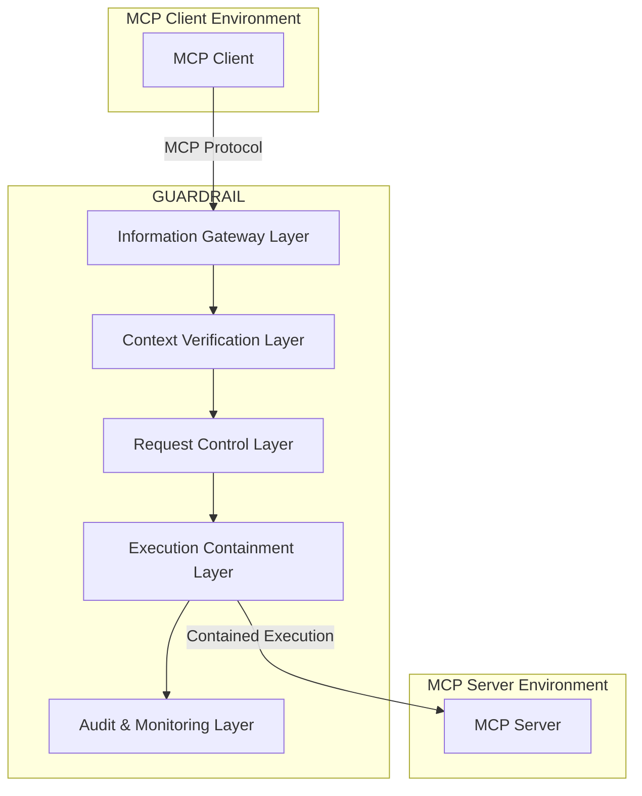
```mermaid
flowchart TB
    subgraph "MCP Client Environment"
        MC[MCP Client]
    end
    
    subgraph "GUARDRAIL"
        direction TB
        IGL[Information Gateway Layer]
        CVL[Context Verification Layer]
        RCL[Request Control Layer]
        ECL[Execution Containment Layer]
        AML[Audit & Monitoring Layer]
        
        IGL --> CVL
        CVL --> RCL
        RCL --> ECL
        ECL --> AML
    end
    
    subgraph "MCP Server Environment"
        MS[MCP Server]
    end
    
    MC -- "MCP Protocol" --> IGL
    ECL -- "Contained Execution" --> MS
```

*   **Information Gateway Layer (IGL):** The first line of defense, managing all information flows in and out of the system.  It handles content classification, flow policy enforcement, and transport security.

*   **Context Verification Layer (CVL):**  Establishes the trustworthiness of the execution environment through attestation, client/server verification, and policy discovery.

*   **Request Control Layer (RCL):**  Implements fine-grained access control to resources and functions, using a capability-based model.  Includes request filtering, resource guarding, and action limiting.

*   **Execution Containment Layer (ECL):**  Ensures that all code execution occurs within secure, isolated boundaries.  This includes memory isolation, resource quotas, and call chain tracking.

*   **Audit and Monitoring Layer (AML):**  Provides comprehensive visibility into system operations and security events.  It logs all information flows, detects anomalies, and creates tamper-evident records.

### 3.2 Deployment Models <a name="deployment-models"></a>

GUARDRAIL can be deployed in three primary configurations, offering flexibility to suit different infrastructure needs:

1.  **Embedded Model:**  GUARDRAIL components are integrated directly into the host process (both client and server). This is suitable for standalone applications or development environments.

2.  **Gateway Model:** GUARDRAIL operates as a standalone security gateway, mediating *all* MCP traffic between clients and servers.  This is ideal for enterprise deployments with strict security requirements.

3.  **Service Mesh Model:** GUARDRAIL components are deployed as sidecars within a Kubernetes environment, providing distributed security with a centralized control plane.  This is best suited for cloud-native and microservices architectures.

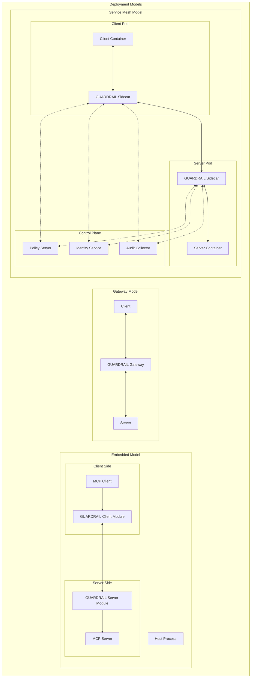
```mermaid
flowchart TB
    subgraph "Deployment Models"
        direction LR
        
        subgraph "Embedded Model"
            direction TB
            HC[Host Process]
            
            subgraph "Client Side"
                MCC[MCP Client]
                GC[GUARDRAIL Client Module]
                
                MCC --> GC
            end
            
            subgraph "Server Side"
                MCS[MCP Server]
                GS[GUARDRAIL Server Module]
                
                GS --> MCS
            end
            
            GC <---> GS
        end
        
        subgraph "Gateway Model"
            direction TB
            CL[Client]
            GW[GUARDRAIL Gateway]
            SV[Server]
            
            CL <---> GW
            GW <---> SV
        end
        
        subgraph "Service Mesh Model"
            direction TB
            
            subgraph "Client Pod"
                CP[Client Container]
                CS[GUARDRAIL Sidecar]
                
                CP <---> CS
            end
            
            subgraph "Server Pod"
                SP[Server Container]
                SS[GUARDRAIL Sidecar]
                
                SS <---> SP
            end
            
            subgraph "Control Plane"
                PS[Policy Server]
                IS[Identity Service]
                AS[Audit Collector]
            end
            
            CS <---> SS
            CS <-..-> PS
            CS <-..-> IS
            CS <-..-> AS
            SS <-..-> PS
            SS <-..-> IS
            SS <-..-> AS
        end
    end
```

## 4. Key Benefits <a name="key-benefits"></a>

GUARDRAIL provides the following key benefits:

1.  **Complete Information Flow Control:** Prevents unauthorized data exfiltration and infiltration.  Enforces classification-based rules.

2.  **Contextual Security Model:** Security adapts to the execution environment, with dynamic trust assessment and environment-aware policies.

3.  **Preservation of MCP Functionality:**  Compatible with existing MCP implementations.  Minimal performance overhead.  Transparent to well-behaved applications.

4.  **Defense Against Common Attack Vectors:** Protects against prompt injection, resource abuse, side-channel attacks, and other LLM-specific vulnerabilities.

5.  **Comprehensive Audit Trail:** Provides complete visibility into information flows, enabling security investigations and compliance with data protection requirements.

## 5. Integration with MCP <a name="integration-with-mcp"></a>

GUARDRAIL is designed for seamless integration with MCP.  It provides wrapper classes for both MCP Clients and Servers, adding security without requiring significant changes to existing application code.

```typescript
// Client Integration Example
import { Client } from "@modelcontextprotocol/sdk/client";
import { GuardrailClient } from "@guardrail/sdk/client";

// Initialize standard MCP client
const mcpClient = new Client({
  name: "example-client",
  version: "1.0.0"
});

// Wrap with Guardrail protection
const client = new GuardrailClient(mcpClient, {
  security: {
    classification_level: "INTERNAL",
    flow_policies: "standard",
    attestation: true
  }
});

// Normal MCP operations now protected by Guardrail
await client.connect(transport);
```

## 6. New Innovations <a name="new-innovations"></a>

Beyond the core architecture, GUARDRAIL incorporates several key innovations to enhance its effectiveness and adaptability:

### 6.1 Extensible Security Middleware (ESM) <a name="extensible-security-middleware-esm"></a>
Provides a pluggable architecture within the Information Gateway Layer, allowing developers to add custom security modules.
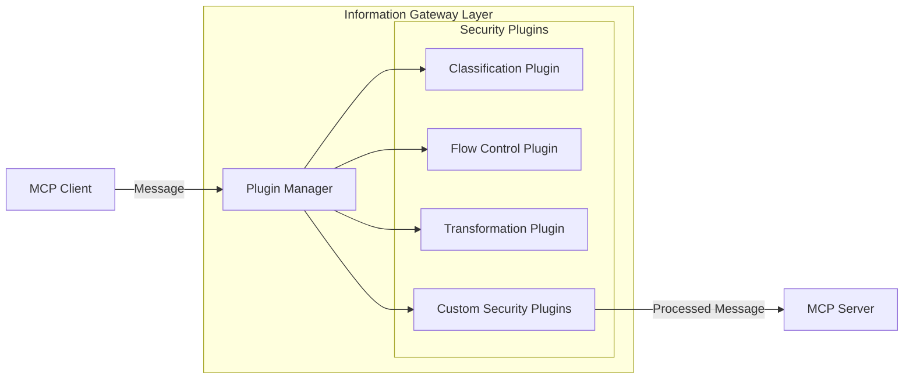
```mermaid
flowchart LR
    subgraph "Information Gateway Layer"
        direction TB
        PM[Plugin Manager]
        
        subgraph "Security Plugins"
            SP1[Classification Plugin]
            SP2[Flow Control Plugin]
            SP3[Transformation Plugin]
            SP4[Custom Security Plugins]
        end
        
        PM --> SP1
        PM --> SP2
        PM --> SP3
        PM --> SP4
    end
    
    MC[MCP Client] -- "Message" --> PM
    SP4 -- "Processed Message" --> MS[MCP Server]
```

### 6.2 Dynamic Security Context (DSC) <a name="dynamic-security-context-dsc"></a>
 A shared, mutable object that holds security-relevant information for the current MCP connection, including a trust score, threat level, and attenuated capabilities.

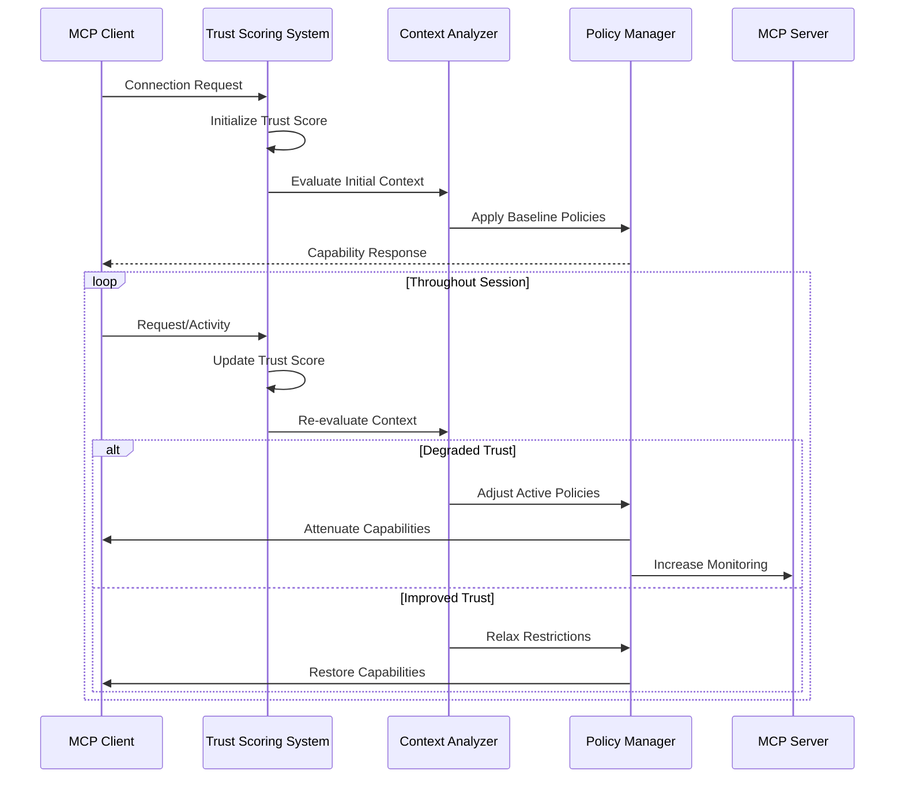
```mermaid
sequenceDiagram
    participant MC as MCP Client
    participant TS as Trust Scoring System
    participant CA as Context Analyzer
    participant PM as Policy Manager
    participant MS as MCP Server
    
    MC->>TS: Connection Request
    TS->>TS: Initialize Trust Score
    TS->>CA: Evaluate Initial Context
    CA->>PM: Apply Baseline Policies
    PM-->>MC: Capability Response
    
    loop Throughout Session
        MC->>TS: Request/Activity
        TS->>TS: Update Trust Score
        TS->>CA: Re-evaluate Context
        
        alt Degraded Trust
            CA->>PM: Adjust Active Policies
            PM->>MC: Attenuate Capabilities
            PM->>MS: Increase Monitoring
        else Improved Trust
            CA->>PM: Relax Restrictions
            PM->>MC: Restore Capabilities
        end
    end
```

### 6.3 Mandatory Message Classification and Tagging (MMCT) <a name="mandatory-message-classification-and-tagging-mmct"></a>
Requires every MCP message to include a `security` field with classification, integrity, source, and sequence information.
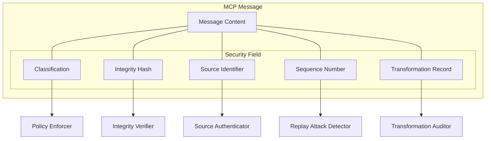
```mermaid
flowchart TB
    subgraph "MCP Message"
        MSG[Message Content]
        
        subgraph "Security Field"
            CL[Classification]
            INT[Integrity Hash]
            SRC[Source Identifier]
            SEQ[Sequence Number]
            TR[Transformation Record]
        end
    end
    
    MSG --- CL
    MSG --- INT
    MSG --- SRC
    MSG --- SEQ
    MSG --- TR
    
    CL --> PL[Policy Enforcer]
    INT --> IV[Integrity Verifier]
    SRC --> SA[Source Authenticator]
    SEQ --> RA[Replay Attack Detector]
    TR --> TA[Transformation Auditor]
```

### 6.4 Lightweight Attestation Protocol (LAP) <a name="lightweight-attestation-protocol-lap"></a>
A simple protocol built on top of MCP for mutual attestation between client and server.
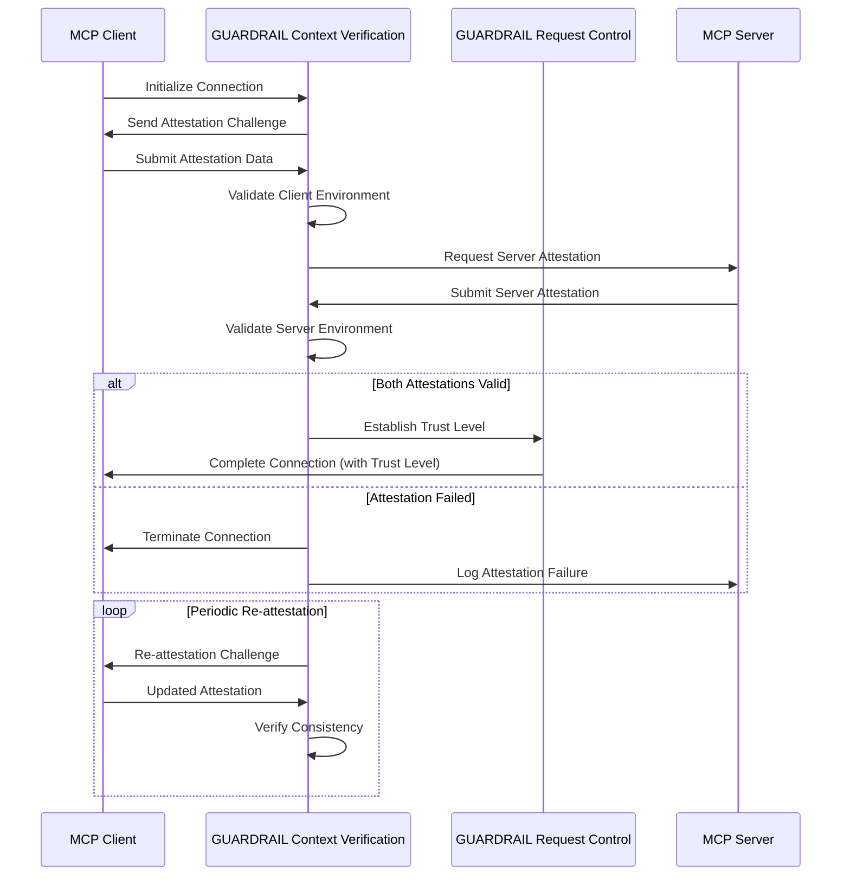
```mermaid
sequenceDiagram
    participant Client as MCP Client
    participant GCVL as GUARDRAIL Context Verification
    participant GRCL as GUARDRAIL Request Control
    participant Server as MCP Server
    
    Client->>GCVL: Initialize Connection
    GCVL->>Client: Send Attestation Challenge
    Client->>GCVL: Submit Attestation Data
    GCVL->>GCVL: Validate Client Environment
    
    GCVL->>Server: Request Server Attestation
    Server->>GCVL: Submit Server Attestation
    GCVL->>GCVL: Validate Server Environment
    
    alt Both Attestations Valid
        GCVL->>GRCL: Establish Trust Level
        GRCL->>Client: Complete Connection (with Trust Level)
    else Attestation Failed
        GCVL->>Client: Terminate Connection
        GCVL->>Server: Log Attestation Failure
    end
    
    loop Periodic Re-attestation
        GCVL->>Client: Re-attestation Challenge
        Client->>GCVL: Updated Attestation
        GCVL->>GCVL: Verify Consistency
    end
```

### 6.5 Adaptive Resource Quotas (ARQ) <a name="adaptive-resource-quotas-arq"></a>
Dynamically adjusts resource quotas (CPU, memory, network) based on the DSC's trust score and threat level.
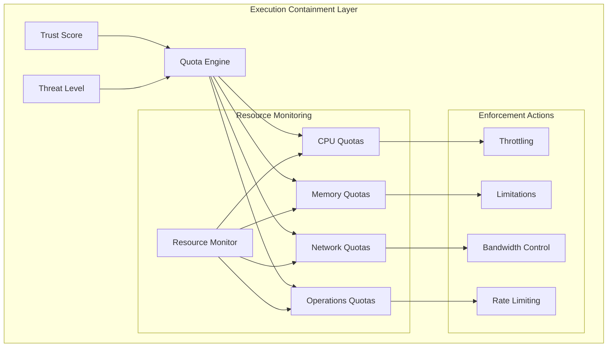
```mermaid
flowchart TB
    subgraph "Execution Containment Layer"
        TS[Trust Score] --> QE[Quota Engine]
        TL[Threat Level] --> QE
        
        QE --> CPU[CPU Quotas]
        QE --> MEM[Memory Quotas]
        QE --> NET[Network Quotas]
        QE --> OPS[Operations Quotas]
        
        subgraph "Resource Monitoring"
            RM[Resource Monitor]
            RM --> CPU
            RM --> MEM
            RM --> NET
            RM --> OPS
        end
        
        subgraph "Enforcement Actions"
            CPU --> THR[Throttling]
            MEM --> LIM[Limitations]
            NET --> BW[Bandwidth Control]
            OPS --> RL[Rate Limiting]
        end
    end
```

### 6.6 Security Event Correlation and Reporting (SECR) <a name="security-event-correlation-and-reporting-secr"></a>
Builds a security-focused event system on top of MCP notifications, allowing for sophisticated monitoring and incident response.

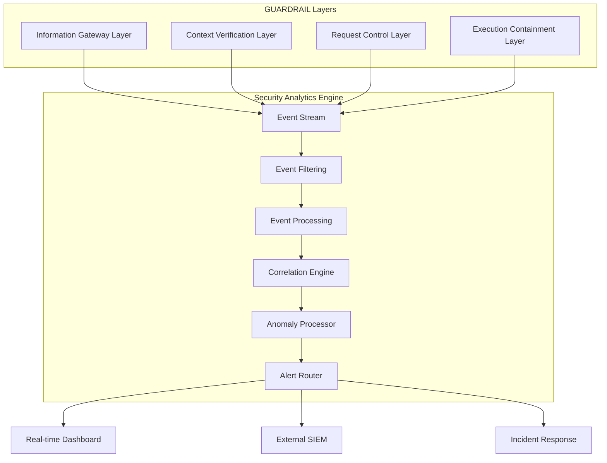
```mermaid
flowchart TB
    subgraph "GUARDRAIL Layers"
        IGL[Information Gateway Layer]
        CVL[Context Verification Layer]
        RCL[Request Control Layer]
        ECL[Execution Containment Layer]
    end
    
    IGL --> ES[Event Stream]
    CVL --> ES
    RCL --> ES
    ECL --> ES
    
    subgraph "Security Analytics Engine"
        ES --> EF[Event Filtering]
        EF --> EP[Event Processing]
        EP --> CE[Correlation Engine]
        CE --> AP[Anomaly Processor]
        AP --> AR[Alert Router]
    end
    
    AR --> RT[Real-time Dashboard]
    AR --> SIEM[External SIEM]
    AR --> IR[Incident Response]
```

### 6.7 Intelligent Threat Response System <a name="intelligent-threat-response-system"></a>
Combines threat intelligence, behavioral analysis, and automated incident response.

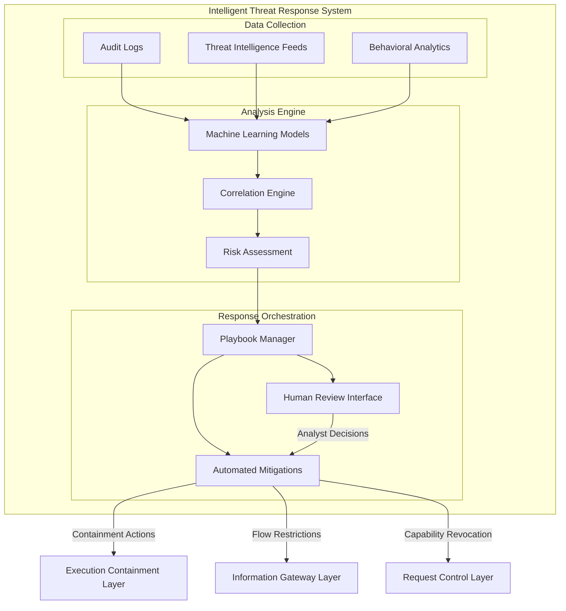
```mermaid
flowchart TB
    subgraph "Intelligent Threat Response System"
        direction TB
        
        subgraph "Data Collection"
            AL[Audit Logs]
            TI[Threat Intelligence Feeds]
            BA[Behavioral Analytics]
        end
        
        subgraph "Analysis Engine"
            ML[Machine Learning Models]
            CB[Correlation Engine]
            RA[Risk Assessment]
        end
        
        subgraph "Response Orchestration"
            PB[Playbook Manager]
            AM[Automated Mitigations]
            HR[Human Review Interface]
        end
        
        AL --> ML
        TI --> ML
        BA --> ML
        
        ML --> CB
        CB --> RA
        
        RA --> PB
        PB --> AM
        PB --> HR
    end
    
    AM -->|"Containment Actions"| ECL[Execution Containment Layer]
    AM -->|"Flow Restrictions"| IGL[Information Gateway Layer]
    AM -->|"Capability Revocation"| RCL[Request Control Layer]
    HR -->|"Analyst Decisions"| AM
```

### 6.8 Advanced Cryptographic Protection Suite <a name="advanced-cryptographic-protection-suite"></a>
Incorporates homomorphic encryption, zero-knowledge proofs, secure multi-party computation, and quantum-safe cryptography.

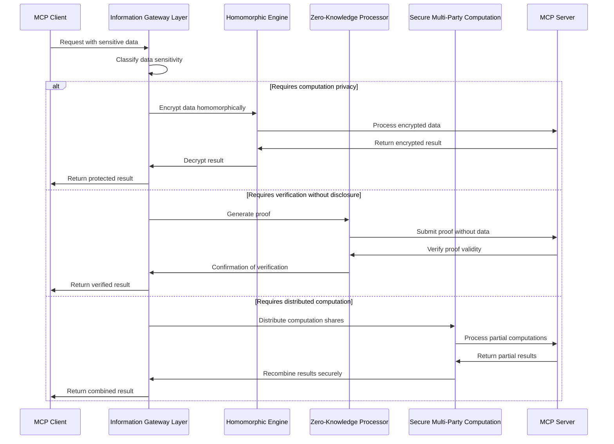
```mermaid
sequenceDiagram
    participant Client as MCP Client
    participant IGL as Information Gateway Layer
    participant HE as Homomorphic Engine
    participant ZKP as Zero-Knowledge Processor
    participant SMPC as Secure Multi-Party Computation
    participant Server as MCP Server
    
    Client->>IGL: Request with sensitive data
    IGL->>IGL: Classify data sensitivity
    
    alt Requires computation privacy
        IGL->>HE: Encrypt data homomorphically
        HE->>Server: Process encrypted data
        Server->>HE: Return encrypted result
        HE->>IGL: Decrypt result
        IGL->>Client: Return protected result
        
    else Requires verification without disclosure
        IGL->>ZKP: Generate proof
        ZKP->>Server: Submit proof without data
        Server->>ZKP: Verify proof validity
        ZKP->>IGL: Confirmation of verification
        IGL->>Client: Return verified result
        
    else Requires distributed computation
        IGL->>SMPC: Distribute computation shares
        SMPC->>Server: Process partial computations
        Server->>SMPC: Return partial results
        SMPC->>IGL: Recombine results securely
        IGL->>Client: Return combined result
    end
```
### 6.9 Comprehensive Supply Chain Security <a name="comprehensive-supply-chain-security"></a>
Combines supply chain security, container security, and network segmentation.
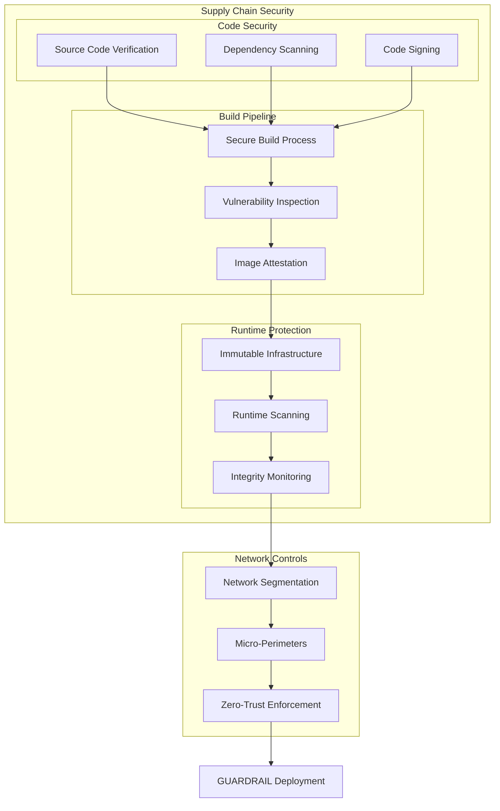
```mermaid
flowchart TB
    subgraph "Supply Chain Security"
        direction TB
        
        subgraph "Code Security"
            SC[Source Code Verification]
            DS[Dependency Scanning]
            CS[Code Signing]
        end
        
        subgraph "Build Pipeline"
            SB[Secure Build Process]
            VI[Vulnerability Inspection]
            IA[Image Attestation]
        end
        
        subgraph "Runtime Protection"
            IM[Immutable Infrastructure]
            RS[Runtime Scanning]
            IR[Integrity Monitoring]
        end
        
        SC --> SB
        DS --> SB
        CS --> SB
        
        SB --> VI
        VI --> IA
        
        IA --> IM
        IM --> RS
        RS --> IR
    end
    
    subgraph "Network Controls"
        NS[Network Segmentation]
        MP[Micro-Perimeters]
        ZT[Zero-Trust Enforcement]
    end
    
    IR --> NS
    NS --> MP
    MP --> ZT
    
    ZT --> GUARDRAIL[GUARDRAIL Deployment]
```

### 6.10 Regulatory Compliance Framework <a name="regulatory-compliance-framework"></a>
 Integrates compliance features, data loss prevention, and backup/recovery.
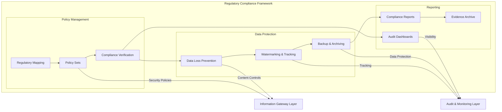
```mermaid
flowchart LR
    subgraph "Regulatory Compliance Framework"
        direction TB
        
        subgraph "Policy Management"
            RM[Regulatory Mapping]
            PS[Policy Sets]
            CV[Compliance Verification]
        end
        
        subgraph "Data Protection"
            DLP[Data Loss Prevention]
            WM[Watermarking & Tracking]
            BAR[Backup & Archiving]
        end
        
        subgraph "Reporting"
            AD[Audit Dashboards]
            CR[Compliance Reports]
            EA[Evidence Archive]
        end
        
        RM --> PS
        PS --> CV
        
        CV --> DLP
        DLP --> WM
        WM --> BAR
        
        CV --> AD
        BAR --> CR
        CR --> EA
    end
    
    PS -->|"Security Policies"| IGL[Information Gateway Layer]
    DLP -->|"Content Controls"| IGL
    WM -->|"Tracking"| AML[Audit & Monitoring Layer]
    BAR -->|"Data Protection"| AML
    AD -->|"Visibility"| AML
```

### 6.11 Distributed Identity and Access Management  <a name="distributed-identity-and-access-management"></a>
Combines decentralized identity, API security, and dynamic trust assessment.

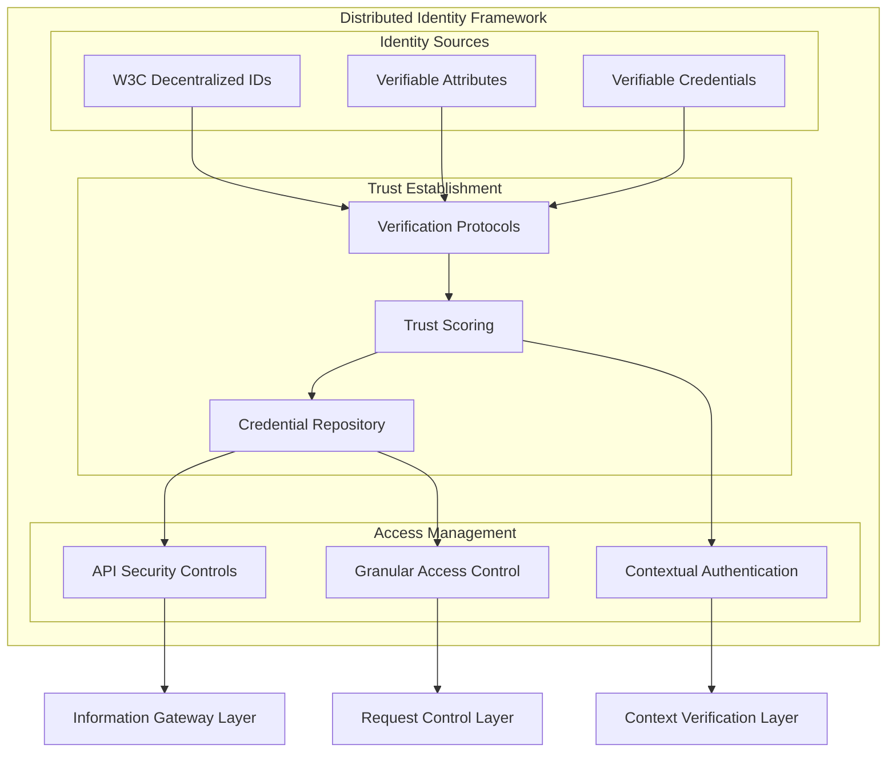
```mermaid
flowchart TB
    subgraph "Distributed Identity Framework"
        direction TB
        
        subgraph "Identity Sources"
            WDI[W3C Decentralized IDs]
            VA[Verifiable Attributes]
            VC[Verifiable Credentials]
        end
        
        subgraph "Trust Establishment"
            VP[Verification Protocols]
            TS[Trust Scoring]
            CR[Credential Repository]
        end
        
        subgraph "Access Management"
            API[API Security Controls]
            GAC[Granular Access Control]
            CAT[Contextual Authentication]
        end
        
        WDI --> VP
        VA --> VP
        VC --> VP
        
        VP --> TS
        TS --> CR
        
        CR --> API
        CR --> GAC
        TS --> CAT
    end
    
    CAT --> CVL[Context Verification Layer]
    GAC --> RCL[Request Control Layer]
    API --> IGL[Information Gateway Layer]
```

### 6.12 Quantum-Ready Security Architecture <a name="quantum-ready-security-architecture"></a>
Prepares GUARDRAIL for the post-quantum era.
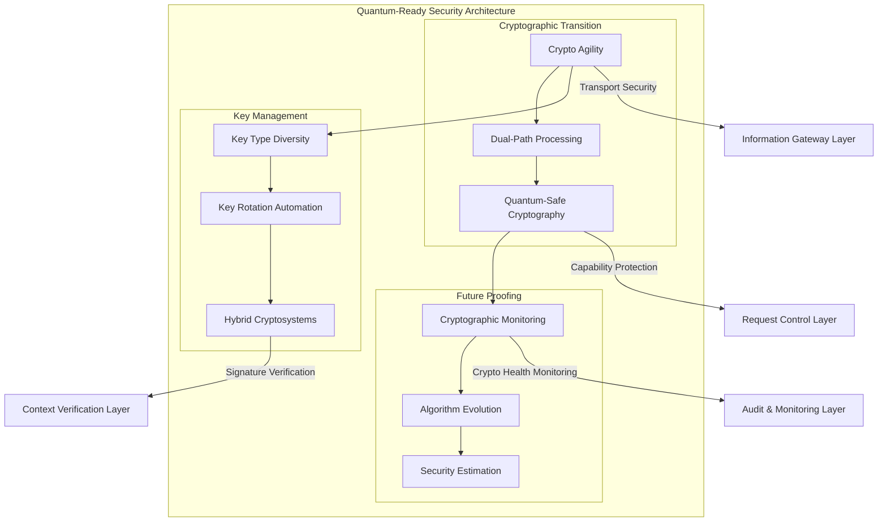
```mermaid
flowchart TB
    subgraph "Quantum-Ready Security Architecture"
        direction TB
        
        subgraph "Cryptographic Transition"
            CA[Crypto Agility]
            DP[Dual-Path Processing]
            QC[Quantum-Safe Cryptography]
        end
        
        subgraph "Key Management"
            KT[Key Type Diversity]
            KR[Key Rotation Automation]
            HC[Hybrid Cryptosystems]
        end
        
        subgraph "Future Proofing"
            CM[Cryptographic Monitoring]
            AE[Algorithm Evolution]
            SE[Security Estimation]
        end
        
        CA --> DP
        DP --> QC
        
        CA --> KT
        KT --> KR
        KR --> HC
        
        QC --> CM
        CM --> AE
        AE --> SE
    end
    
    CA -->|"Transport Security"| IGL[Information Gateway Layer]
    HC -->|"Signature Verification"| CVL[Context Verification Layer]
    QC -->|"Capability Protection"| RCL[Request Control Layer]
    CM -->|"Crypto Health Monitoring"| AML[Audit & Monitoring Layer]
```

## 7. Visualizations and Diagrams <a name="visualizations-and-diagrams"></a>

The following diagrams provide visual representations of GUARDRAIL's architecture, deployment models, and internal components:

- **Embedded Deployment Model:**
  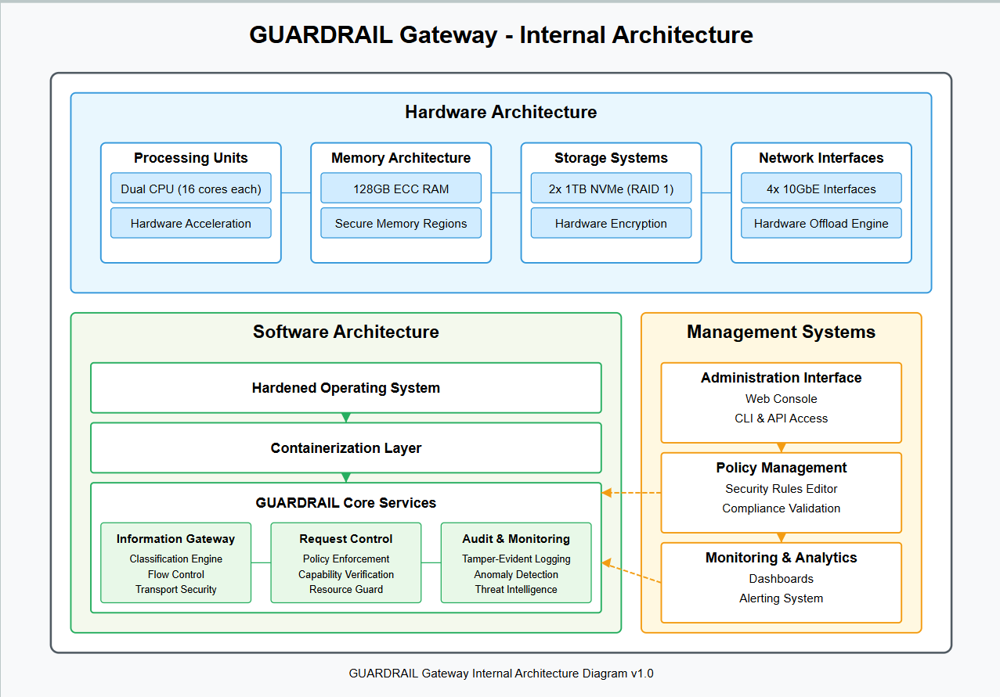

- **Gateway Deployment Model:**
  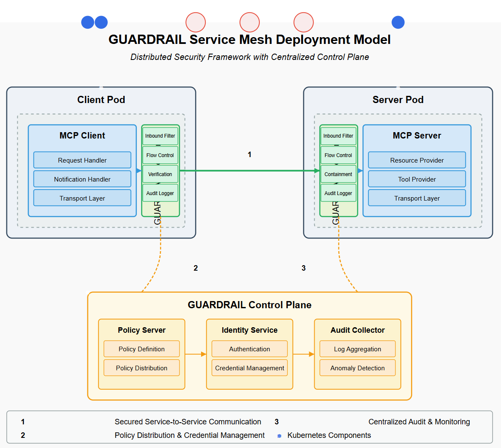

- **Gateway Internal Architecture:**
    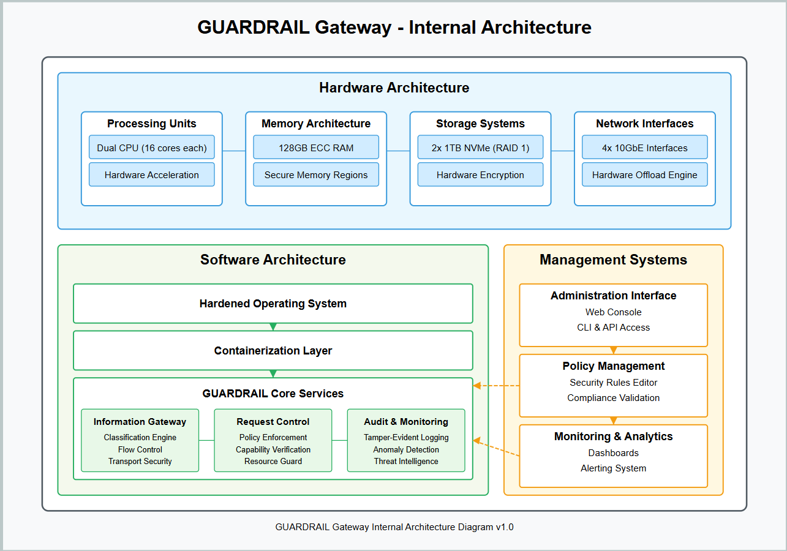

- **Service Mesh Deployment Model (First Instance):**
   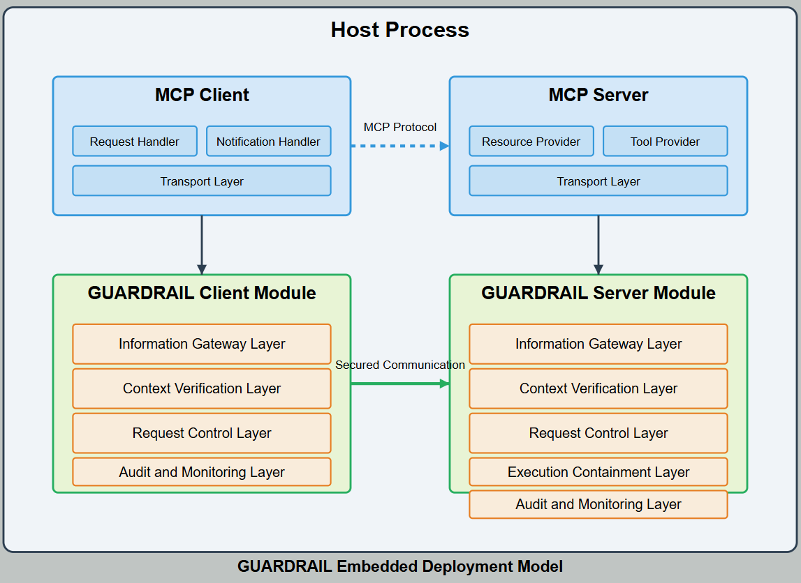

- **Service Mesh Deployment Model (Duplicate Instance):**
      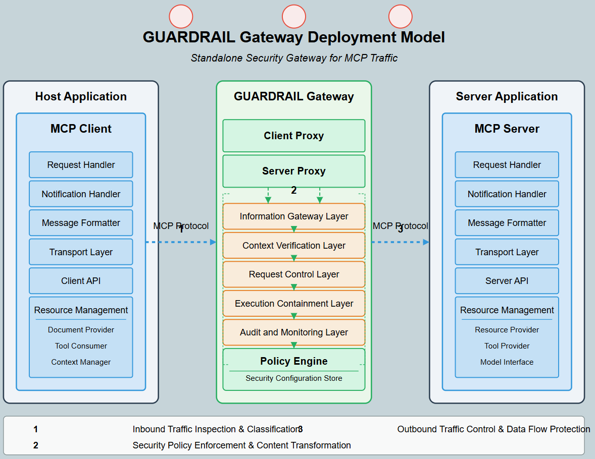

- **Gateway Deployment Model (Duplicate Instance):**
        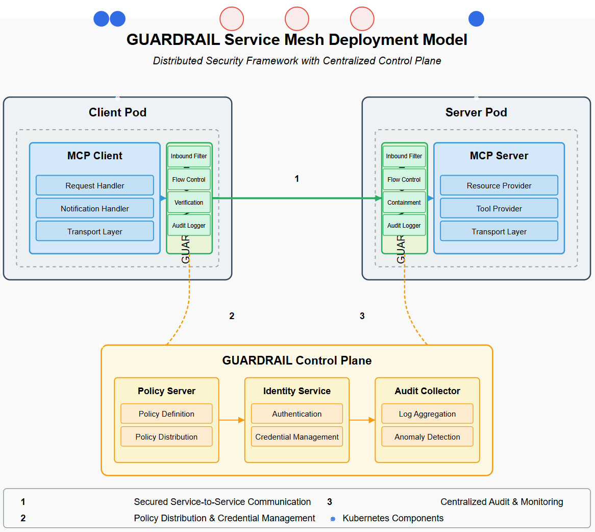

- **Gateway Internal Architecture (Duplicate instance):**
        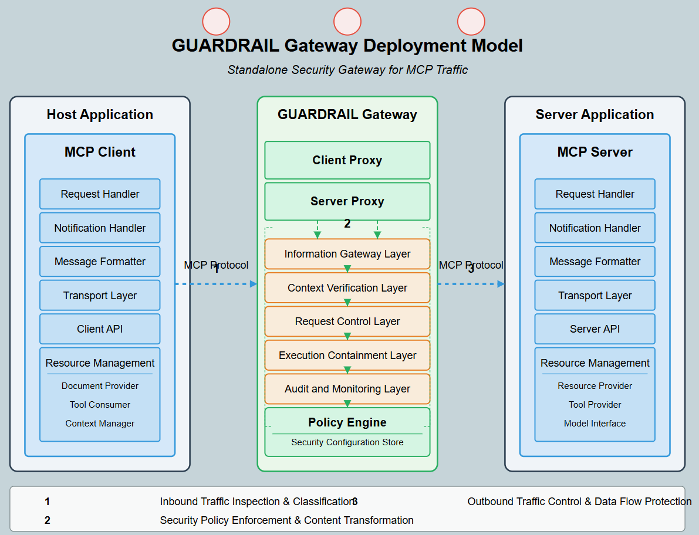

- **Gateway Data Flow Architecture:**
  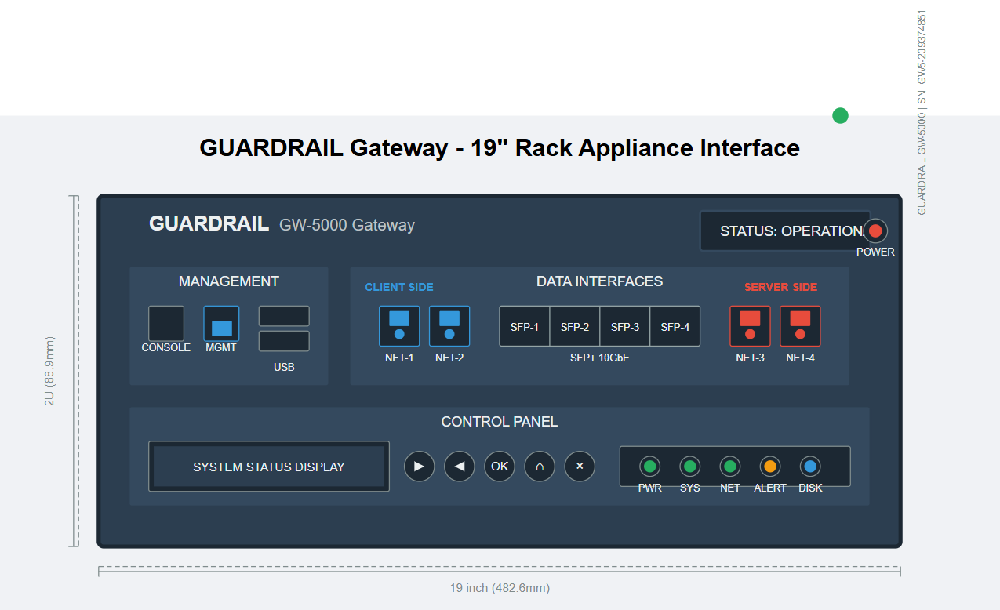

- **Gateway 19" Rack Appliance Interface:**
  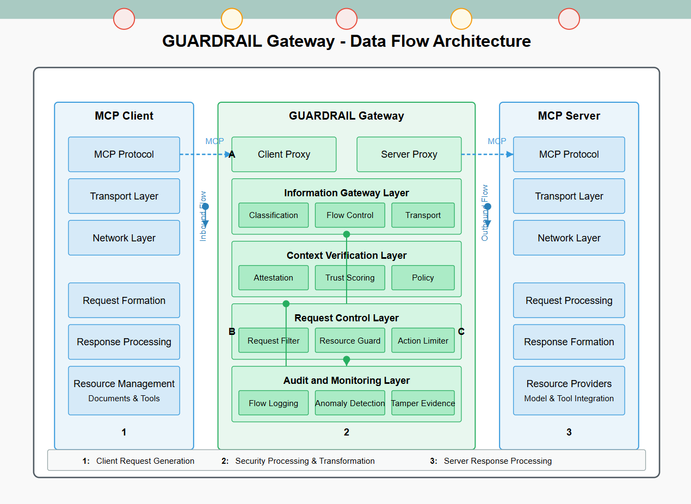

- **Sidecar Internal Architecture:**
  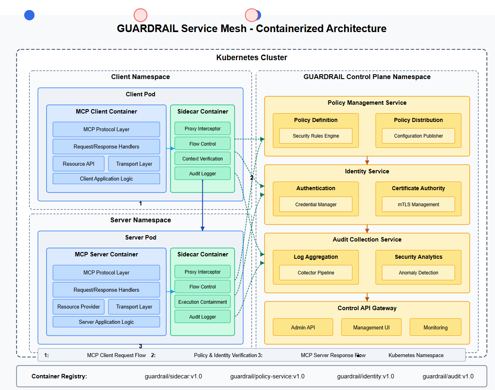

- **Service Mesh Containerized Architecture:**
  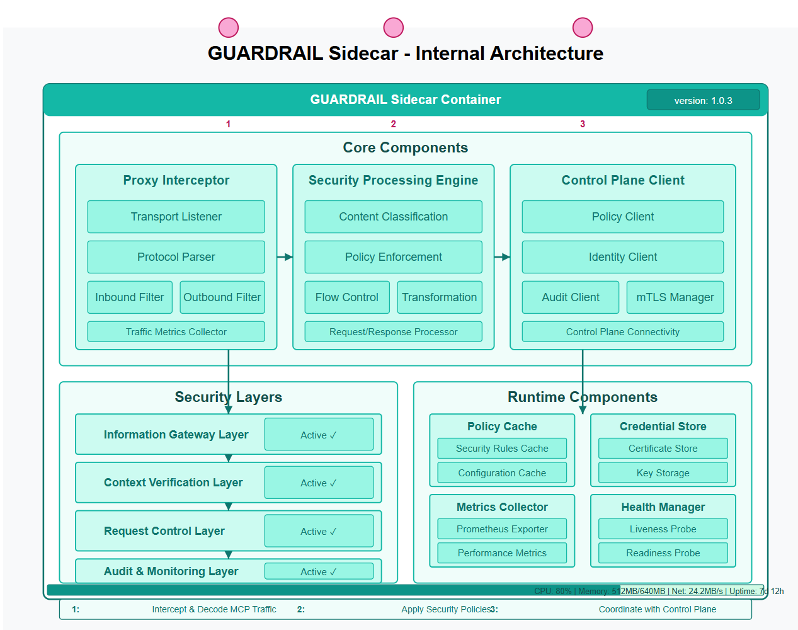

- **Service Mesh Control Plane Architecture:**
  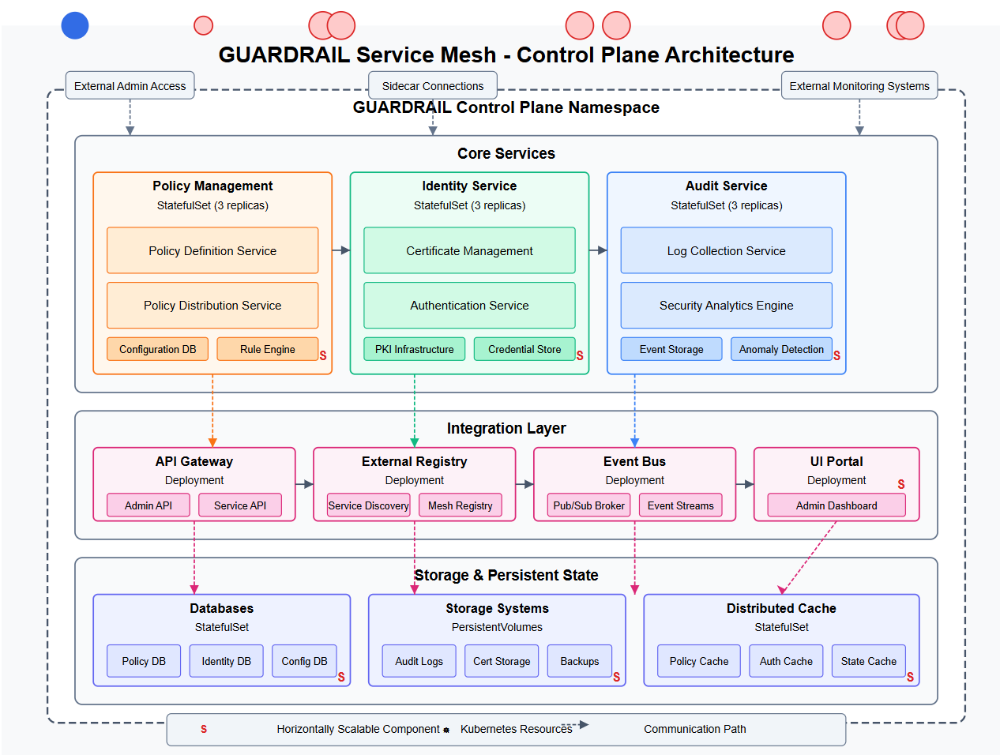

## 8. Detailed Documentation <a name="detailed-documentation"></a>

For a deeper understanding of GUARDRAIL, refer to the following documents:

*   [**Technical Specification (2-technical-spec.md)**](./2-technical-spec.md):  Provides a comprehensive technical description of all GUARDRAIL components, configurations, and protocols.
*   [**Architecture Diagrams (6-diags-mermaid.md)**](./6-diags-mermaid.md): Contains Mermaid diagrams illustrating various aspects of the GUARDRAIL architecture and workflows.

## 9. Emergency Response Framework <a name="emergency-response-framework"></a>

GUARDRAIL incorporates an Emergency Response Framework providing comprehensive procedures to detect, respond to, and recover from security incidents. For more information, see [Emergency Response Framework](./SHIELD-7-emergency-response-framework.md).

## 10. Getting Started (Future) <a name="getting-started-future"></a>

This section will provide instructions on how to install, configure, and use GUARDRAIL once production-ready code is available.

## 11. How to Contribute (Future) <a name="how-to-contribute-future"></a>

This section will provide guidelines for contributing to the GUARDRAIL project.

## 12. Roadmap (Future) <a name="roadmap-future"></a>

This section will outline the future development plans for GUARDRAIL.

## 13. License <a name="license"></a>

This project is licensed under the [MIT License](./LICENSE).
