# GUARDRAIL: Security Framework for Large Language Model Applications

# Practical Security vs. Framework Complexity: The GUARDRAIL Reality Check

You've hit on several critical practical concerns that cut straight to the heart of real-world application security. Let me address each point:

## 1. Isolation vs. Framework Complexity

Your "put a condom on" analogy is spot-on. Simple containerization or VM isolation often provides more immediate security benefits than complex frameworks. While GUARDRAIL offers sophisticated protocol-level security, basic isolation through Docker or VMs:

- Creates clear security boundaries
- Limits potential damage from compromises
- Requires minimal specialized knowledge to implement
- Provides proven protection with lower implementation risk

**Reality check**: For many teams, proper containerization with resource limits and minimal attack surface would deliver more immediate security value than implementing GUARDRAIL's multi-layered architecture.

## 2. The Credential Security Gap

The absence of clear credential security patterns in GUARDRAIL is a significant oversight. Basic credential security practices like:

- Secrets management (using tools like HashiCorp Vault or cloud key management)
- Environment variable segregation
- Credential rotation
- Least-privilege access patterns

...aren't explicitly addressed in the framework, despite being fundamental to application security.

**Reality check**: Storing API keys securely is more immediately valuable than implementing sophisticated protocol-level security annotations.

## 3. HTTP/SSE Implementation Mismatch

GUARDRAIL's protocol-agnostic approach might seem attractive, but it creates a disconnect from the specific security concerns of HTTP and SSE implementations, including:

- CORS policies
- Content Security Policy
- HTTP header security
- Cross-site scripting protection
- HTTP-specific authentication patterns

**Reality check**: Framework abstractions that don't connect to your actual transport mechanism (HTTP/SSE) create implementation gaps.

## 4. The Authentication Blind Spot

Authentication is curiously underdeveloped in GUARDRAIL, which focuses more on attestation between services than user authentication. It lacks:

- Integration patterns with identity providers
- Token validation and management
- Session security
- Authorization frameworks

**Reality check**: Without solid authentication fundamentals, other security layers become much less effective.

## 5. The Developer Knowledge Problem

Your most incisive point: GUARDRAIL doesn't solve the problem of "young devs with no background in app level security." Complex frameworks can actually exacerbate this problem by:

- Creating a false sense of security ("we implemented GUARDRAIL so we're secure")
- Adding complexity that obscures basic security principles
- Requiring specialized knowledge to implement correctly
- Potentially introducing new security gaps through misconfiguration

**Reality check**: Developer security education and simple, consistent security patterns often yield better outcomes than complex frameworks.

## Practical Recommendations

Instead of full GUARDRAIL implementation, consider:

1. **Start with basics**: Proper isolation, credential management, input validation, and output sanitization

2. **Implement LLM-specific controls**: Add targeted protections against prompt injection, jailbreaking, and data leakage

3. **Use established auth patterns**: Leverage battle-tested authentication libraries and frameworks rather than building custom solutions

4. **Security education**: Invest in developer security awareness specific to LLM applications

5. **Selective adoption**: If some GUARDRAIL concepts seem valuable (like the Information Gateway Layer), implement them pragmatically without the full framework complexity

## Conclusion

GUARDRAIL offers an academically interesting approach to LLM security but may overcomplicate what are often straightforward security challenges. Sometimes putting on the condom (basic isolation), handling credentials properly, and following established HTTP security practices will deliver more real security value than implementing complex architectural frameworks.

The gap between security theory and practice remains wide, and addressing fundamental developer security knowledge will likely yield better outcomes than adding architectural complexity through comprehensive frameworks like GUARDRAIL.


# Original README:


## Executive Summary

GUARDRAIL is a comprehensive security framework designed to protect Large Language Model (LLM) application ecosystems, particularly those built using the Model Context Protocol (MCP). It addresses critical security vulnerabilities inherent in LLM applications, focusing on preventing data exfiltration, data infiltration, unauthorized access, and resource abuse. GUARDRAIL provides a modular, layered, and extensible architecture, offering robust protection without sacrificing performance or usability. It prioritizes *practical, incremental adoption*, allowing developers to enhance security progressively.

## Project Status

GUARDRAIL is currently in active development. This repository contains the architectural design, technical specifications, and implementation documentation. Production-ready code components and reference implementations will be released incrementally. This README serves as the central hub for understanding the project.

## Table of Contents

- [GUARDRAIL: Security Framework for Large Language Model Applications](#guardrail-security-framework-for-large-language-model-applications)
- [Practical Security vs. Framework Complexity: The GUARDRAIL Reality Check](#practical-security-vs-framework-complexity-the-guardrail-reality-check)
  - [1. Isolation vs. Framework Complexity](#1-isolation-vs-framework-complexity)
  - [2. The Credential Security Gap](#2-the-credential-security-gap)
  - [3. HTTP/SSE Implementation Mismatch](#3-httpsse-implementation-mismatch)
  - [4. The Authentication Blind Spot](#4-the-authentication-blind-spot)
  - [5. The Developer Knowledge Problem](#5-the-developer-knowledge-problem)
  - [Practical Recommendations](#practical-recommendations)
  - [Conclusion](#conclusion)
- [Original README:](#original-readme)
  - [Executive Summary](#executive-summary)
  - [Project Status](#project-status)
  - [Table of Contents](#table-of-contents)
  - [1. Introduction ](#1-introduction-)
  - [2. Core Principles ](#2-core-principles-)
  - [3. Architecture Overview ](#3-architecture-overview-)
    - [3.1 Security Layers ](#31-security-layers-)
    - [3.2 Deployment Models ](#32-deployment-models-)
  - [4. Key Benefits ](#4-key-benefits-)
  - [5. Integration with MCP ](#5-integration-with-mcp-)
  - [6. Practical Security Innovations ](#6-practical-security-innovations-)
    - [6.1 Extensible Security Middleware (ESM) ](#61-extensible-security-middleware-esm-)
    - [6.2 Dynamic Security Context (DSC) ](#62-dynamic-security-context-dsc-)
    - [6.3 Protocol-Level Security Annotations ](#63-protocol-level-security-annotations-)
    - [6.4 Lightweight Attestation Protocol (LAP) ](#64-lightweight-attestation-protocol-lap-)
    - [6.5 Adaptive Resource Quotas (ARQ) ](#65-adaptive-resource-quotas-arq-)
    - [6.6 Security Event Correlation and Reporting (SECR) ](#66-security-event-correlation-and-reporting-secr-)
  - [7. Visualizations and Diagrams ](#7-visualizations-and-diagrams-)
  - [8. Detailed Documentation ](#8-detailed-documentation-)
  - [9. Emergency Response Framework ](#9-emergency-response-framework-)
  - [10. License ](#10-license-)
  - [11. Phase 1 Implementation: Foundation (0-3 Months)  ](#11-phase-1-implementation-foundation-0-3-months--)
    - [11.1 Executive Summary ](#111-executive-summary-)
    - [11.2 Objectives ](#112-objectives-)
    - [11.3 Protocol-Level Security Annotations (Implementation Details) ](#113-protocol-level-security-annotations-implementation-details-)
      - [11.3.1 JSON Schema ](#1131-json-schema-)
      - [11.3.2 Code Examples (TypeScript/Python) ](#1132-code-examples-typescriptpython-)
      - [11.3.3 Classification Levels ](#1133-classification-levels-)
      - [11.3.4 Integrity Verification ](#1134-integrity-verification-)
    - [11.4 Dynamic Security Context (DSC) - Initial Implementation ](#114-dynamic-security-context-dsc---initial-implementation-)
      - [11.4.1 DSC Class Definition (TypeScript/Python) ](#1141-dsc-class-definition-typescriptpython-)
      - [11.4.2 Trust Score Algorithm ](#1142-trust-score-algorithm-)
      - [11.4.3 Secure Initialization ](#1143-secure-initialization-)
      - [11.4.4 Code Examples (TypeScript/Python) ](#1144-code-examples-typescriptpython-)
    - [11.5 Extensible Security Middleware (ESM) - Core Modules ](#115-extensible-security-middleware-esm---core-modules-)
      - [11.5.1 ESM Module Interface ](#1151-esm-module-interface-)
      - [11.5.2 Core Module Implementations ](#1152-core-module-implementations-)
      - [11.5.3 ESM Configuration ](#1153-esm-configuration-)
      - [11.5.4 Integration with MCP Client/Server ](#1154-integration-with-mcp-clientserver-)
    - [11.6 Timeline and Deliverables ](#116-timeline-and-deliverables-)
    - [11.7 Testing Strategy ](#117-testing-strategy-)
    - [11.8 Resource Requirements ](#118-resource-requirements-)
    - [11.9 Risk Mitigation ](#119-risk-mitigation-)
  - [12. Future Enhancements and Roadmap  ](#12-future-enhancements-and-roadmap--)
    - [12.1 Short-Term (Phase 2 - 3-6 Months) ](#121-short-term-phase-2---3-6-months-)
    - [12.2 Medium-Term (Phase 3 - 6-12 Months) ](#122-medium-term-phase-3---6-12-months-)
    - [12.3 Long-Term (Phase 4 - 12+ Months) ](#123-long-term-phase-4---12-months-)
  - [13. Community and Governance  ](#13-community-and-governance--)
    - [13.1 Guiding Principles ](#131-guiding-principles-)
    - [13.2 Governance Structure ](#132-governance-structure-)
    - [13.3 Contribution Process ](#133-contribution-process-)
    - [13.4 Communication Channels ](#134-communication-channels-)
    - [13.5 Code of Conduct ](#135-code-of-conduct-)


## 1. Introduction <a name="introduction"></a>

Large Language Models (LLMs) are rapidly transforming various industries, but their power and complexity introduce significant security risks. The Model Context Protocol (MCP) aims to standardize communication between LLM applications and services. GUARDRAIL addresses the inherent security challenges by providing a comprehensive and *incrementally adoptable* security framework specifically tailored for MCP and other LLM application ecosystems.  It is designed to be practical and easy to integrate, starting with simple enhancements and progressing to more advanced security measures.

## 2. Core Principles <a name="core-principles"></a>

GUARDRAIL is built on the following core principles:

1.  **Information Flow Control:** Strict policies govern the movement of information, preventing unauthorized data exfiltration and infiltration. This includes data classification and fine-grained control over data access.
2.  **Contextual Security:** Security decisions are made based on the *dynamic* execution context, including continuous trust assessment.
3.  **Transport-Agnostic Protection:** Security guarantees are provided *regardless* of the underlying transport mechanism.
4.  **Least-Privilege Execution:** All components operate with the *minimum* necessary permissions, granted just-in-time and revoked when no longer needed.
5. **Zero Trust:** No component or user is inherently trusted. Continuous verification is required.

## 3. Architecture Overview <a name="architecture-overview"></a>

### 3.1 Security Layers <a name="security-layers"></a>

GUARDRAIL implements a multi-layered architecture, with each layer providing distinct security controls.  These layers can be implemented *incrementally*, starting with the most critical.

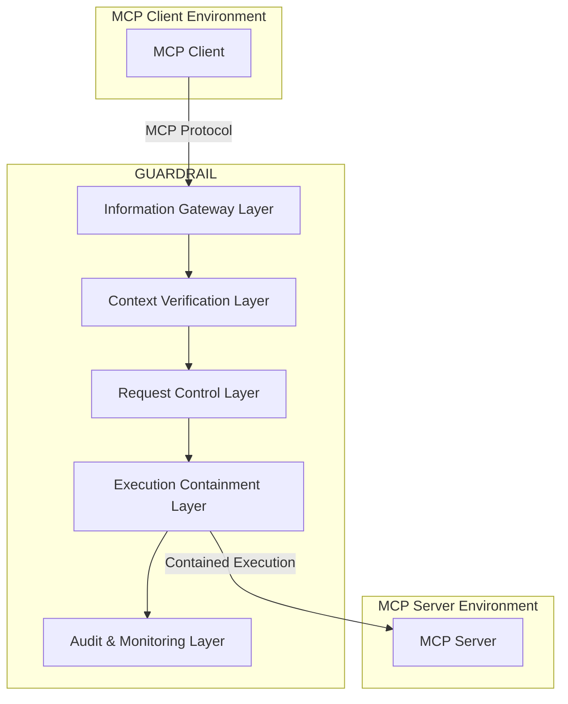
```mermaid
flowchart TB
    subgraph "MCP Client Environment"
        MC[MCP Client]
    end

    subgraph "GUARDRAIL"
        direction TB
        IGL[Information Gateway Layer]
        CVL[Context Verification Layer]
        RCL[Request Control Layer]
        ECL[Execution Containment Layer]
        AML[Audit & Monitoring Layer]

        IGL --> CVL
        CVL --> RCL
        RCL --> ECL
        ECL --> AML
    end

    subgraph "MCP Server Environment"
        MS[MCP Server]
    end

    MC -- "MCP Protocol" --> IGL
    ECL -- "Contained Execution" --> MS
```

*   **Information Gateway Layer (IGL):**  Manages information flows, content classification, flow policy enforcement, and transport security. *This is a primary focus for initial implementations.*
*   **Context Verification Layer (CVL):** Establishes trust through attestation and client/server verification. *Can be added after the IGL is established.*
*   **Request Control Layer (RCL):** Implements fine-grained access control, request filtering, and action limiting. *Adds another layer of defense on top of context verification.*
*   **Execution Containment Layer (ECL):** Ensures code execution within secure, isolated boundaries (e.g., using containers or sandboxes). *This is for more advanced deployments with higher security needs.*
*   **Audit and Monitoring Layer (AML):** Provides visibility into system operations and security events.  *Essential for monitoring and incident response.*

### 3.2 Deployment Models <a name="deployment-models"></a>

GUARDRAIL can be deployed in several configurations:

1.  **Embedded Model:** GUARDRAIL components are integrated directly into the host process (both client and server). This is suitable for standalone applications or development/testing environments.

2.  **Gateway Model:** GUARDRAIL operates as a standalone security gateway, mediating *all* MCP traffic. This is ideal for enterprise deployments with strict security requirements.

3.  **Service Mesh Model:** GUARDRAIL components are deployed as sidecars within a Kubernetes environment (or similar). This is best suited for cloud-native and microservices architectures.

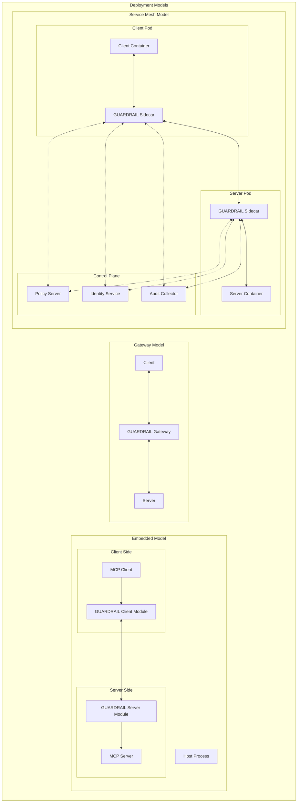
```mermaid
flowchart TB
    subgraph "Deployment Models"
        direction LR

        subgraph "Embedded Model"
            direction TB
            HC[Host Process]

            subgraph "Client Side"
                MCC[MCP Client]
                GC[GUARDRAIL Client Module]

                MCC --> GC
            end

            subgraph "Server Side"
                MCS[MCP Server]
                GS[GUARDRAIL Server Module]

                GS --> MCS
            end

            GC <---> GS
        end

        subgraph "Gateway Model"
            direction TB
            CL[Client]
            GW[GUARDRAIL Gateway]
            SV[Server]

            CL <---> GW
            GW <---> SV
        end

        subgraph "Service Mesh Model"
            direction TB

            subgraph "Client Pod"
                CP[Client Container]
                CS[GUARDRAIL Sidecar]

                CP <---> CS
            end

            subgraph "Server Pod"
                SP[Server Container]
                SS[GUARDRAIL Sidecar]

                SS <---> SP
            end

            subgraph "Control Plane"
                PS[Policy Server]
                IS[Identity Service]
                AS[Audit Collector]
            end

            CS <---> SS
            CS <-..-> PS
            CS <-..-> IS
            CS <-..-> AS
            SS <-..-> PS
            SS <-..-> IS
            SS <-..-> AS
        end
    end
```

## 4. Key Benefits <a name="key-benefits"></a>

GUARDRAIL provides:

1.  **Comprehensive Information Flow Control:** Prevents unauthorized data exfiltration and infiltration.
2.  **Contextual Security:** Security adapts to the execution environment.
3.  **Compatibility:** Works with existing MCP implementations.
4.  **Attack Prevention:** Protects against common LLM-specific vulnerabilities (e.g., prompt injection, resource abuse).
5.  **Auditability:** Provides visibility into information flows for investigations and compliance.
6.  **Incremental Adoption:** Allows organizations to start with basic security and add more layers as needed.

## 5. Integration with MCP <a name="integration-with-mcp"></a>

GUARDRAIL is designed for seamless integration with MCP. It provides wrapper classes for MCP Clients and Servers and can also hook in at a lower level, using the ESM.

```typescript
// Client Integration Example
import { Client } from "@modelcontextprotocol/sdk/client";
import { GuardrailClient } from "@guardrail/sdk/client";

// Initialize standard MCP client
const mcpClient = new Client({
  name: "example-client",
  version: "1.0.0"
});

// Wrap with Guardrail protection (Basic)
const client = new GuardrailClient(mcpClient, {
  security: {
    classification_level: "INTERNAL", // Start with basic classification
    // Add more options later as needed.
  }
});

// Normal MCP operations now protected by Guardrail
await client.connect(transport);
```

## 6. Practical Security Innovations <a name="practical-security-innovations"></a>

GUARDRAIL incorporates key innovations designed for *practical implementation and incremental adoption*. These are the building blocks of a secure MCP ecosystem.

### 6.1 Extensible Security Middleware (ESM) <a name="extensible-security-middleware-esm"></a>

The ESM provides a pluggable architecture *within* MCP client and server implementations, allowing for customized security processing of MCP messages. It sits between the MCP protocol layer and the transport layer.

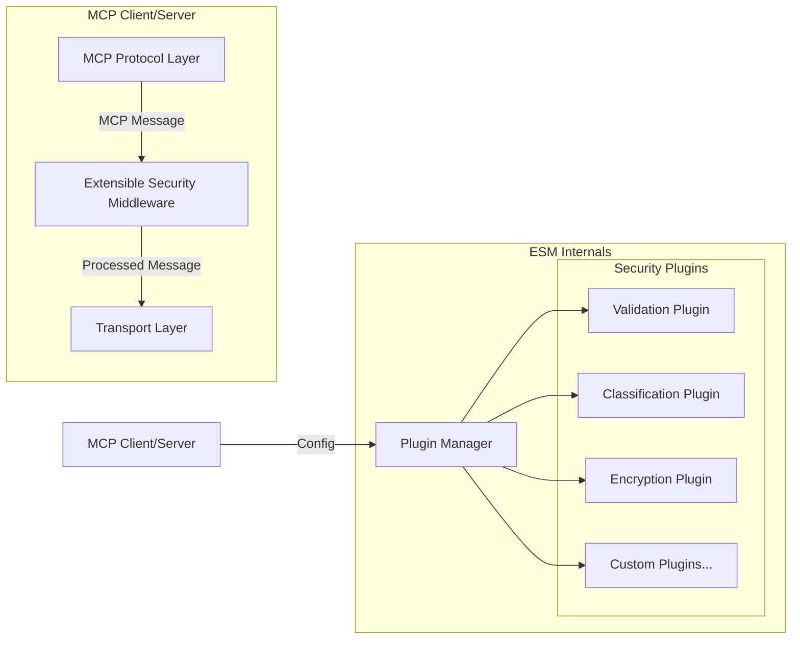
```mermaid
flowchart LR
    subgraph "MCP Client/Server"
        direction TB
        MP[MCP Protocol Layer]
        ESM[Extensible Security Middleware]
        TL[Transport Layer]

        MP -- "MCP Message" --> ESM
        ESM -- "Processed Message" --> TL
    end

    subgraph "ESM Internals"
        direction TB
        PM[Plugin Manager]
        subgraph "Security Plugins"
            SP1[Validation Plugin]
            SP2[Classification Plugin]
            SP3[Encryption Plugin]
            SP4[Custom Plugins...]
        end
        PM --> SP1
        PM --> SP2
        PM --> SP3
        PM --> SP4
    end
    MC[MCP Client/Server] -- "Config" --> PM
```

*   **Key Features:**
    *   **Pluggable Modules:** Security functions are implemented as modules (e.g., `validate`, `transform`, `preSend`, `postReceive`).
    *   **Module Chaining:** Modules can be chained in a configurable sequence.
    *   **Asynchronous Operation:** Avoids blocking the main MCP thread.
    *   **Context-Aware:** Modules access the MCP context and the Dynamic Security Context (DSC).
    *   **Policy-Driven:** Module behavior is controlled by declarative policies.

*   **Benefits:** Flexibility, extensibility, performance, and testability.

### 6.2 Dynamic Security Context (DSC) <a name="dynamic-security-context-dsc"></a>

The DSC is a *shared, mutable* object that maintains security-relevant information about an MCP connection. It enables *adaptive security* based on observed behavior.

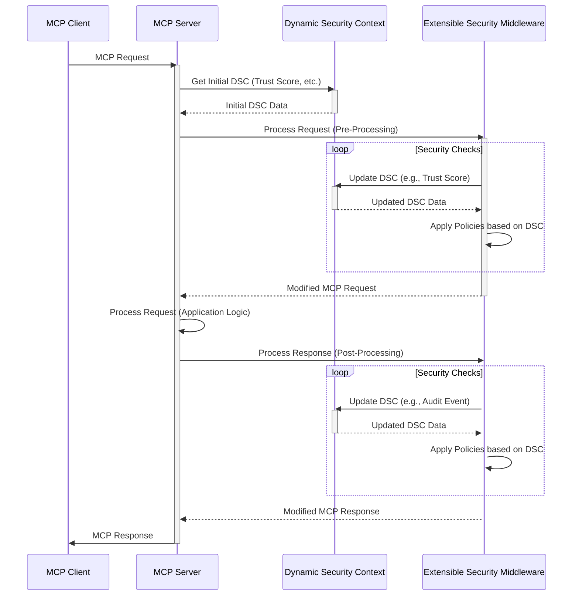
```mermaid
sequenceDiagram
    participant Client as MCP Client
    participant Server as MCP Server
    participant DSC as Dynamic Security Context
    participant ESM as Extensible Security Middleware

    Client->>Server: MCP Request
    activate Server
    Server->>DSC: Get Initial DSC (Trust Score, etc.)
    activate DSC
    DSC-->>Server: Initial DSC Data
    deactivate DSC
    Server->>ESM: Process Request (Pre-Processing)
    activate ESM

    loop Security Checks
        ESM->>DSC: Update DSC (e.g., Trust Score)
        activate DSC
        DSC-->>ESM: Updated DSC Data
        deactivate DSC
        ESM->>ESM: Apply Policies based on DSC
    end

    ESM-->>Server: Modified MCP Request
    deactivate ESM

    Server->>Server: Process Request (Application Logic)

    Server->>ESM: Process Response (Post-Processing)
    activate ESM
      loop Security Checks
        ESM->>DSC: Update DSC (e.g., Audit Event)
        activate DSC
        DSC-->>ESM: Updated DSC Data
        deactivate DSC
        ESM->>ESM: Apply Policies based on DSC
    end
    ESM-->>Server: Modified MCP Response

    Server->>Client: MCP Response
    deactivate Server
```

*   **Key Features:**
    *   **Trust Score:** A numerical representation of trustworthiness, adjusted by events.
    *   **Threat Level:** A categorical indicator of risk (e.g., "low," "medium," "high").
    *   **Capability Attenuation:** Capabilities can be dynamically restricted.
    *   **Session Data:** Securely stores session-specific information.
    *   **Event History:** Maintains a history of security-relevant events.

* **Benefits:** Adaptive security, zero-trust foundation, fine-grained control, improved resilience.

### 6.3 Protocol-Level Security Annotations <a name="protocol-security"></a>

This introduces *optional* security metadata fields *within* the MCP message structure itself.

```json
{
  "jsonrpc": "2.0",
  "method": "someMethod",
  "params": {
    "data": "..."
  },
  "security": { // OPTIONAL security metadata
    "classification": "INTERNAL", // e.g., PUBLIC, INTERNAL, SENSITIVE
    "integrity": "sha256:...",  // Hash of message content
    "source": "client:123",       // Identifier of sender
    "sequence": 42,              // Sequence number
    "transformations": [        // OPTIONAL array of transformations
        "redacted:pii"
    ]
  },
  "id": 1
}
```
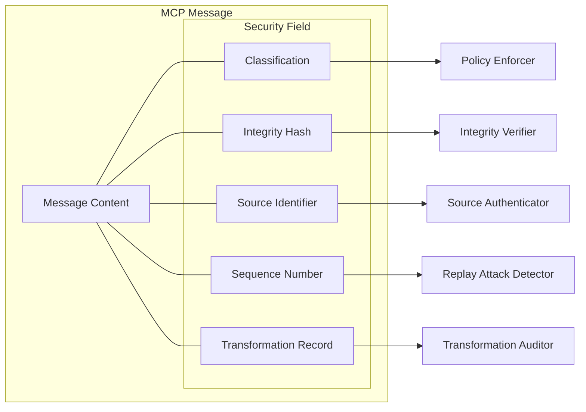
```mermaid
flowchart LR
    subgraph "MCP Message"
        MSG[Message Content]

        subgraph "Security Field"
            CL[Classification]
            INT[Integrity Hash]
            SRC[Source Identifier]
            SEQ[Sequence Number]
            TR[Transformation Record]
        end
    end

    MSG --- CL
    MSG --- INT
    MSG --- SRC
    MSG --- SEQ
    MSG --- TR

    CL --> PL[Policy Enforcer]
    INT --> IV[Integrity Verifier]
    SRC --> SA[Source Authenticator]
    SEQ --> RA[Replay Attack Detector]
    TR --> TA[Transformation Auditor]
```

*   **Key Features:**
    *   `classification`: Sensitivity level of the message content.
    *   `integrity`: Cryptographic hash to verify message integrity.
    *   `source`: Identifies the sender.
    *   `sequence`: Prevents replay attacks.
    *   `transformations` (optional): Describes transformations applied to the message.

*   **Benefits:** Increased transparency, simplified security processing, improved interoperability, and defense in depth.

### 6.4 Lightweight Attestation Protocol (LAP) <a name="lap-new"></a>

LAP provides a mechanism for MCP clients and servers to *verify each other's identity and environment integrity*. It's built on top of MCP, using custom message types.

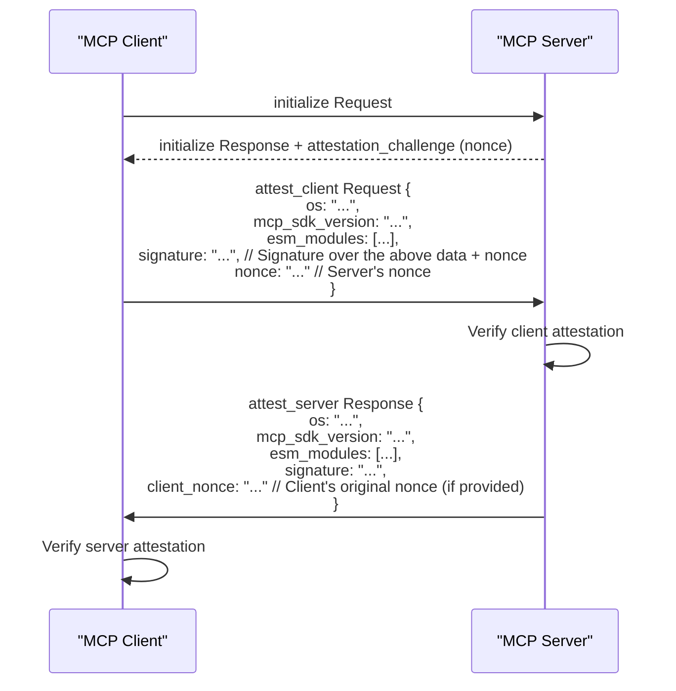
```mermaid
sequenceDiagram
    participant Client as "MCP Client"
    participant Server as "MCP Server"

    Client->>Server: initialize Request
    Server-->>Client: initialize Response + attestation_challenge (nonce)

    Client->>Server: attest_client Request {<br>    os: "...",<br>    mcp_sdk_version: "...",<br>    esm_modules: [...],<br>    signature: "...", // Signature over the above data + nonce<br>    nonce: "..." // Server's nonce<br>}
    Server->>Server: Verify client attestation

    Server->>Client: attest_server Response {<br>    os: "...",<br>    mcp_sdk_version: "...",<br>    esm_modules: [...],<br>    signature: "...",<br>    client_nonce: "..." // Client's original nonce (if provided)<br>}

    Client->>Client: Verify server attestation

```

*   **Key Features:**
    *   **Mutual Attestation:** Both client and server verify each other.
    *   **Challenge-Response:** Uses nonces to prevent replay attacks.
    *   **Environment Information:** Exchanges OS, SDK version, and loaded ESM modules.
    *   **Cryptographic Signatures:** Ensures authenticity of attestation data.
    *   **Periodic Re-attestation:**  Can be performed periodically.
    *   **Trust Score Integration:**  Results affect the DSC trust score.

*   **Benefits:** Enhanced trust, reduced attack surface, and improved security posture.

### 6.5 Adaptive Resource Quotas (ARQ) <a name="arq-new"></a>

ARQ allows MCP servers to *dynamically adjust resource quotas* (CPU, memory, network, requests/second) for each client, based on the DSC.

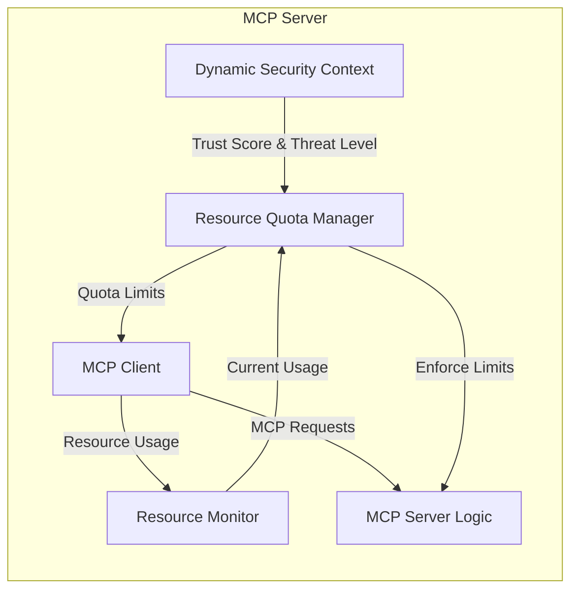
```mermaid
flowchart LR
    subgraph "MCP Server"
        DSC[Dynamic Security Context]
        RQ[Resource Quota Manager]
        RM[Resource Monitor]
        MC[MCP Client]

        DSC -- "Trust Score & Threat Level" --> RQ
        MC -- "Resource Usage" --> RM
        RM -- "Current Usage" --> RQ
        RQ -- "Quota Limits" --> MC
        MC -- "MCP Requests" --> MS[MCP Server Logic]
        RQ --"Enforce Limits"--> MS
    end
```

*   **Key Features:**
    *   **Baseline Quotas:** Default quotas for each resource.
    *   **Dynamic Adjustment:** Quotas adjusted in real-time based on the DSC.
    *   **Per-Client Quotas:** Tracked individually for each client.
    *   **Graduated Enforcement:** Throttling and rate limiting.
    *   **Feedback to Clients:** Clients informed about their quotas.

*   **Benefits:** Resource protection, adaptive security, fairness, and improved stability.

### 6.6 Security Event Correlation and Reporting (SECR) <a name="secr-new"></a>

SECR builds upon MCP's notification system to create a comprehensive security event reporting and analysis framework.

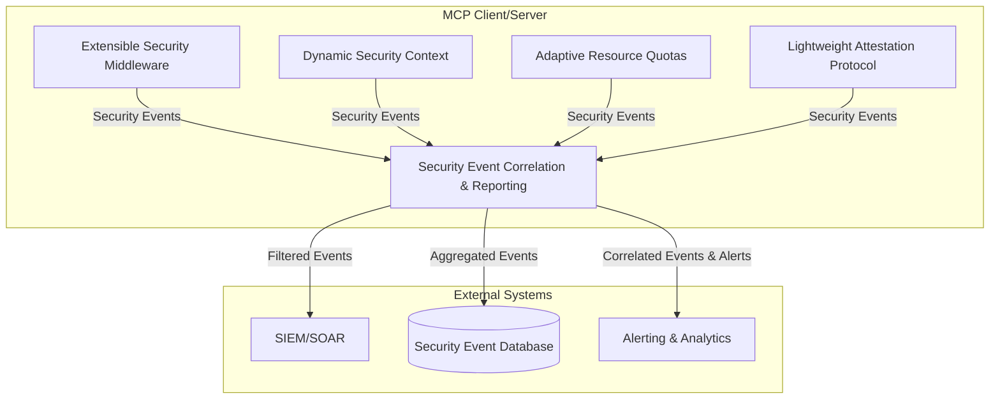
```mermaid
flowchart TB
    subgraph "MCP Client/Server"
        ESM[Extensible Security Middleware]
        DSC[Dynamic Security Context]
        ARQ[Adaptive Resource Quotas]
        LAP[Lightweight Attestation Protocol]

        ESM -- "Security Events" --> SECR[Security Event Correlation & Reporting]
        DSC -- "Security Events" --> SECR
        ARQ -- "Security Events" --> SECR
        LAP -- "Security Events" --> SECR
    end

    subgraph "External Systems"
        SIEM[SIEM/SOAR]
        DB[(Security Event Database)]
        AA[Alerting & Analytics]
    end

        SECR -- "Filtered Events" --> SIEM
    SECR -- "Aggregated Events" --> DB
    SECR -- "Correlated Events & Alerts" --> AA
```

*   **Key Features:**
    *   **Standardized Event Formats:** Common schema for security events (e.g., `event.security.authentication.failed`).
    *   **Event Filtering and Routing:** Subscribe to specific event types.
    *   **Event Correlation:** Identifies patterns of suspicious activity.
    *   **External Integration:** Exports events to SIEM/SOAR systems.
    *   **Auditing and Reporting:** Centralized view of security events.

*   **Benefits:** Improved visibility, faster incident response, proactive threat hunting, and compliance reporting.

## 7. Visualizations and Diagrams <a name="visualizations-and-diagrams"></a>

The following diagrams provide visual representations of GUARDRAIL's architecture, deployment models, and internal components:

- **Embedded Deployment Model:**
  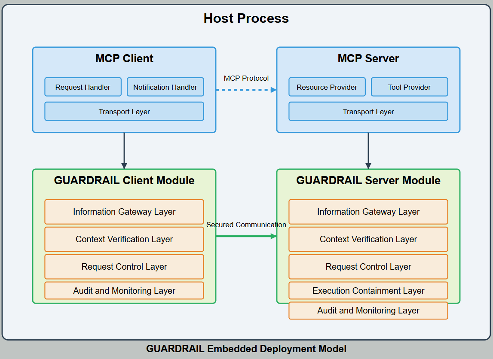

- **Gateway Deployment Model:**
  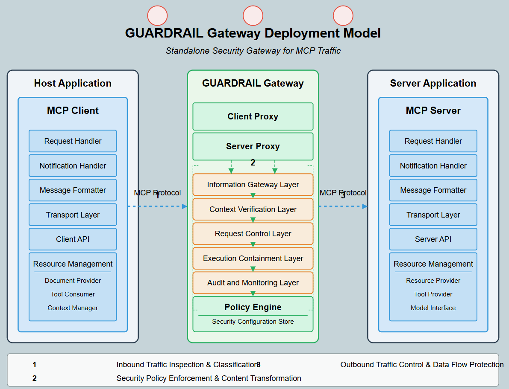

- **Service Mesh Deployment Model:**
  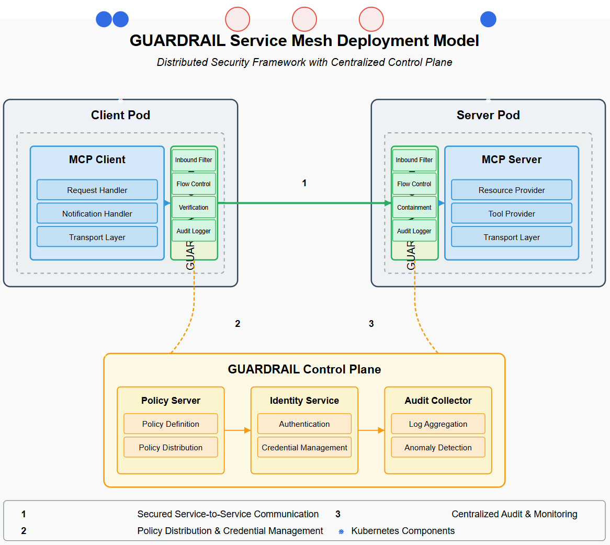

- **Gateway - Internal Architecture:**
  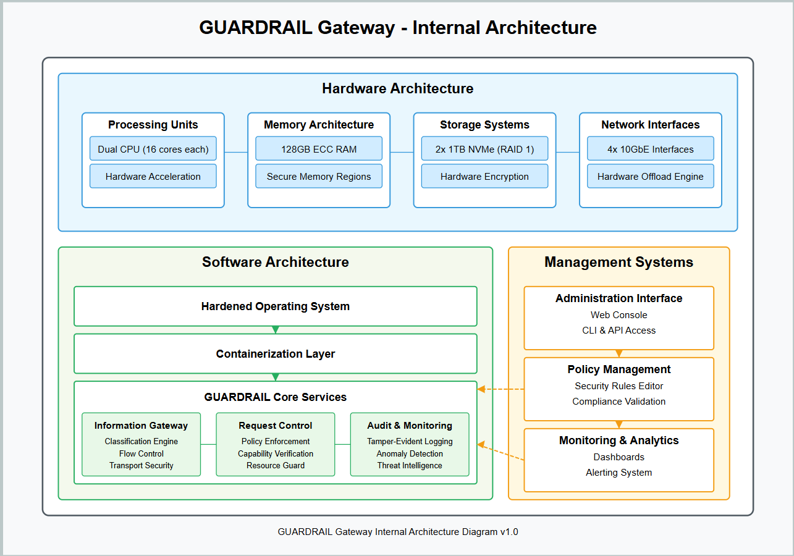

- **Gateway - 19" Rack Appliance**
  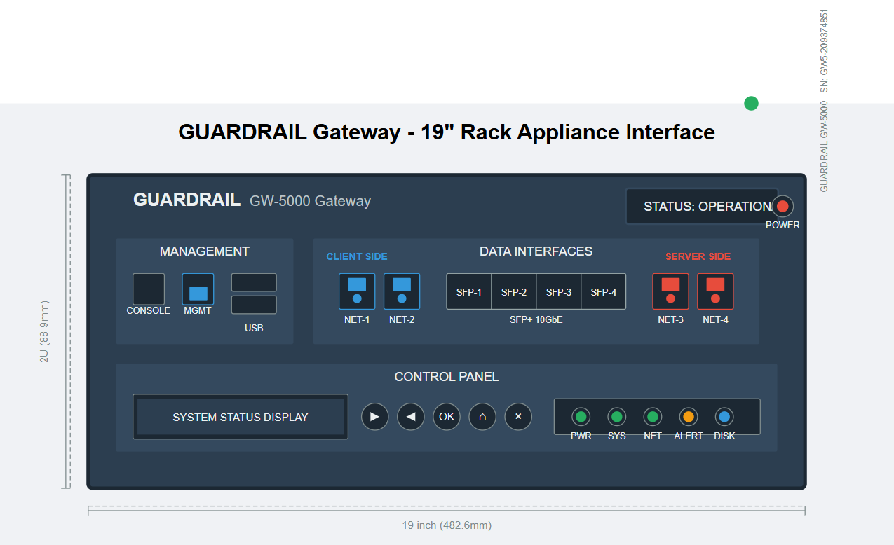

- **Gateway - Data Flow Architecture:**
  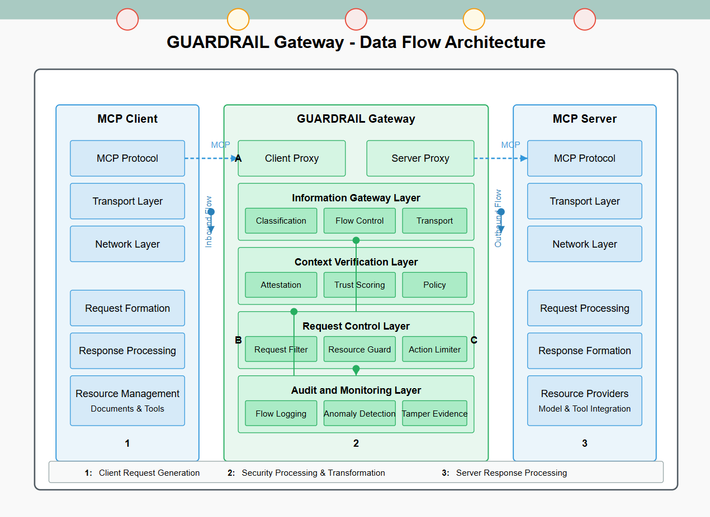

- **Service Mesh - Containerized Architecture:**
  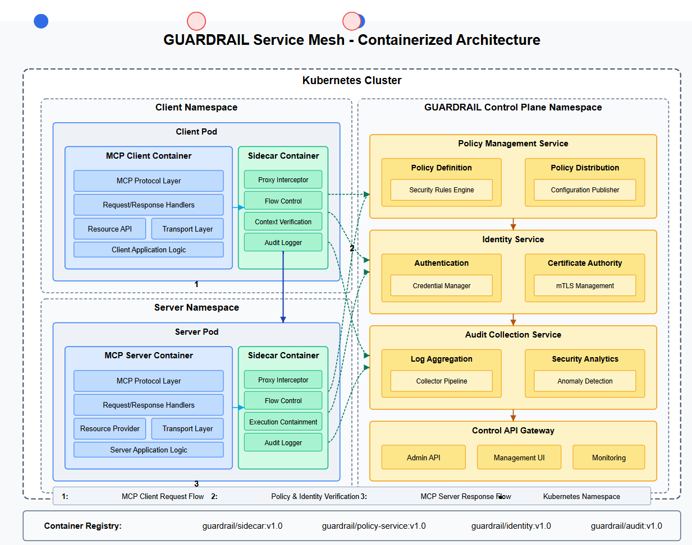

- **Service Mesh Sidecar - Internal Architecture:**
  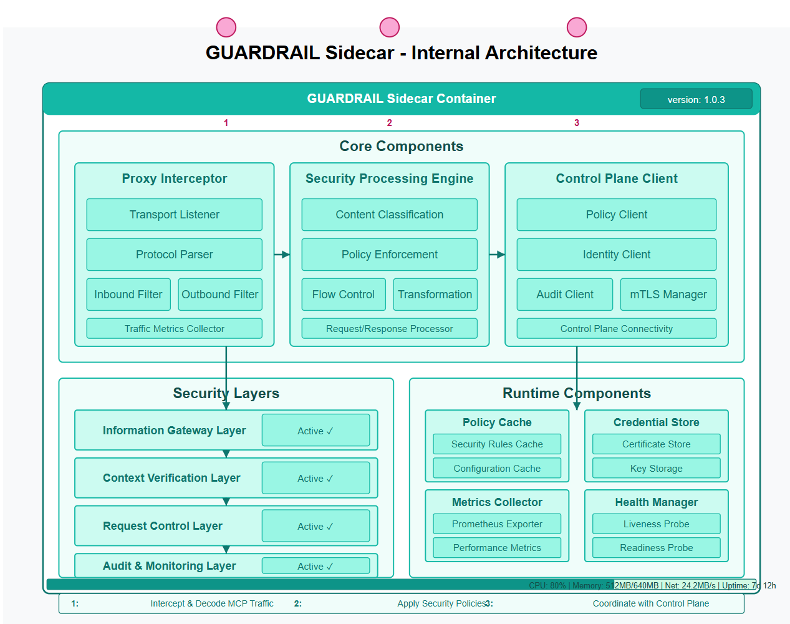

- **Service Mesh - Control Plane Architecture:**
  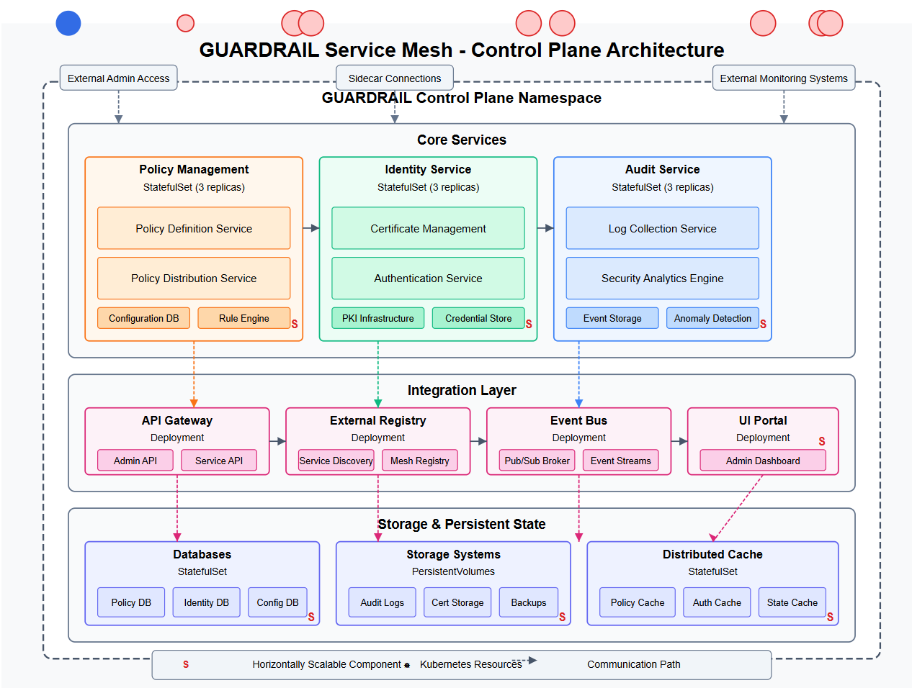

## 8. Detailed Documentation <a name="detailed-documentation"></a>

While this README serves as the primary, definitive source for understanding the GUARDRAIL framework, several supplementary documents exist that capture various stages of brainstorming, design iterations, and more detailed technical explorations. These documents should be considered *supporting material* and may contain ideas that are still under development, have been superseded, or represent alternative approaches. However, they can be valuable for understanding the evolution of the design and for exploring specific aspects in greater depth.

**Important Note:** The documents referenced below represent different points in the GUARDRAIL design process. This README reflects the *current, prioritized, and more practical approach*. If discrepancies exist between the README and these supplementary documents, the README should be considered the authoritative source.

Here's a guide to the supplementary documents:

*   [**Technical Specification (2-technical-spec.md)**](./2-technical-spec.md): This document is the most comprehensive technical deep-dive, representing an *early, expansive vision* of GUARDRAIL. It includes detailed specifications for all layers, components, configurations, and algorithms. While the core principles remain valid, the implementation details and overall architecture have been streamlined in this README (especially in Section 6). Use this for:
    *   **Detailed Component Requirements:** Granular specifications for each layer.
    *   **Configuration Schemas:** JSON schemas for all configurable aspects.
    *   **Algorithm Descriptions:** In-depth explanations of core algorithms.
    *   **Threat Model:** A detailed threat model and countermeasures.
    *   **Conformance Levels:** Definitions of different conformance levels.

*   [**Architecture Diagrams (6-diags-mermaid.md)**](./6-diags-mermaid.md): A collection of Mermaid diagrams visualizing various aspects of GUARDRAIL, including some earlier, more complex design ideas. Use this for:
    *   **Alternative Workflow Diagrams:** Different perspectives on core workflows.
    *   **Detailed Component Interactions:** Granular views of internal component relationships.
    *   **Deployment Model Variations:** More detailed diagrams of deployment options.
    *   **Emergency Response Flows:** Visualizations of emergency response procedures.
    *   **Exploration of Earlier Concepts:** Diagrams of earlier design iterations.

*   [**Initial GUARDRAIL Proposal (1-GUARDRAIL-mcp-security-claude.md)**](./1-GUARDRAIL-mcp-security-claude.md): This document represents an *initial proposal* for the GUARDRAIL framework, generated by Claude. It provides a good overview of the initial problem statement and proposed solution, but it predates the refinements and practical considerations outlined in this README.  It's useful for understanding the *original motivation and conceptual basis* for GUARDRAIL.

*    **[Emergency Response Framework](./SHIELD-7-emergency-response-framework.md)**. This doc details the emergency response plan, a key compoennt of the overall security strategy. Note that this doc still uses the SHIELD naming convention, which is a historical artifact.

*   **Synthesis and Innovation Documents (various `*-synthesis-*.md` files):** These documents (e.g., `7-synthesis-gemini.md`, `9-new-innovations-diags-claude.md`, `10-new-innovations-claude.md`) represent *intermediate brainstorming and synthesis steps*. They explore various new innovations and enhancements to GUARDRAIL, combining ideas from different sources and iterating on the design. These are useful for understanding the *thought process* behind the "Practical Security Innovations" presented in Section 6 of this README.  However, the final, refined versions of these innovations are described in *this* README.

*   **Critical Analysis Documents (15-CRITICAL-ANALYSIS-claude-and-gemini.md):** This document provides a *critical review* of the GUARDRAIL framework and explores alternative approaches to securing MCP. It highlights the strengths and weaknesses of GUARDRAIL and discusses the trade-offs of different design choices. This is valuable for understanding the *rationale* behind the move towards a more practical, incremental approach.

*   **Diagram Source Files (various `SVG-*.svg.txt` files):** These files contain the source code (in SVG format) for the diagrams included in this README and in `6-diags-mermaid.md`. They are primarily useful for developers who want to modify or extend the diagrams.

*   **Mermaid Diagram Source Files (various `SHIELD-*.md` files):** These files represent the *original* SHIELD-related Mermaid diagram source, from a prior, related project. These predate the extracted and refactored diagrams in `6-diags-mermaid.md` and `README.md`, and should generally be considered historical artifacts.

This collection of documents provides a comprehensive view of the GUARDRAIL project, from its initial conception to its current, refined state.  By understanding the evolution of the design and the rationale behind different choices, developers and stakeholders can gain a deeper appreciation for the framework and its capabilities. Remember to always prioritize the information in this README as the definitive source.


## 9. Emergency Response Framework <a name="emergency-response-framework"></a>

GUARDRAIL incorporates an Emergency Response Framework providing comprehensive procedures to detect, respond to, and recover from security incidents.  See [Emergency Response Framework](./SHIELD-7-emergency-response-framework.md) for details.

## 10. License <a name="license"></a>
This project is licensed under the MIT License. See [LICENSE](./LICENSE) for details.


## 11. Phase 1 Implementation: Foundation (0-3 Months)  <a name="phase-1-implementation"></a>

### 11.1 Executive Summary <a name="phase-1-executive-summary"></a>

Phase 1 of GUARDRAIL focuses on establishing a baseline level of security within the Model Context Protocol (MCP) ecosystem with minimal disruption to existing implementations. This phase prioritizes *incremental adoption* and delivers *immediate* security benefits. The core components implemented in Phase 1 are:

1.  **Protocol-Level Security Annotations:**  Adding optional metadata to MCP messages for classification, integrity, source identification, and replay protection.
2.  **Dynamic Security Context (DSC):**  Creating a shared, mutable context for tracking security-relevant information throughout an MCP connection.
3.  **Extensible Security Middleware (ESM) (Partial):**  Implementing the basic ESM framework with a limited set of *core* modules for validation, classification, integrity checking, sequence checking, and trust score updates.

This phase lays the groundwork for all subsequent security layers and allows early adopters to begin securing their MCP implementations.

### 11.2 Objectives <a name="phase-1-objectives"></a>

The measurable objectives of Phase 1 are:

1.  **Implement Mandatory Security Annotations:** Ensure all MCP messages include the `security` field with `classification`, `integrity`, `source`, and `sequence` attributes.
2.  **Establish Baseline Trust Score:** Implement a basic trust score mechanism within the DSC, with at least five distinct events that modify the trust score.
3.  **Reduce Replay Attacks:**  Decrease successful replay attacks by 99% (measured by comparing the number of detected replay attempts before and after Phase 1 implementation).
4.  **Validate Message Integrity:** Achieve 100% validation of message integrity for messages with the `security` field.
5. **Minimal Performance Overhead:** Limit the added latency due to security processing to no more than 5% for typical MCP messages.

### 11.3 Protocol-Level Security Annotations (Implementation Details) <a name="protocol-annotations-implementation"></a>

#### 11.3.1 JSON Schema <a name="protocol-annotations-json-schema"></a>

The following JSON schema defines the structure of the `security` field within MCP messages:

```json
{
  "type": "object",
  "properties": {
    "classification": {
      "type": "string",
      "enum": ["PUBLIC", "INTERNAL", "SENSITIVE", "RESTRICTED"]
    },
    "integrity": {
      "type": "string",
      "pattern": "^sha256:[a-f0-9]{64}$"
    },
    "source": {
      "type": "string"
    },
    "sequence": {
      "type": "integer",
      "minimum": 0
    },
    "transformations": {
      "type": "array",
      "items": {
        "type": "string"
      }
    }
  },
  "required": ["classification", "integrity", "source", "sequence"]
}
```

#### 11.3.2 Code Examples (TypeScript/Python) <a name="protocol-annotations-code-examples"></a>

**TypeScript - Adding the `security` field to a request:**

```typescript
import { createHmac } from 'crypto';

function addSecurityField(message: any, classification: string, source: string, sequence: number, sharedSecret: Buffer): any {
  const messageCopy = { ...message }; // Avoid modifying the original object
    delete messageCopy.security;

  const hmac = createHmac('sha256', sharedSecret);
    hmac.update(JSON.stringify(messageCopy));

    message.security = {
        classification: classification,
        integrity: 'sha256:' + hmac.digest('hex'),
        source: source,
        sequence: sequence,
        transformations: [] // Initialize transformations as empty
    };
    return message;
}
```

**Python - Adding the `security` field to a request:**

```python
import hashlib
import hmac
import json

def add_security_field(message, classification, source, sequence, shared_secret):
    message_copy = message.copy() # Avoid modifying the original
    if "security" in message_copy:
        del message_copy["security"]
    
    message_string = json.dumps(message_copy, sort_keys=True).encode('utf-8') # Consistent encoding
    integrity_hash = hmac.new(shared_secret, message_string, hashlib.sha256).hexdigest()
    message['security'] = {
        'classification': classification,
        'integrity': 'sha256:' + integrity_hash,
        'source': source,
        'sequence': sequence,
        'transformations': []  # Initialize transformations as empty
    }
    return message
```

**TypeScript - Adding the `security` field to a response:**

(Same `addSecurityField` function as above can be used for responses.)

**Python - Adding the `security` field to a response:**

(Same `add_security_field` function as above can be used for responses.)

**TypeScript - Validating the `security` field:**

```typescript
function validateSecurityField(message: any, sharedSecret: Buffer): boolean {
  if (!message.security) {
    return false;
  }

  const { classification, integrity, source, sequence } = message.security;

  if (!classification || !['PUBLIC', 'INTERNAL', 'SENSITIVE', 'RESTRICTED'].includes(classification)) {
    return false;
  }
  if (!integrity || !integrity.startsWith('sha256:')) {
    return false;
  }
  if (!source) {
    return false;
  }
  if (typeof sequence !== 'number' || sequence < 0) {
    return false;
  }
    //Verify integrity
    const messageCopy = { ...message };
    delete messageCopy.security;

    const hmac = createHmac('sha256', sharedSecret);
    hmac.update(JSON.stringify(messageCopy));
    const calculatedIntegrity = 'sha256:' + hmac.digest('hex');

    return integrity === calculatedIntegrity;
}
```

**Python - Validating the `security` field:**

```python
def validate_security_field(message, shared_secret):
    if not message.get('security'):
        return False

    security = message['security']
    classification = security.get('classification')
    integrity = security.get('integrity')
    source = security.get('source')
    sequence = security.get('sequence')

    if not classification or classification not in ['PUBLIC', 'INTERNAL', 'SENSITIVE', 'RESTRICTED']:
        return False
    if not integrity or not integrity.startswith('sha256:'):
        return False
    if not source:
        return False
    if not isinstance(sequence, int) or sequence < 0:
        return False
        
    #Verify integrity
    message_copy = message.copy()
    del message_copy["security"]
    message_string = json.dumps(message_copy, sort_keys=True).encode('utf-8')
    calculated_integrity = 'sha256:' + hmac.new(shared_secret, message_string, hashlib.sha256).hexdigest()

    return integrity == calculated_integrity
```

**TypeScript - Handling Validation Errors:**

```typescript
// ... inside your message handling logic ...
if (!validateSecurityField(receivedMessage, sharedSecret)) {
  console.error("SEC001: Invalid security field."); // Standardized error code
  // Take appropriate action: reject the message, log the error, update DSC, etc.
}
```

**Python - Handling Validation Errors:**

```python
# ... inside your message handling logic ...
if not validate_security_field(received_message, shared_secret):
    print("SEC001: Invalid security field.")  # Standardized error code
    # Take appropriate action: reject the message, log the error, update DSC, etc.
```

#### 11.3.3 Classification Levels <a name="protocol-annotations-classification-levels"></a>

The following classification levels are defined for Phase 1:

*   **PUBLIC:**  Information that is safe for public disclosure. No restrictions on access or distribution.
*   **INTERNAL:** Information that is restricted to the organization and its authorized partners.
*   **SENSITIVE:** Information that requires additional protection due to privacy, legal, or regulatory requirements.
*   **RESTRICTED:** Highly sensitive information with strict access controls.  Disclosure could cause significant harm.

#### 11.3.4 Integrity Verification <a name="protocol-annotations-integrity-verification"></a>

The `integrity` field uses an HMAC (Hash-based Message Authentication Code) with SHA-256.  The HMAC is calculated using a *shared secret* derived during the `initialize` handshake (see [DSC Secure Initialization](#dsc-secure-initialization)).

**Formula:**

`integrity = "sha256:" + HMAC-SHA256(sharedSecret, message)`

Where `message` is the JSON string representation of the MCP message *excluding* the `security` field itself. The `sort_keys=True` is crucial for ensuring consistent results across different JSON implementations.

### 11.4 Dynamic Security Context (DSC) - Initial Implementation <a name="dsc-initial-implementation"></a>

#### 11.4.1 DSC Class Definition (TypeScript/Python) <a name="dsc-class-definition"></a>

**TypeScript:**

```typescript
class DynamicSecurityContext {
  private trustScore: number;
  private threatLevel: 'low' | 'medium' | 'high' | 'critical';
  private capabilities: Set<string>;
  private sessionData: Map<string, any>;
  private eventHistory: any[]; //  Replace 'any' with a proper event type
  private sharedSecret: Buffer;

  constructor(initialTrustScore: number, initialSharedSecret: Buffer) {
    this.trustScore = initialTrustScore;
    this.threatLevel = 'low';
    this.capabilities = new Set();
    this.sessionData = new Map();
    this.eventHistory = [];
    this.sharedSecret = initialSharedSecret;
  }

  getTrustScore(): number {
    return this.trustScore;
  }

  updateTrustScore(adjustment: number, reason: string): void {
    this.trustScore += adjustment;
    this.trustScore = Math.max(0, Math.min(100, this.trustScore)); // Clamp to 0-100

        // Update threat level based on trust score
    if (this.trustScore <= 25) {
      this.threatLevel = 'critical';
    } else if (this.trustScore <= 50) {
      this.threatLevel = 'high';
    } else if (this.trustScore <= 75) {
      this.threatLevel = 'medium';
    } else {
        this.threatLevel = 'low'
    }

    this.logEvent({ type: 'trust_score_update', adjustment, reason, timestamp: Date.now() });
  }

  getThreatLevel(): 'low' | 'medium' | 'high' | 'critical' {
    return this.threatLevel;
  }
    
  getSharedSecret(): Buffer {
      return this.sharedSecret;
  }

  // ... other methods (addCapability, removeCapability, getSessionData, setSessionData, logEvent) ...

    logEvent(event: any): void {
      this.eventHistory.push(event)
    }
}

export { DynamicSecurityContext };
```

**Python:**

```python
class DynamicSecurityContext:
    def __init__(self, initial_trust_score, initial_shared_secret):
        self.trust_score = initial_trust_score
        self.threat_level = 'low'
        self.capabilities = set()
        self.session_data = {}
        self.event_history = []
        self.shared_secret = initial_shared_secret

    def get_trust_score(self):
        return self.trust_score

    def update_trust_score(self, adjustment, reason):
        self.trust_score += adjustment
        self.trust_score = max(0, min(100, self.trust_score))  # Clamp to 0-100

        # Update threat level based on trust score
        if self.trust_score <= 25:
            self.threat_level = 'critical'
        elif self.trust_score <= 50:
            self.threat_level = 'high'
        elif self.trust_score <= 75:
            self.threat_level = 'medium'
        else:
            self.threat_level = 'low'

        self.log_event({
            'type': 'trust_score_update',
            'adjustment': adjustment,
            'reason': reason,
            'timestamp': datetime.now().timestamp()
        })

    def get_threat_level(self):
        return self.threat_level

    def get_shared_secret(self):
        return self.shared_secret
        
    # ... other methods (add_capability, remove_capability, get_session_data, set_session_data, log_event) ...
    def log_event(self, event):
        self.event_history.append(event)
```

#### 11.4.2 Trust Score Algorithm <a name="dsc-trust-score-algorithm"></a>

The trust score is a numerical value between 0 and 100, representing the trustworthiness of an MCP client or server.

**Algorithm:**

```
trustScore = initialTrustValue;
trustScore += event.trustImpact * weight; // trustImpact is +ve or -ve
trustScore = Math.max(0, Math.min(100, trustScore)); // Clamp to 0-100
```

**Example Events and Impacts:**

| Event                        | trustImpact | weight |
| ---------------------------- | ----------- | ------ |
| Successful Authentication    | +5          | 1.0    |
| Invalid Signature           | -10         | 1.0    |
| Resource Quota Exceeded     | -2          | 0.5    |
| Valid Message Received       | +1          | 0.1    |
| Invalid Message Received    | -5          | 1.0    |
| Sequence Number Mismatch     | -8          | 1.0 |

**Threat Levels**
Threat levels will change according to these thresholds:

*   **low**: Between 76 and 100.
*   **medium**: Between 51 and 75.
*   **high**: Between 26 and 50.
*  **critical**: Between 0 and 25.

#### 11.4.3 Secure Initialization <a name="dsc-secure-initialization"></a>

Secure initialization of the DSC, including the exchange of a shared secret for integrity verification, is performed during the MCP `initialize` handshake.  This example uses a *simplified* Diffie-Hellman key exchange for demonstration purposes.  A *production implementation would use a more robust, well-vetted cryptographic library and protocol.*

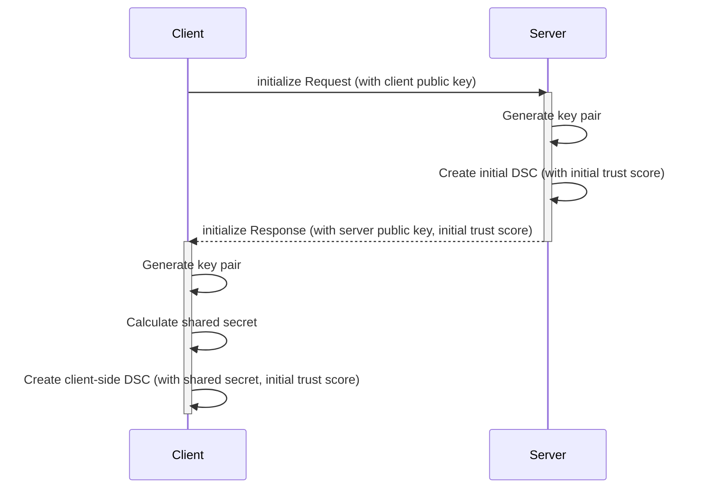
```mermaid
sequenceDiagram
    participant Client
    participant Server

    Client->>Server: initialize Request (with client public key)
    activate Server
    Server->>Server: Generate key pair
    Server->>Server: Create initial DSC (with initial trust score)
    Server-->>Client: initialize Response (with server public key, initial trust score)
    deactivate Server
    activate Client
    Client->>Client: Generate key pair
    Client->>Client: Calculate shared secret
    Client->>Client: Create client-side DSC (with shared secret, initial trust score)
    deactivate Client
```
**Simplified Example (Conceptual - Not for Production):**

**TypeScript:**

```typescript
// --- SERVER SIDE --- (Simplified, conceptual Diffie-Hellman)
import * as crypto from 'crypto';
const connectionContexts = new Map();

function handleInitializeRequest(request: any, transport: any) {
  // 1. Generate an ephemeral key pair.
  const serverKeyPair = crypto.generateKeyPairSync('ec', {
        namedCurve: 'secp256k1', // Use a strong curve
        publicKeyEncoding: { type: 'spki', format: 'pem' },
        privateKeyEncoding: { type: 'pkcs8', format: 'pem' }
    });

  // 2. Create the initial DSC.
  const initialTrustScore = 50;
    const serverSecret = crypto.randomBytes(32); // Generate random secret
  const dsc = new DynamicSecurityContext(initialTrustScore, serverSecret);
    connectionContexts.set(transport, dsc);

  // 3. Include the server's *public* key in the response.
    let initializeResponse: any = {
    jsonrpc: "2.0",
    id: request.id,
    result: {
      serverId: "server-abc",
      publicKey: serverKeyPair.publicKey, // Send the PUBLIC key
      initialTrustScore: initialTrustScore, // Report initial score
    }
  };
    
    // 4. Use the addSecurityField method created earlier
    initializeResponse = addSecurityField(initializeResponse, "INTERNAL", "server:abc", 1, dsc.getSharedSecret());
    
    return initializeResponse
}

// --- CLIENT SIDE --- (Simplified, conceptual Diffie-Hellman)
import * as crypto from 'crypto';
let clientDsc: DynamicSecurityContext;
let clientKeyPair: crypto.KeyPairKeyObjectResult;

function initializeClient() {
    clientKeyPair = crypto.generateKeyPairSync('ec', {
        namedCurve: 'secp256k1',
        publicKeyEncoding: { type: 'spki', format: 'pem' },
        privateKeyEncoding: { type: 'pkcs8', format: 'pem' }
    });
}

function getClientPublicKey() {
    return clientKeyPair.publicKey
}

function setClientDSC(dsc: DynamicSecurityContext) {
    clientDsc = dsc;
}

function getClientSecret() {
    return clientDsc.getSharedSecret();
}

async function handleInitializeResponse(response: any) {
  // 1. Validate the response.
  if (!response.result || !response.result.serverId || !response.result.publicKey) {
    throw new Error("Invalid initialize response");
  }
    
    // 2. Calculate the shared secret. *THIS IS A SIMPLIFIED EXAMPLE*.
  //    In a real implementation, use a proper Diffie-Hellman library.

  const serverPublicKey = crypto.createPublicKey(response.result.publicKey);
  const sharedSecret = crypto.diffieHellman({
    privateKey: clientKeyPair.privateKey,
    publicKey: serverPublicKey,
  });


    // 3.  Create *client-side* DSC.
  const dsc = new DynamicSecurityContext(response.result.initialTrustScore, sharedSecret);

    setClientDSC(dsc);
}
```

**Python:**

```python
# --- SERVER SIDE --- (Simplified, conceptual Diffie-Hellman)
from cryptography.hazmat.primitives.asymmetric import ec
from cryptography.hazmat.primitives import serialization
from cryptography.hazmat.primitives import hashes
from cryptography.hazmat.primitives.kdf.hkdf import HKDF
from cryptography.hazmat.backends import default_backend
import os
connection_contexts = {}

def handle_initialize_request(request, transport):
    # 1. Generate an ephemeral key pair.
    server_private_key = ec.generate_private_key(
        ec.SECP256K1(), default_backend()
    )
    server_public_key = server_private_key.public_key()
    
    # Serialize the public key
    public_pem = server_public_key.public_bytes(
        encoding=serialization.Encoding.PEM,
        format=serialization.PublicFormat.SubjectPublicKeyInfo
    )

    # 2. Create the initial DSC.
    initial_trust_score = 50
    server_secret = os.urandom(32) # Generate a random secret
    dsc = DynamicSecurityContext(initial_trust_score, server_secret)
    connection_contexts[transport] = dsc

    # 3. Include the server's *public* key in the response.
    initialize_response = {
        'jsonrpc': '2.0',
        'id': request['id'],
        'result': {
            'serverId': 'server-abc',
            'publicKey': public_pem.decode('utf-8'),  # Send the PUBLIC key
            'initialTrustScore': initial_trust_score,  # Report initial score
        }
    }
    
    initialize_response = add_security_field(initialize_response, "INTERNAL", "server:abc", 1, dsc.get_shared_secret())
    return initialize_response

# --- CLIENT SIDE --- (Simplified, conceptual Diffie-Hellman)
client_dsc = None
client_private_key = None

def initialize_client():
    global client_private_key
    client_private_key = ec.generate_private_key(
        ec.SECP256K1(), default_backend()
    )

def get_client_public_key():
    public_key = client_private_key.public_key()
    public_pem = public_key.public_bytes(
        encoding=serialization.Encoding.PEM,
        format=serialization.PublicFormat.SubjectPublicKeyInfo
    )
    return public_pem.decode('utf-8')

def set_client_dsc(dsc):
    global client_dsc
    client_dsc = dsc

def get_client_secret():
    return client_dsc.get_shared_secret()

async def handle_initialize_response(response):
    # 1. Validate the response.
    if not response.get('result') or not response['result'].get('serverId') or not response['result'].get('publicKey'):
        raise ValueError("Invalid initialize response")

    # 2. Calculate the shared secret.  *THIS IS A SIMPLIFIED EXAMPLE*.
    server_public_key = serialization.load_pem_public_key(
        response['result']['publicKey'].encode('utf-8'),
        backend=default_backend()
    )

    shared_key = client_private_key.exchange(ec.ECDH(), server_public_key)

    # Derive a key from the shared secret using HKDF
    derived_key = HKDF(
        algorithm=hashes.SHA256(),
        length=32,
        salt=None,
        info=b'handshake data',
        backend=default_backend()
    ).derive(shared_key)

    # 3. Create *client-side* DSC.
    dsc = DynamicSecurityContext(response['result']['initialTrustScore'], derived_key)
    set_client_dsc(dsc)
```

#### 11.4.4 Code Examples (TypeScript/Python) <a name="dsc-code-examples"></a>

**TypeScript - Accessing and Modifying the DSC:**

```typescript
// Assuming you have a way to get the DSC for the current connection
// (e.g., from a context object or a global map).

function someFunction(context: any) {
  const dsc = context.dsc; // Get the DSC

  const currentTrustScore = dsc.getTrustScore();
  console.log("Current Trust Score:", currentTrustScore);

  dsc.updateTrustScore(-5, "Invalid parameter in request");

  const updatedTrustScore = dsc.getTrustScore();
  console.log("Updated Trust Score:", updatedTrustScore);
    console.log("Current Threat Level:", dsc.getThreatLevel())
}
```

**Python - Accessing and Modifying the DSC:**

```python
# Assuming you have a way to get the DSC for the current connection
# (e.g., from a context object or a global map).

def some_function(context):
    dsc = context.dsc  # Get the DSC

    current_trust_score = dsc.get_trust_score()
    print("Current Trust Score:", current_trust_score)

    dsc.update_trust_score(-5, "Invalid parameter in request")

    updated_trust_score = dsc.get_trust_score()
    print("Updated Trust Score:", updated_trust_score)
    print("Current Threat Level:", dsc.get_threat_level())
```

### 11.5 Extensible Security Middleware (ESM) - Core Modules <a name="esm-core-modules"></a>

#### 11.5.1 ESM Module Interface <a name="esm-module-interface"></a>

**TypeScript:**

```typescript
interface ESMModule {
  name: string;
  process(message: any, context: DynamicSecurityContext): Promise<any>;
}
```

**Python:**

```python
from abc import ABC, abstractmethod

class ESMModule(ABC):
    @property
    @abstractmethod
    def name(self):
        pass
    
    @abstractmethod
    async def process(self, message, context):
        pass
```

#### 11.5.2 Core Module Implementations <a name="esm-core-module-implementations"></a>

**TypeScript - Validator Module:**

```typescript
import { ESMModule } from "./esm-module-interface"; // Adjust path as needed
import { DynamicSecurityContext } from "./dsc"; // Adjust path as needed

class ValidatorModule implements ESMModule {
  name = "Validator";

  async process(message: any, context: DynamicSecurityContext): Promise<any> {
    if (!message.security) {
      context.updateTrustScore(-10, "Missing security field");
      throw new Error("SEC001: Missing security field.");
    }

    // Basic schema validation (using the validateSecurityField function)
        if (!validateSecurityField(message, context.getSharedSecret())) {
            context.updateTrustScore(-10, "Invalid security field");
            throw new Error("SEC002: Invalid security field.");
        }
    return message;
  }
}
```

**Python - Validator Module:**

```python
from esm_module_interface import ESMModule  # Adjust path as needed
from dsc import DynamicSecurityContext  # Adjust path as needed

class ValidatorModule(ESMModule):
    @property
    def name(self):
        return "Validator"

    async def process(self, message, context):
        if not message.get('security'):
            context.update_trust_score(-10, "Missing security field")
            raise ValueError("SEC001: Missing security field.")

        # Basic schema validation (using the validate_security_field function)
        if not validate_security_field(message, context.get_shared_secret()):
            context.update_trust_score(-10, "Invalid security field")
            raise ValueError("SEC002: Invalid security field.")
        return message
```

**TypeScript - Classifier Module (Simplified):**

```typescript
import { ESMModule } from "./esm-module-interface"; // Adjust path as needed
import { DynamicSecurityContext } from "./dsc"; // Adjust path as needed

class ClassifierModule implements ESMModule {
  name = "Classifier";

  async process(message: any, context: DynamicSecurityContext): Promise<any> {
    if (!message.security || !message.security.classification) {
      // Simple keyword-based classification (for demonstration)
      let classification = 'INTERNAL'; // Default
      if (message.params && typeof message.params === 'object') {
        const content = JSON.stringify(message.params).toLowerCase();
        if (content.includes('confidential')) {
          classification = 'RESTRICTED';
        } else if (content.includes('sensitive')) {
          classification = 'SENSITIVE';
        } else if (content.includes('public')) {
          classification = 'PUBLIC';
        }
      }
            // Add a security field, so next modules won't fail.
            message = addSecurityField(message, classification, message.security.source , message.security.sequence, context.getSharedSecret()) // Set a default classification.
    }
    return message;
  }
}
```

**Python - Classifier Module (Simplified):**

```python
from esm_module_interface import ESMModule  # Adjust path as needed
from dsc import DynamicSecurityContext # Adjust path as needed
import json

class ClassifierModule(ESMModule):
    @property
    def name(self):
        return "Classifier"

    async def process(self, message, context):
        if not message.get('security') or not message['security'].get('classification'):
            # Simple keyword-based classification (for demonstration)
            classification = 'INTERNAL'  # Default
            if message.get('params') and isinstance(message['params'], dict):
                content = json.dumps(message['params']).lower()
                if 'confidential' in content:
                    classification = 'RESTRICTED'
                elif 'sensitive' in content:
                    classification = 'SENSITIVE'
                elif 'public' in content:
                    classification = 'PUBLIC'

            message = add_security_field(message, classification, message['security']['source'], message['security']['sequence'], context.get_shared_secret())
        return message
```

**TypeScript - IntegrityChecker Module:**

```typescript
import { ESMModule } from "./esm-module-interface"; // Adjust path as needed
import { DynamicSecurityContext } from "./dsc"; // Adjust path as needed
import { createHmac } from 'crypto';

class IntegrityCheckerModule implements ESMModule {
  name = "IntegrityChecker";

  async process(message: any, context: DynamicSecurityContext): Promise<any> {
        if (!validateSecurityField(message, context.getSharedSecret())) {
            context.updateTrustScore(-20, "Message integrity check failed");
            throw new Error("SEC003: Message integrity check failed.");
        }
    return message;
  }
}
```

**Python - IntegrityChecker Module:**

```python
from esm_module_interface import ESMModule  # Adjust path as needed
from dsc import DynamicSecurityContext  # Adjust path as needed
import hashlib
import hmac
import json

class IntegrityCheckerModule(ESMModule):
    @property
    def name(self):
        return "IntegrityChecker"

    async def process(self, message, context):
        if not validate_security_field(message, context.get_shared_secret()):
            context.update_trust_score(-20, "Message integrity check failed")
            raise ValueError("SEC003: Message integrity check failed.")
        return message
```
**TypeScript - SequenceChecker Module:**
```typescript
import { ESMModule } from "./esm-module-interface";
import { DynamicSecurityContext } from "./dsc";

class SequenceCheckerModule implements ESMModule {
  name = "SequenceChecker";
  private lastSequenceNumbers: Map<string, number> = new Map(); // Store per-source

  async process(message: any, context: DynamicSecurityContext): Promise<any> {
    const source = message.security.source;
    const sequence = message.security.sequence;
    const lastSequence = this.lastSequenceNumbers.get(source) || 0;

    if (sequence <= lastSequence) {
      context.updateTrustScore(-15, "Potential replay attack detected");
      throw new Error(`SEC004: Potential replay attack detected (source: ${source}, sequence: ${sequence}, last sequence: ${lastSequence}).`);
    }

    this.lastSequenceNumbers.set(source, sequence);
    return message;
  }
}
```

**Python - SequenceChecker Module:**

```python
from esm_module_interface import ESMModule
from dsc import DynamicSecurityContext

class SequenceCheckerModule(ESMModule):
    @property
    def name(self):
      return "SequenceChecker"
    
    def __init__(self):
        self.last_sequence_numbers = {}  # Store per-source

    async def process(self, message, context):
        source = message['security']['source']
        sequence = message['security']['sequence']
        last_sequence = self.last_sequence_numbers.get(source, 0)

        if sequence <= last_sequence:
            context.update_trust_score(-15, "Potential replay attack detected")
            raise ValueError(f"SEC004: Potential replay attack detected (source: {source}, sequence: {sequence}, last sequence: {last_sequence}).")

        self.last_sequence_numbers[source] = sequence
        return message
```

**TypeScript - TrustUpdater Module:**

```typescript
import { ESMModule } from "./esm-module-interface"; // Adjust path as needed
import { DynamicSecurityContext } from "./dsc"; // Adjust path as needed

class TrustUpdaterModule implements ESMModule {
  name = "TrustUpdater";

  async process(message: any, context: DynamicSecurityContext): Promise<any> {
    // In a real implementation, this module might perform more complex
    // trust calculations based on the results of other modules.
    // For Phase 1, we've already updated the trust score in other modules.
    return message;
  }
}
```

**Python - TrustUpdater Module:**

```python
from esm_module_interface import ESMModule  # Adjust path as needed
from dsc import DynamicSecurityContext  # Adjust path as needed

class TrustUpdaterModule(ESMModule):
    @property
    def name(self):
        return "TrustUpdater"

    async def process(self, message, context):
        # In a real implementation, this module might perform more complex
        # trust calculations based on the results of other modules.
        # For Phase 1, we've already updated the trust score in other modules.
        return message
```

#### 11.5.3 ESM Configuration <a name="esm-configuration"></a>

The ESM modules are executed in a defined order.  For Phase 1, a simple JSON configuration is used:

```json
{
  "esm": {
    "modules": [
      { "name": "Validator", "enabled": true },
      { "name": "Classifier", "enabled": true },
      { "name": "IntegrityChecker", "enabled": true },
      { "name": "SequenceChecker", "enabled": true },
      { "name": "TrustUpdater", "enabled": true }
    ]
  }
}
```

#### 11.5.4 Integration with MCP Client/Server <a name="esm-integration"></a>

(Refer to the existing integration examples in the README, but now with the concrete module implementations.)

**TypeScript - Client Integration (Simplified):**

```typescript
import { Client } from '@modelcontextprotocol/sdk/client';
import { ValidatorModule } from './validator-module';
import { ClassifierModule } from './classifier-module';
import { IntegrityCheckerModule } from './integrity-checker-module';
import { SequenceCheckerModule } from './sequence-checker-module';
import { TrustUpdaterModule } from './trust-updater-module';
import { DynamicSecurityContext } from './dsc';
import { addSecurityField, validateSecurityField } from './security-utils'; // Helper functions

// ... other imports ...
const clientInitialSecret = crypto.randomBytes(32);
const clientDsc = new DynamicSecurityContext(50, clientInitialSecret); // Example initial values

const mcpClient = new Client({ /* ... your MCP client options ... */ });

// ESM configuration (could be loaded from a file)
const esmConfig = {
  modules: [
    { name: "Validator", enabled: true },
    { name: "Classifier", enabled: true },
    { name: "IntegrityChecker", enabled: true },
    { name: "SequenceChecker", enabled: true },
    { name: "TrustUpdater", enabled: true }
  ]
};

// Create ESM module instances
const modules = esmConfig.modules
  .filter(m => m.enabled)
  .map(m => {
    switch (m.name) {
      case "Validator": return new ValidatorModule();
      case "Classifier": return new ClassifierModule();
      case "IntegrityChecker": return new IntegrityCheckerModule();
      case "SequenceChecker": return new SequenceCheckerModule();
      case "TrustUpdater": return new TrustUpdaterModule();
      default:
        console.warn(`Unknown ESM module: ${m.name}`);
        return null;
    }
  })
  .filter(m => m !== null);

// Intercept outbound messages
mcpClient.setOutboundInterceptor(async (message) => {
    let sequence = 1; //Initialize sequence
    if (message.security && typeof message.security.sequence === 'number') {
        sequence = message.security.sequence + 1;
    }
  // Add security annotations (using helper function)
  let secureMessage = addSecurityField(message, 'INTERNAL', 'client:123', sequence , clientDsc.getSharedSecret()); // Example

  // Process through ESM modules
  for (const module of modules) {
    try {
      secureMessage = await module.process(secureMessage, clientDsc);
    } catch (error) {
      console.error(`ESM module ${module.name} failed:`, error);
      // Handle the error (e.g., reject the message, log, etc.)
      throw error; // Re-throw to stop processing
    }
  }

  return secureMessage;
});

// Intercept inbound messages
mcpClient.setInboundInterceptor(async (message) => {
    // Process through ESM modules
    let secureMessage = message;
    for (const module of modules) {
        try {
            secureMessage = await module.process(secureMessage, clientDsc);
        } catch (error) {
            console.error(`ESM module ${module.name} failed:`, error.message);
            // Decide how to handle:  Reject?  Continue with reduced trust?
            throw error; //For now, stop processing.
        }
    }

    return secureMessage;
});
```

**Python - Client Integration (Simplified):**

```python
from mcp.client import Client
from validator_module import ValidatorModule
from classifier_module import ClassifierModule
from integrity_checker_module import IntegrityCheckerModule
from sequence_checker_module import SequenceCheckerModule
from trust_updater_module import TrustUpdaterModule
from dsc import DynamicSecurityContext
from security_utils import add_security_field, validate_security_field  # Helper functions
import os
import asyncio

# ... other imports ...

client_initial_secret = os.urandom(32)
client_dsc = DynamicSecurityContext(50, client_initial_secret)  # Example

mcp_client = Client( # your MCP client options
    name="example-client",
    version="1.0.0"
)

# ESM configuration (could be loaded from a file)
esm_config = {
    "modules": [
        {"name": "Validator", "enabled": True},
        {"name": "Classifier", "enabled": True},
        {"name": "IntegrityChecker", "enabled": True},
        {"name": "SequenceChecker", "enabled": True},
        {"name": "TrustUpdater", "enabled": True},
    ]
}

# Create ESM module instances
modules = []
for m in esm_config["modules"]:
    if m["enabled"]:
        if m["name"] == "Validator":
            modules.append(ValidatorModule())
        elif m["name"] == "Classifier":
            modules.append(ClassifierModule())
        elif m["name"] == "IntegrityChecker":
            modules.append(IntegrityCheckerModule())
        elif m["name"] == "SequenceChecker":
            modules.append(SequenceCheckerModule())
        elif m["name"] == "TrustUpdater":
            modules.append(TrustUpdaterModule())
        else:
            print(f"Unknown ESM module: {m['name']}")

# Intercept outbound messages
async def outbound_interceptor(message):
    sequence = 1 # Initialize sequence
    if message.get('security') and isinstance(message['security'].get('sequence'), int):
        sequence = message['security']['sequence'] + 1
    # Add security annotations
    secure_message = add_security_field(message, 'INTERNAL', 'client:123', sequence, client_dsc.get_shared_secret()) # Example

    # Process through ESM modules
    for module in modules:
        try:
            secure_message = await module.process(secure_message, client_dsc)
        except ValueError as e:
            print(f"ESM module {module.name} failed: {e}")
            # Handle error, potentially re-raise
            raise
    return secure_message

# Intercept inbound messages
async def inbound_interceptor(message):
    secure_message = message
    # Process through ESM modules
    for module in modules:
        try:
            secure_message = await module.process(secure_message, client_dsc)
        except ValueError as e:
            print(f"ESM module {module.name} failed: {e}")
            # Handle the error (e.g., reject, log, reduce trust)
            raise # For now, stop processing.
    return secure_message

mcp_client.set_outbound_interceptor(outbound_interceptor)
mcp_client.set_inbound_interceptor(inbound_interceptor)
```

**Server-side integration would follow a similar pattern.**

### 11.6 Timeline and Deliverables <a name="phase-1-timeline"></a>

| Week | Task                                      | Deliverable                                                                 |
| ---- | ----------------------------------------- | --------------------------------------------------------------------------- |
| 1-2  | Design and Prototyping                    | - Detailed design documents for DSC and core ESM modules.                     |
|      |                                           | - JSON schema for `security` field.                                          |
|      |                                           | - Initial trust score algorithm.                                            |
|      |                                           | - Prototype code for key exchange (simplified Diffie-Hellman).              |
| 3-4  | Core Implementation                       | - TypeScript and Python implementations of:                                 |
|      |                                           |    - `DynamicSecurityContext` class.                                        |
|      |                                           |    - Core ESM modules (`Validator`, `Classifier`, `IntegrityChecker`,`SequenceChecker`, `TrustUpdater`). |
|      |                                           |    - Helper functions for adding/validating security annotations.            |
|      |                                           |    - Basic integration with MCP client/server (interceptor examples).       |
| 5-6  | Testing and Refinement                    | - Unit tests for all classes and functions.                                  |
|      |                                           | - Integration tests for ESM with MCP.                                        |
|      |                                           | - Security tests (replay attack simulation, invalid signature injection).   |
|      |                                           | - Performance benchmarks.                                                  |
|      |                                           | - Refined code based on test results.                                       |
| 7-8  | Documentation and Preparation for Phase 2 | - Updated `README.md` with Phase 1 implementation details.                   |
|      |                                           | - Developer documentation for using the Phase 1 components.                |
|      |                                           | - Plan for Phase 2 (scope, resources, timeline).                             |

### 11.7 Testing Strategy <a name="phase-1-testing"></a>

Phase 1 testing will include:

*   **Unit Tests:**  Verify the correct behavior of individual classes and functions (DSC, ESM modules, helper functions).
*   **Integration Tests:**  Test the interaction between the ESM and the MCP client/server, ensuring messages are correctly processed and security annotations are handled.
*   **Security Tests:**
    *   **Replay Attack Simulation:**  Send duplicate messages with the same sequence number to verify replay protection.
    *   **Invalid Signature Injection:**  Send messages with modified content or incorrect integrity hashes to verify integrity checks.
    *   **Missing Security Field:** Send messages without the `security` field to verify that they are rejected (or handled appropriately based on configuration).
    *   **Invalid Classification:** Send messages with invalid classification values.
*  **Boundary condition tests:** Test with parameters at the limit of the specifications (very long strings, very big numbers, etc.)
*   **Performance Benchmarks:** Measure the added latency introduced by the security processing.

### 11.8 Resource Requirements <a name="phase-1-resources"></a>

*   **Personnel:**
    *   1-2 Senior Software Engineers (with security experience).
    *   1 QA Engineer (for testing).
*   **Tools:**
    *   TypeScript/Python development environment (IDEs, debuggers).
    *   Testing frameworks (Jest for TypeScript, pytest for Python).
    *   Cryptographic libraries (e.g., `crypto` in Node.js, `cryptography` in Python).
    *   MCP client/server SDK.
    *   Version control (Git).
    *   CI/CD pipeline (for automated testing and building).
*   **Infrastructure:**
    *   Development machines.
    *   Test server(s) for running MCP and GUARDRAIL components.

### 11.9 Risk Mitigation <a name="phase-1-risks"></a>

| Risk                                   | Mitigation Strategy                                                                                                                                                                                                         |
| -------------------------------------- | ------------------------------------------------------------------------------------------------------------------------------------------------------------------------------------------------------------------------- |
| Performance Overhead                   | - Use efficient algorithms and data structures.  - Implement asynchronous processing in the ESM. - Benchmark frequently and optimize critical code paths.                                                                |
| Incorrect Security Implementation       | - Thorough code reviews. - Extensive testing (unit, integration, security). - Follow secure coding best practices.                                                                                                     |
| Compatibility Issues with Existing MCP | - Prioritize non-breaking changes (optional `security` field). - Provide clear migration guides for existing MCP users. - Use feature flags to enable/disable GUARDRAIL features.                                          |
| Key Management Vulnerabilities        | - Use a secure key exchange protocol (e.g., a robust implementation of Diffie-Hellman or similar). - Never hardcode secrets. - Integrate with a secure key management system (e.g., Vault) in later phases.                      |
| Complexity of Implementation           | - Start with a simplified implementation (core ESM modules only). - Break down the implementation into smaller, manageable tasks. - Use clear and consistent coding styles. - Thorough documentation.                       |

## 12. Future Enhancements and Roadmap  <a name="future-enhancements"></a>

### 12.1 Short-Term (Phase 2 - 3-6 Months) <a name="future-enhancements-short-term"></a>

*   **Full ESM Implementation:**  Implement the complete ESM plugin system, allowing developers to create and register custom security modules.
*   **Lightweight Attestation Protocol (LAP):**  Implement LAP for mutual client/server authentication and environment verification. [Link to LAP section in existing README](#lap-new).
*   **Basic Security Event Correlation and Reporting (SECR):**  Implement basic event logging and reporting. [Link to SECR section in existing README](#secr-new).
*   **Integration with Common Security Tools:**  Provide initial integrations with common logging and monitoring tools.

### 12.2 Medium-Term (Phase 3 - 6-12 Months) <a name="future-enhancements-medium-term"></a>

*   **Adaptive Resource Quotas (ARQ):**  Implement ARQ to dynamically adjust resource limits based on the DSC's trust score. [Link to ARQ section in existing README](#arq-new).
*   **Comprehensive Audit and Compliance Reporting:**  Enhance SECR with more detailed audit logging and reporting capabilities, suitable for compliance requirements.
*   **Enterprise Integration Connectors:**  Develop connectors for integrating GUARDRAIL with enterprise security systems (SIEM, IAM).
*   **Advanced Threat Detection Capabilities:**  Explore more sophisticated threat detection techniques (e.g., anomaly detection using machine learning).

### 12.3 Long-Term (Phase 4 - 12+ Months) <a name="future-enhancements-long-term"></a>

*   **Privacy-Enhancing Technologies:**  Integrate privacy-enhancing technologies like differential privacy and homomorphic encryption.
*   **Multi-Tenant Security Isolation:**  Provide mechanisms for isolating different tenants within a shared MCP environment.
*   **Federated Security Models:**  Enable secure communication and trust management across different organizations or MCP deployments.
*   **Automated Security Testing Frameworks:**  Develop tools for automatically testing the security of GUARDRAIL and MCP applications.
*   **AI-Driven Threat Detection:** Integrate machine learning for real-time anomaly detection within the AML, enhancing proactive threat hunting.
*   **Dynamic Policy Updates:** Enable real-time policy updates from external threat intelligence feeds via SECR, improving responsiveness.
*   **Decentralized Identity:** Incorporate W3C Decentralized Identifiers (DID) into the CVL for privacy-preserving authentication.
*   **Quantum-Safe Enhancements:** Upgrade cryptographic primitives (e.g., lattice-based algorithms) to future-proof against quantum threats.

* **12.4. Open Source Reference Implementation:** Develop and maintain an open-source reference implementation of GUARDRAIL to encourage adoption and community contributions.

## 13. Community and Governance  <a name="community-governance"></a>

### 13.1 Guiding Principles <a name="community-guiding-principles"></a>

1.  **Security First:**  Security is the paramount concern in all decisions.
2.  **Practical Adoption:**  Focus on incremental adoption and ease of use.
3.  **Open Governance:**  Transparent decision-making and inclusive participation.
4.  **Technical Excellence:**  Maintain high standards for code quality and security.
5.  **Sustainability:**  Ensure long-term project viability.
6.  **Interoperability:**  Maintain compatibility with evolving MCP standards.
7.  **Community Driven:**  Be responsive to community needs and contributions.

### 13.2 Governance Structure <a name="community-governance-structure"></a>

*   **Technical Steering Committee (TSC):**  Provides technical leadership, sets the architectural direction, and approves major design decisions.
*   **Working Groups:**  Focus on specific areas (e.g., security layers, integration, documentation).
*   **Maintainers:**  Responsible for day-to-day technical leadership of specific components.
*   **Contributors:**  Anyone who contributes to the project.

### 13.3 Contribution Process <a name="community-contribution-process"></a>

1.  Create a GitHub issue to discuss proposed changes.
2.  Submit a pull request with code, tests, and documentation.
3.  Maintainers review and approve the pull request.
4.  Changes are merged into the main branch.

### 13.4 Communication Channels <a name="community-communication-channels"></a>

*   **GitHub:**  Primary repository for code, issues, and pull requests.
*   **Discussion Forums:**  For discussions and proposals.
*   **Chat Platform:** (e.g., Discord, Slack) For real-time communication.
*    **Mailing list:** For announcements.

### 13.5 Code of Conduct <a name="community-code-of-conduct"></a>

All participants are expected to adhere to a Code of Conduct that promotes a respectful and inclusive community.