# GUARDRAIL: Gateway for Unified Access, Resource Delegation, and Risk-Attenuating Information Limits

## Executive Summary

GUARDRAIL (Gateway for Unified Access, Resource Delegation, and Risk-Attenuating Information Limits) is a comprehensive security framework designed to protect Large Language Model (LLM) application ecosystems, particularly those built using the Model Context Protocol (MCP).  It addresses critical security vulnerabilities inherent in LLM applications, focusing on preventing data exfiltration, data infiltration, unauthorized access, and resource abuse. GUARDRAIL implements a multi-layered, defense-in-depth architecture based on zero-trust principles, providing robust protection without sacrificing performance or usability.

## Project Status

GUARDRAIL is currently in active development. This repository contains the architectural design, technical specifications, implementation documentation, and visual representations of the framework.  Production-ready code components will be released incrementally. This README serves as the central hub for understanding the project.

## Table of Contents

- [GUARDRAIL: Gateway for Unified Access, Resource Delegation, and Risk-Attenuating Information Limits](#guardrail-gateway-for-unified-access-resource-delegation-and-risk-attenuating-information-limits)
  - [Executive Summary](#executive-summary)
  - [Project Status](#project-status)
  - [Table of Contents](#table-of-contents)
  - [1. Introduction ](#1-introduction-)
  - [2. Core Principles ](#2-core-principles-)
  - [3. Architecture Overview ](#3-architecture-overview-)
    - [3.1 Security Layers ](#31-security-layers-)
    - [3.2 Deployment Models ](#32-deployment-models-)
  - [4. Key Benefits ](#4-key-benefits-)
  - [5. Integration with MCP ](#5-integration-with-mcp-)
  - [6. New Innovations ](#6-new-innovations-)
    - [6.1 Extensible Security Middleware (ESM) ](#61-extensible-security-middleware-esm-)
    - [6.2 Dynamic Security Context (DSC) ](#62-dynamic-security-context-dsc-)
    - [6.3 Mandatory Message Classification and Tagging (MMCT) ](#63-mandatory-message-classification-and-tagging-mmct-)
    - [6.4 Lightweight Attestation Protocol (LAP) ](#64-lightweight-attestation-protocol-lap-)
    - [6.5 Adaptive Resource Quotas (ARQ) ](#65-adaptive-resource-quotas-arq-)
    - [6.6 Security Event Correlation and Reporting (SECR) ](#66-security-event-correlation-and-reporting-secr-)
    - [6.7 Intelligent Threat Response System ](#67-intelligent-threat-response-system-)
    - [6.8 Advanced Cryptographic Protection Suite ](#68-advanced-cryptographic-protection-suite-)
    - [6.9 Comprehensive Supply Chain Security ](#69-comprehensive-supply-chain-security-)
    - [6.10 Regulatory Compliance Framework ](#610-regulatory-compliance-framework-)
    - [6.11 Distributed Identity and Access Management  ](#611-distributed-identity-and-access-management--)
    - [6.12 Quantum-Ready Security Architecture ](#612-quantum-ready-security-architecture-)
  - [7. Visualizations and Diagrams ](#7-visualizations-and-diagrams-)
  - [8. Detailed Documentation ](#8-detailed-documentation-)
  - [9. Emergency Response Framework ](#9-emergency-response-framework-)
  - [10. New Directions: Practical and Incremental MCP Security ](#10-new-directions-practical-and-incremental-mcp-security-)
    - [10.1 Phased Implementation Approach](#101-phased-implementation-approach)
    - [10.2 Practical Security Innovations](#102-practical-security-innovations)
    - [10.3 Extensible Security Middleware (ESM) ](#103-extensible-security-middleware-esm-)
    - [10.4 Dynamic Security Context (DSC) ](#104-dynamic-security-context-dsc-)
    - [10.5 Protocol-Level Security Annotations ](#105-protocol-level-security-annotations-)
    - [10.6 Lightweight Attestation Protocol (LAP) ](#106-lightweight-attestation-protocol-lap-)
    - [10.7 Adaptive Resource Quotas (ARQ) ](#107-adaptive-resource-quotas-arq-)
    - [10.8 Security Event Correlation and Reporting (SECR) ](#108-security-event-correlation-and-reporting-secr-)
  - [99. License ](#99-license-)

## 1. Introduction <a name="introduction"></a>

Large Language Models (LLMs) are rapidly transforming various industries, but their power and complexity introduce significant security risks.  The Model Context Protocol (MCP) aims to standardize communication between LLM applications and services, but its initial design lacks the robust security mechanisms necessary to protect sensitive data and prevent abuse. GUARDRAIL addresses these shortcomings by providing a comprehensive security framework specifically tailored for MCP and other LLM application ecosystems.

## 2. Core Principles <a name="core-principles"></a>

GUARDRAIL is built on the following core principles:

1.  **Information Flow Control:**  Strict policies govern the movement of information between security boundaries. This includes data classification, labeling, and fine-grained control over data access and propagation.  *Prevention of both exfiltration and infiltration is paramount.*

2.  **Contextual Security:** Security decisions are made based on the *dynamic* execution context.  This includes continuous trust assessment and environment-aware policies.

3.  **Transport-Agnostic Protection:** Security guarantees are provided *regardless* of the underlying transport mechanism used for communication.

4.  **Least-Privilege Execution:**  All components and operations within the LLM application ecosystem operate with the *minimum* necessary permissions.  Privileges are granted just-in-time and automatically revoked when no longer needed.

5.  **Zero Trust:** No component or user is inherently trusted.  Continuous verification and authentication are required at every interaction.

## 3. Architecture Overview <a name="architecture-overview"></a>

### 3.1 Security Layers <a name="security-layers"></a>

GUARDRAIL implements a multi-layered architecture, with each layer providing a distinct set of security controls:

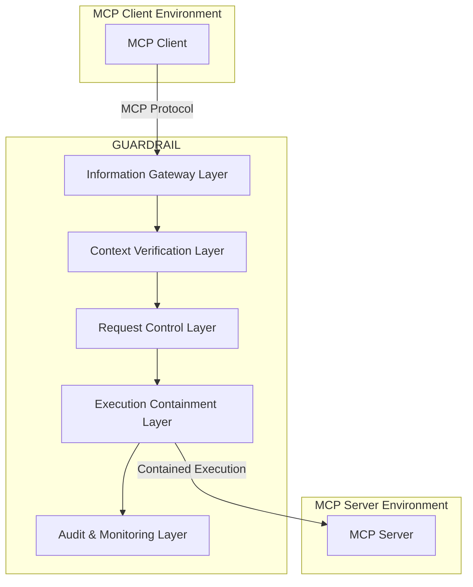
```mermaid
flowchart TB
    subgraph "MCP Client Environment"
        MC[MCP Client]
    end
    
    subgraph "GUARDRAIL"
        direction TB
        IGL[Information Gateway Layer]
        CVL[Context Verification Layer]
        RCL[Request Control Layer]
        ECL[Execution Containment Layer]
        AML[Audit & Monitoring Layer]
        
        IGL --> CVL
        CVL --> RCL
        RCL --> ECL
        ECL --> AML
    end
    
    subgraph "MCP Server Environment"
        MS[MCP Server]
    end
    
    MC -- "MCP Protocol" --> IGL
    ECL -- "Contained Execution" --> MS
```

*   **Information Gateway Layer (IGL):** The first line of defense, managing all information flows in and out of the system.  It handles content classification, flow policy enforcement, and transport security.

*   **Context Verification Layer (CVL):**  Establishes the trustworthiness of the execution environment through attestation, client/server verification, and policy discovery.

*   **Request Control Layer (RCL):**  Implements fine-grained access control to resources and functions, using a capability-based model.  Includes request filtering, resource guarding, and action limiting.

*   **Execution Containment Layer (ECL):**  Ensures that all code execution occurs within secure, isolated boundaries.  This includes memory isolation, resource quotas, and call chain tracking.

*   **Audit and Monitoring Layer (AML):**  Provides comprehensive visibility into system operations and security events.  It logs all information flows, detects anomalies, and creates tamper-evident records.

### 3.2 Deployment Models <a name="deployment-models"></a>

GUARDRAIL can be deployed in three primary configurations, offering flexibility to suit different infrastructure needs:

1.  **Embedded Model:**  GUARDRAIL components are integrated directly into the host process (both client and server). This is suitable for standalone applications or development environments.

2.  **Gateway Model:** GUARDRAIL operates as a standalone security gateway, mediating *all* MCP traffic between clients and servers.  This is ideal for enterprise deployments with strict security requirements.

3.  **Service Mesh Model:** GUARDRAIL components are deployed as sidecars within a Kubernetes environment, providing distributed security with a centralized control plane.  This is best suited for cloud-native and microservices architectures.

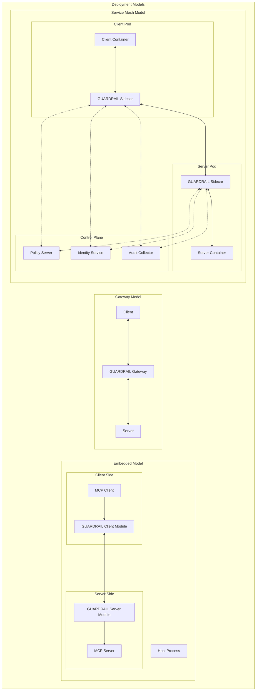
```mermaid
flowchart TB
    subgraph "Deployment Models"
        direction LR
        
        subgraph "Embedded Model"
            direction TB
            HC[Host Process]
            
            subgraph "Client Side"
                MCC[MCP Client]
                GC[GUARDRAIL Client Module]
                
                MCC --> GC
            end
            
            subgraph "Server Side"
                MCS[MCP Server]
                GS[GUARDRAIL Server Module]
                
                GS --> MCS
            end
            
            GC <---> GS
        end
        
        subgraph "Gateway Model"
            direction TB
            CL[Client]
            GW[GUARDRAIL Gateway]
            SV[Server]
            
            CL <---> GW
            GW <---> SV
        end
        
        subgraph "Service Mesh Model"
            direction TB
            
            subgraph "Client Pod"
                CP[Client Container]
                CS[GUARDRAIL Sidecar]
                
                CP <---> CS
            end
            
            subgraph "Server Pod"
                SP[Server Container]
                SS[GUARDRAIL Sidecar]
                
                SS <---> SP
            end
            
            subgraph "Control Plane"
                PS[Policy Server]
                IS[Identity Service]
                AS[Audit Collector]
            end
            
            CS <---> SS
            CS <-..-> PS
            CS <-..-> IS
            CS <-..-> AS
            SS <-..-> PS
            SS <-..-> IS
            SS <-..-> AS
        end
    end
```

## 4. Key Benefits <a name="key-benefits"></a>

GUARDRAIL provides the following key benefits:

1.  **Complete Information Flow Control:** Prevents unauthorized data exfiltration and infiltration.  Enforces classification-based rules.

2.  **Contextual Security Model:** Security adapts to the execution environment, with dynamic trust assessment and environment-aware policies.

3.  **Preservation of MCP Functionality:**  Compatible with existing MCP implementations.  Minimal performance overhead.  Transparent to well-behaved applications.

4.  **Defense Against Common Attack Vectors:** Protects against prompt injection, resource abuse, side-channel attacks, and other LLM-specific vulnerabilities.

5.  **Comprehensive Audit Trail:** Provides complete visibility into information flows, enabling security investigations and compliance with data protection requirements.

## 5. Integration with MCP <a name="integration-with-mcp"></a>

GUARDRAIL is designed for seamless integration with MCP.  It provides wrapper classes for both MCP Clients and Servers, adding security without requiring significant changes to existing application code.

```typescript
// Client Integration Example
import { Client } from "@modelcontextprotocol/sdk/client";
import { GuardrailClient } from "@guardrail/sdk/client";

// Initialize standard MCP client
const mcpClient = new Client({
  name: "example-client",
  version: "1.0.0"
});

// Wrap with Guardrail protection
const client = new GuardrailClient(mcpClient, {
  security: {
    classification_level: "INTERNAL",
    flow_policies: "standard",
    attestation: true
  }
});

// Normal MCP operations now protected by Guardrail
await client.connect(transport);
```

## 6. New Innovations <a name="new-innovations"></a>

Beyond the core architecture, GUARDRAIL incorporates several key innovations to enhance its effectiveness and adaptability:

### 6.1 Extensible Security Middleware (ESM) <a name="extensible-security-middleware-esm"></a>
Provides a pluggable architecture within the Information Gateway Layer, allowing developers to add custom security modules.
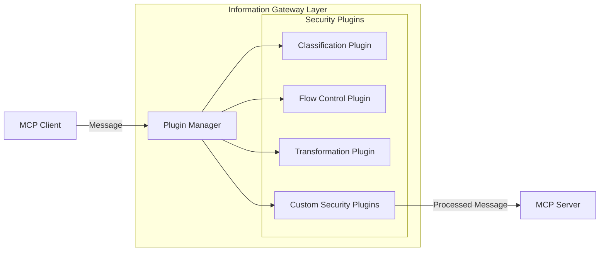
```mermaid
flowchart LR
    subgraph "Information Gateway Layer"
        direction TB
        PM[Plugin Manager]
        
        subgraph "Security Plugins"
            SP1[Classification Plugin]
            SP2[Flow Control Plugin]
            SP3[Transformation Plugin]
            SP4[Custom Security Plugins]
        end
        
        PM --> SP1
        PM --> SP2
        PM --> SP3
        PM --> SP4
    end
    
    MC[MCP Client] -- "Message" --> PM
    SP4 -- "Processed Message" --> MS[MCP Server]
```

### 6.2 Dynamic Security Context (DSC) <a name="dynamic-security-context-dsc"></a>
 A shared, mutable object that holds security-relevant information for the current MCP connection, including a trust score, threat level, and attenuated capabilities.

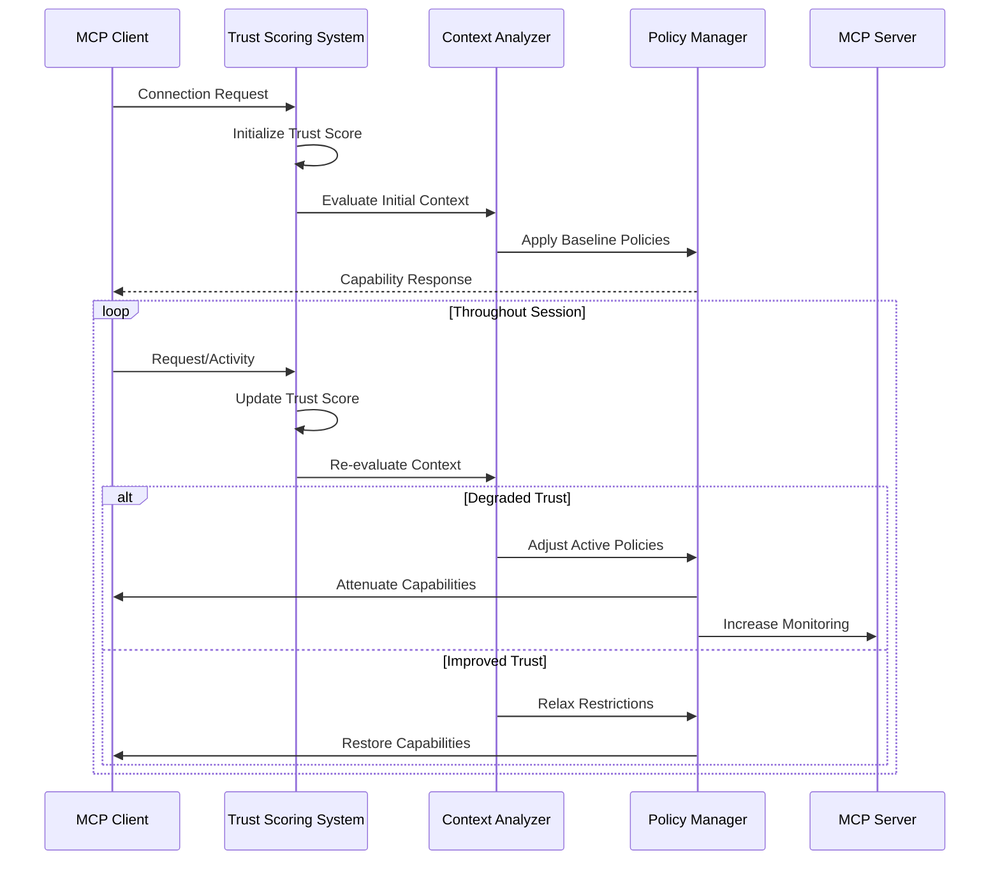
```mermaid
sequenceDiagram
    participant MC as MCP Client
    participant TS as Trust Scoring System
    participant CA as Context Analyzer
    participant PM as Policy Manager
    participant MS as MCP Server
    
    MC->>TS: Connection Request
    TS->>TS: Initialize Trust Score
    TS->>CA: Evaluate Initial Context
    CA->>PM: Apply Baseline Policies
    PM-->>MC: Capability Response
    
    loop Throughout Session
        MC->>TS: Request/Activity
        TS->>TS: Update Trust Score
        TS->>CA: Re-evaluate Context
        
        alt Degraded Trust
            CA->>PM: Adjust Active Policies
            PM->>MC: Attenuate Capabilities
            PM->>MS: Increase Monitoring
        else Improved Trust
            CA->>PM: Relax Restrictions
            PM->>MC: Restore Capabilities
        end
    end
```

### 6.3 Mandatory Message Classification and Tagging (MMCT) <a name="mandatory-message-classification-and-tagging-mmct"></a>
Requires every MCP message to include a `security` field with classification, integrity, source, and sequence information.
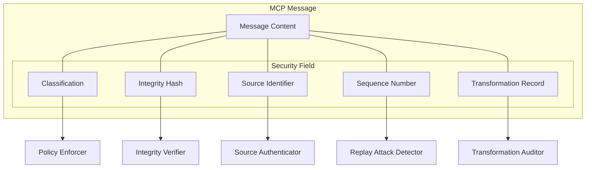
```mermaid
flowchart TB
    subgraph "MCP Message"
        MSG[Message Content]
        
        subgraph "Security Field"
            CL[Classification]
            INT[Integrity Hash]
            SRC[Source Identifier]
            SEQ[Sequence Number]
            TR[Transformation Record]
        end
    end
    
    MSG --- CL
    MSG --- INT
    MSG --- SRC
    MSG --- SEQ
    MSG --- TR
    
    CL --> PL[Policy Enforcer]
    INT --> IV[Integrity Verifier]
    SRC --> SA[Source Authenticator]
    SEQ --> RA[Replay Attack Detector]
    TR --> TA[Transformation Auditor]
```

### 6.4 Lightweight Attestation Protocol (LAP) <a name="lightweight-attestation-protocol-lap"></a>
A simple protocol built on top of MCP for mutual attestation between client and server.
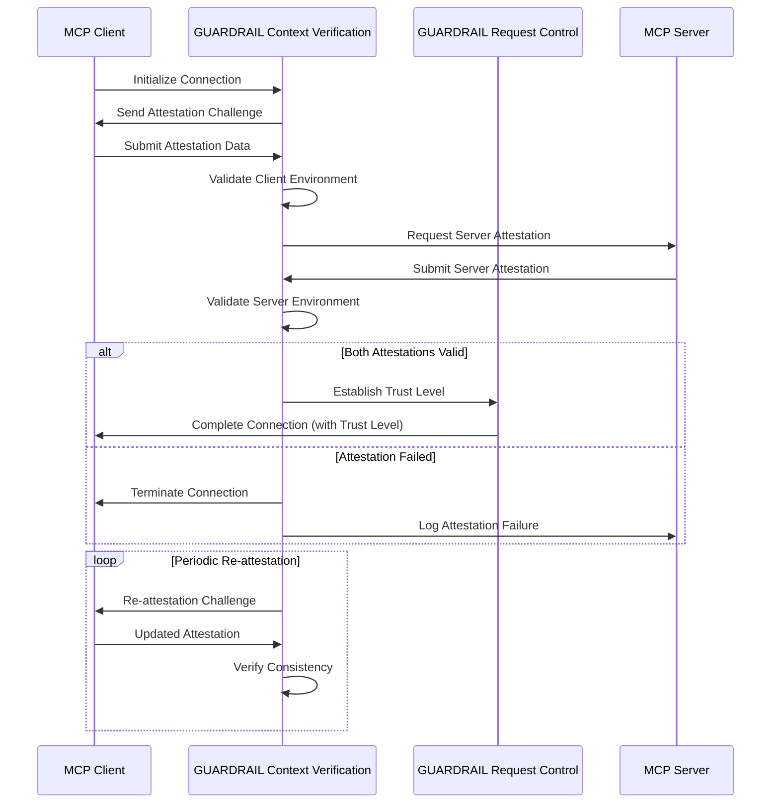
```mermaid
sequenceDiagram
    participant Client as MCP Client
    participant GCVL as GUARDRAIL Context Verification
    participant GRCL as GUARDRAIL Request Control
    participant Server as MCP Server
    
    Client->>GCVL: Initialize Connection
    GCVL->>Client: Send Attestation Challenge
    Client->>GCVL: Submit Attestation Data
    GCVL->>GCVL: Validate Client Environment
    
    GCVL->>Server: Request Server Attestation
    Server->>GCVL: Submit Server Attestation
    GCVL->>GCVL: Validate Server Environment
    
    alt Both Attestations Valid
        GCVL->>GRCL: Establish Trust Level
        GRCL->>Client: Complete Connection (with Trust Level)
    else Attestation Failed
        GCVL->>Client: Terminate Connection
        GCVL->>Server: Log Attestation Failure
    end
    
    loop Periodic Re-attestation
        GCVL->>Client: Re-attestation Challenge
        Client->>GCVL: Updated Attestation
        GCVL->>GCVL: Verify Consistency
    end
```

### 6.5 Adaptive Resource Quotas (ARQ) <a name="adaptive-resource-quotas-arq"></a>
Dynamically adjusts resource quotas (CPU, memory, network) based on the DSC's trust score and threat level.
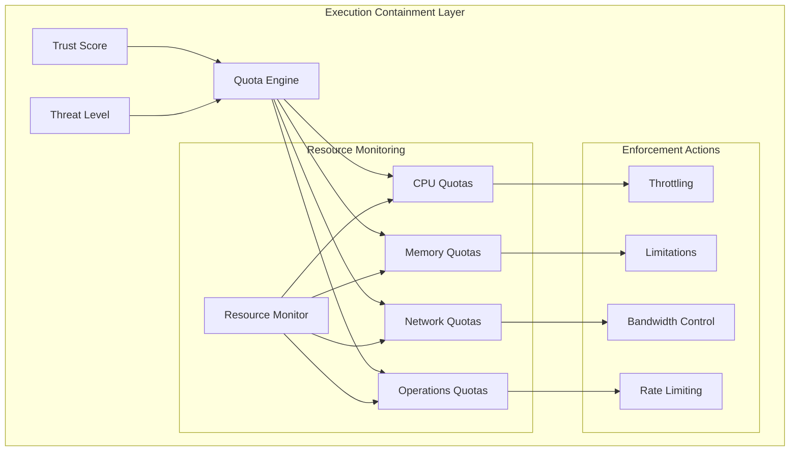
```mermaid
flowchart TB
    subgraph "Execution Containment Layer"
        TS[Trust Score] --> QE[Quota Engine]
        TL[Threat Level] --> QE
        
        QE --> CPU[CPU Quotas]
        QE --> MEM[Memory Quotas]
        QE --> NET[Network Quotas]
        QE --> OPS[Operations Quotas]
        
        subgraph "Resource Monitoring"
            RM[Resource Monitor]
            RM --> CPU
            RM --> MEM
            RM --> NET
            RM --> OPS
        end
        
        subgraph "Enforcement Actions"
            CPU --> THR[Throttling]
            MEM --> LIM[Limitations]
            NET --> BW[Bandwidth Control]
            OPS --> RL[Rate Limiting]
        end
    end
```

### 6.6 Security Event Correlation and Reporting (SECR) <a name="security-event-correlation-and-reporting-secr"></a>
Builds a security-focused event system on top of MCP notifications, allowing for sophisticated monitoring and incident response.

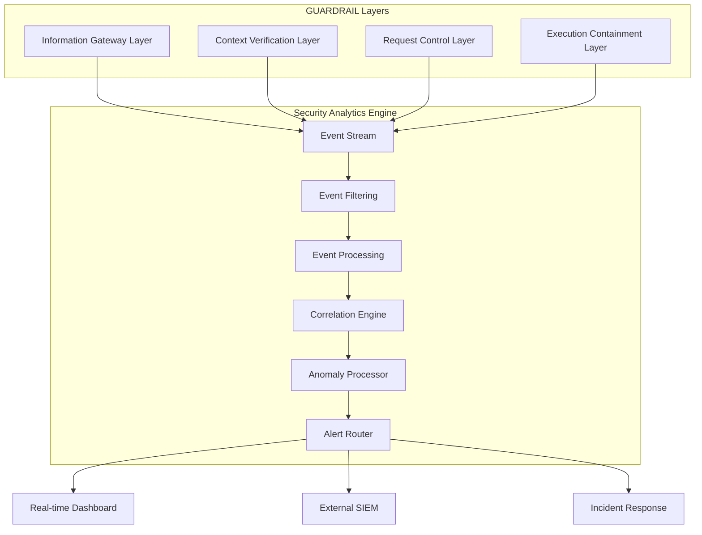
```mermaid
flowchart TB
    subgraph "GUARDRAIL Layers"
        IGL[Information Gateway Layer]
        CVL[Context Verification Layer]
        RCL[Request Control Layer]
        ECL[Execution Containment Layer]
    end
    
    IGL --> ES[Event Stream]
    CVL --> ES
    RCL --> ES
    ECL --> ES
    
    subgraph "Security Analytics Engine"
        ES --> EF[Event Filtering]
        EF --> EP[Event Processing]
        EP --> CE[Correlation Engine]
        CE --> AP[Anomaly Processor]
        AP --> AR[Alert Router]
    end
    
    AR --> RT[Real-time Dashboard]
    AR --> SIEM[External SIEM]
    AR --> IR[Incident Response]
```

### 6.7 Intelligent Threat Response System <a name="intelligent-threat-response-system"></a>
Combines threat intelligence, behavioral analysis, and automated incident response.

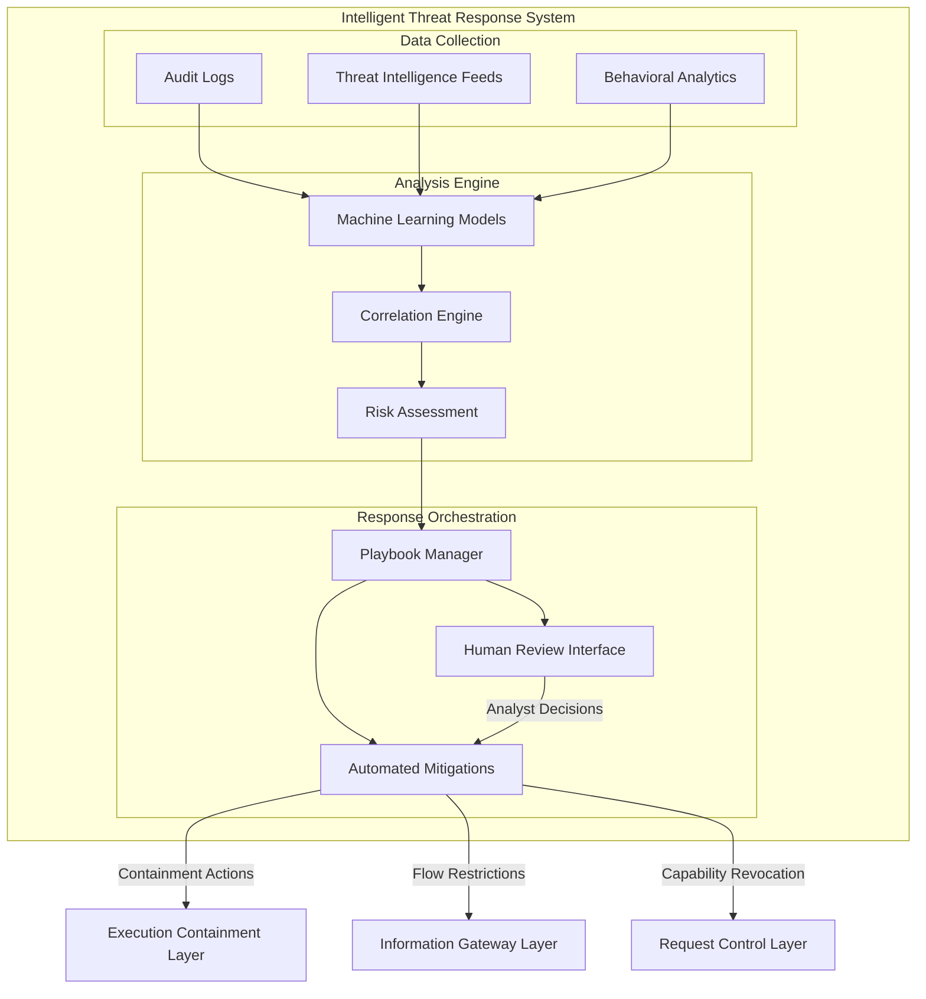
```mermaid
flowchart TB
    subgraph "Intelligent Threat Response System"
        direction TB
        
        subgraph "Data Collection"
            AL[Audit Logs]
            TI[Threat Intelligence Feeds]
            BA[Behavioral Analytics]
        end
        
        subgraph "Analysis Engine"
            ML[Machine Learning Models]
            CB[Correlation Engine]
            RA[Risk Assessment]
        end
        
        subgraph "Response Orchestration"
            PB[Playbook Manager]
            AM[Automated Mitigations]
            HR[Human Review Interface]
        end
        
        AL --> ML
        TI --> ML
        BA --> ML
        
        ML --> CB
        CB --> RA
        
        RA --> PB
        PB --> AM
        PB --> HR
    end
    
    AM -->|"Containment Actions"| ECL[Execution Containment Layer]
    AM -->|"Flow Restrictions"| IGL[Information Gateway Layer]
    AM -->|"Capability Revocation"| RCL[Request Control Layer]
    HR -->|"Analyst Decisions"| AM
```

### 6.8 Advanced Cryptographic Protection Suite <a name="advanced-cryptographic-protection-suite"></a>
Incorporates homomorphic encryption, zero-knowledge proofs, secure multi-party computation, and quantum-safe cryptography.

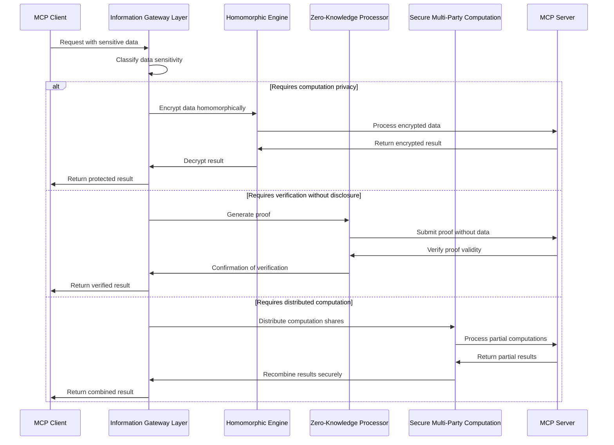
```mermaid
sequenceDiagram
    participant Client as MCP Client
    participant IGL as Information Gateway Layer
    participant HE as Homomorphic Engine
    participant ZKP as Zero-Knowledge Processor
    participant SMPC as Secure Multi-Party Computation
    participant Server as MCP Server
    
    Client->>IGL: Request with sensitive data
    IGL->>IGL: Classify data sensitivity
    
    alt Requires computation privacy
        IGL->>HE: Encrypt data homomorphically
        HE->>Server: Process encrypted data
        Server->>HE: Return encrypted result
        HE->>IGL: Decrypt result
        IGL->>Client: Return protected result
        
    else Requires verification without disclosure
        IGL->>ZKP: Generate proof
        ZKP->>Server: Submit proof without data
        Server->>ZKP: Verify proof validity
        ZKP->>IGL: Confirmation of verification
        IGL->>Client: Return verified result
        
    else Requires distributed computation
        IGL->>SMPC: Distribute computation shares
        SMPC->>Server: Process partial computations
        Server->>SMPC: Return partial results
        SMPC->>IGL: Recombine results securely
        IGL->>Client: Return combined result
    end
```
### 6.9 Comprehensive Supply Chain Security <a name="comprehensive-supply-chain-security"></a>
Combines supply chain security, container security, and network segmentation.
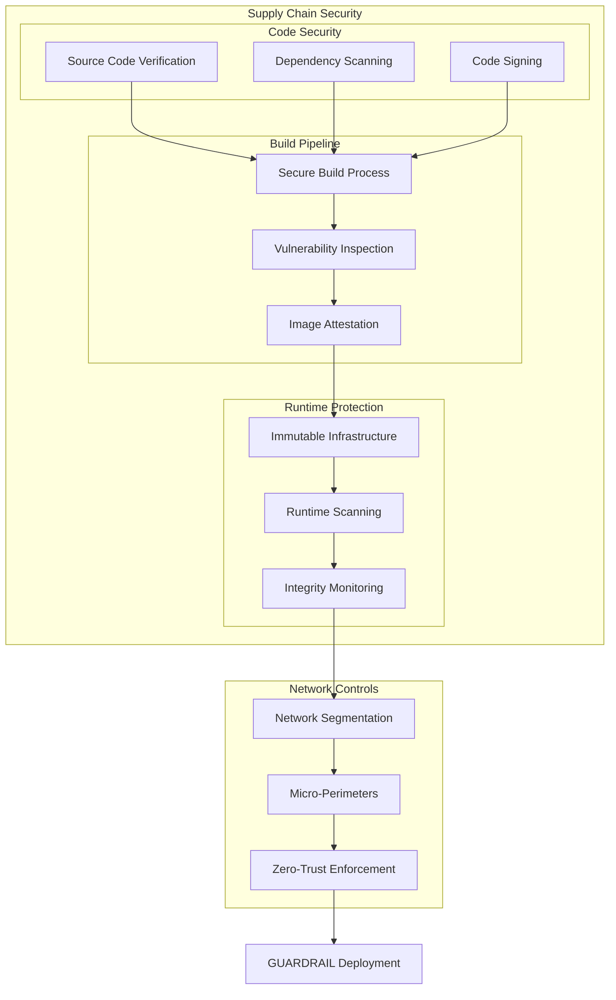
```mermaid
flowchart TB
    subgraph "Supply Chain Security"
        direction TB
        
        subgraph "Code Security"
            SC[Source Code Verification]
            DS[Dependency Scanning]
            CS[Code Signing]
        end
        
        subgraph "Build Pipeline"
            SB[Secure Build Process]
            VI[Vulnerability Inspection]
            IA[Image Attestation]
        end
        
        subgraph "Runtime Protection"
            IM[Immutable Infrastructure]
            RS[Runtime Scanning]
            IR[Integrity Monitoring]
        end
        
        SC --> SB
        DS --> SB
        CS --> SB
        
        SB --> VI
        VI --> IA
        
        IA --> IM
        IM --> RS
        RS --> IR
    end
    
    subgraph "Network Controls"
        NS[Network Segmentation]
        MP[Micro-Perimeters]
        ZT[Zero-Trust Enforcement]
    end
    
    IR --> NS
    NS --> MP
    MP --> ZT
    
    ZT --> GUARDRAIL[GUARDRAIL Deployment]
```

### 6.10 Regulatory Compliance Framework <a name="regulatory-compliance-framework"></a>
 Integrates compliance features, data loss prevention, and backup/recovery.
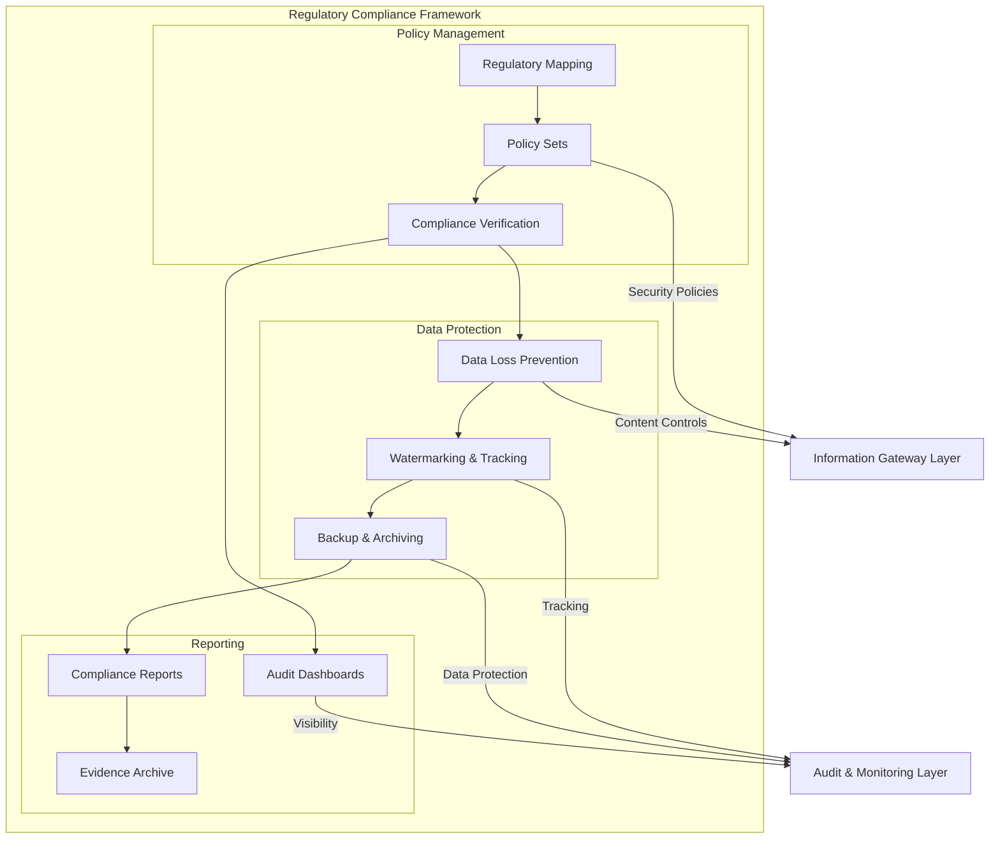
```mermaid
flowchart TB
    subgraph "Regulatory Compliance Framework"
        direction TB
        
        subgraph "Policy Management"
            RM[Regulatory Mapping]
            PS[Policy Sets]
            CV[Compliance Verification]
        end
        
        subgraph "Data Protection"
            DLP[Data Loss Prevention]
            WM[Watermarking & Tracking]
            BAR[Backup & Archiving]
        end
        
        subgraph "Reporting"
            AD[Audit Dashboards]
            CR[Compliance Reports]
            EA[Evidence Archive]
        end
        
        RM --> PS
        PS --> CV
        
        CV --> DLP
        DLP --> WM
        WM --> BAR
        
        CV --> AD
        BAR --> CR
        CR --> EA
    end
    
    PS -->|"Security Policies"| IGL[Information Gateway Layer]
    DLP -->|"Content Controls"| IGL
    WM -->|"Tracking"| AML[Audit & Monitoring Layer]
    BAR -->|"Data Protection"| AML
    AD -->|"Visibility"| AML
```

### 6.11 Distributed Identity and Access Management  <a name="distributed-identity-and-access-management"></a>
Combines decentralized identity, API security, and dynamic trust assessment.

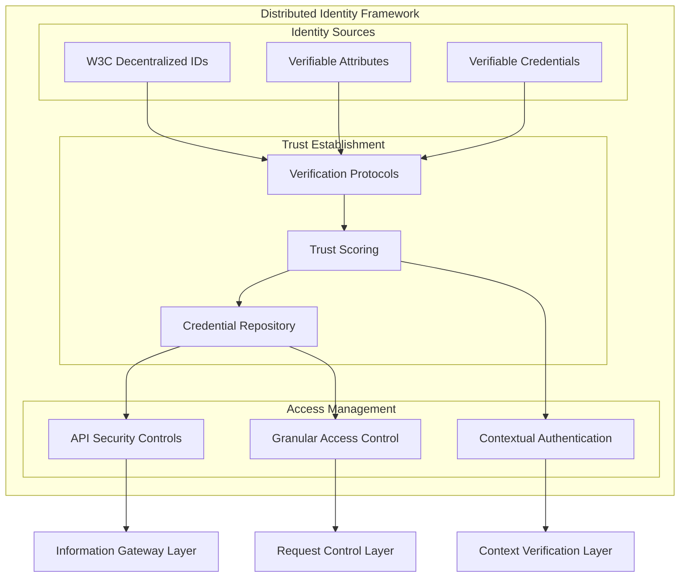
```mermaid
flowchart TB
    subgraph "Distributed Identity Framework"
        direction TB
        
        subgraph "Identity Sources"
            WDI[W3C Decentralized IDs]
            VA[Verifiable Attributes]
            VC[Verifiable Credentials]
        end
        
        subgraph "Trust Establishment"
            VP[Verification Protocols]
            TS[Trust Scoring]
            CR[Credential Repository]
        end
        
        subgraph "Access Management"
            API[API Security Controls]
            GAC[Granular Access Control]
            CAT[Contextual Authentication]
        end
        
        WDI --> VP
        VA --> VP
        VC --> VP
        
        VP --> TS
        TS --> CR
        
        CR --> API
        CR --> GAC
        TS --> CAT
    end
    
    CAT --> CVL[Context Verification Layer]
    GAC --> RCL[Request Control Layer]
    API --> IGL[Information Gateway Layer]
```

### 6.12 Quantum-Ready Security Architecture <a name="quantum-ready-security-architecture"></a>
Prepares GUARDRAIL for the post-quantum era.
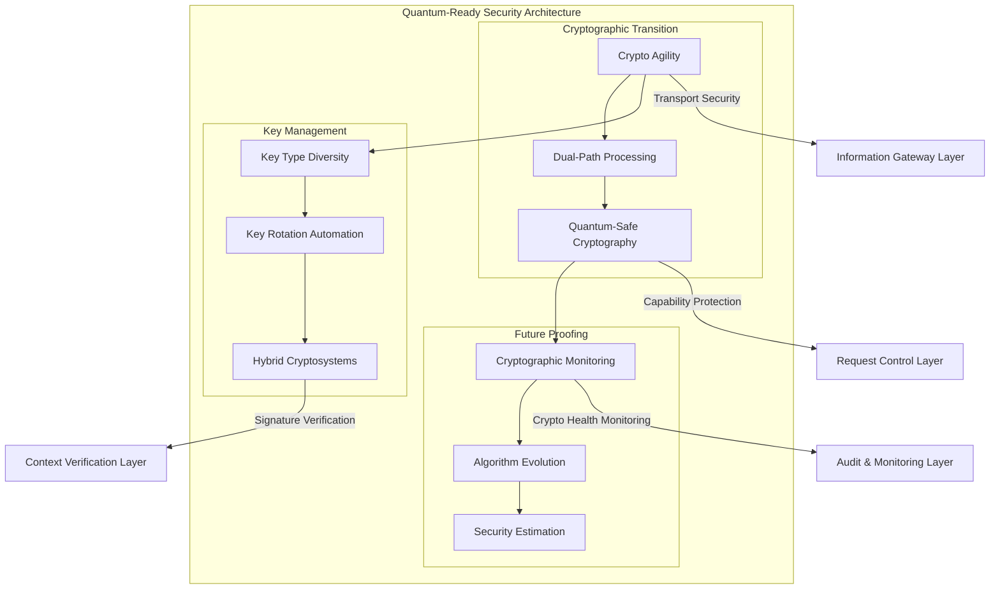
```mermaid
flowchart TB
    subgraph "Quantum-Ready Security Architecture"
        direction TB
        
        subgraph "Cryptographic Transition"
            CA[Crypto Agility]
            DP[Dual-Path Processing]
            QC[Quantum-Safe Cryptography]
        end
        
        subgraph "Key Management"
            KT[Key Type Diversity]
            KR[Key Rotation Automation]
            HC[Hybrid Cryptosystems]
        end
        
        subgraph "Future Proofing"
            CM[Cryptographic Monitoring]
            AE[Algorithm Evolution]
            SE[Security Estimation]
        end
        
        CA --> DP
        DP --> QC
        
        CA --> KT
        KT --> KR
        KR --> HC
        
        QC --> CM
        CM --> AE
        AE --> SE
    end
    
    CA -->|"Transport Security"| IGL[Information Gateway Layer]
    HC -->|"Signature Verification"| CVL[Context Verification Layer]
    QC -->|"Capability Protection"| RCL[Request Control Layer]
    CM -->|"Crypto Health Monitoring"| AML[Audit & Monitoring Layer]
```

## 7. Visualizations and Diagrams <a name="visualizations-and-diagrams"></a>

The following diagrams provide visual representations of GUARDRAIL's architecture, deployment models, and internal components:

- **Embedded Deployment Model:**
  

- **Gateway Deployment Model:**
  

- **Service Mesh Deployment Model:**
  

- **Gateway - Internal Architecture:**
  

- **Gateway - 19" Rack Appliance**
  

- **Gateway - Data Flow Architecture:**
  

- **Service Mesh - Containerized Architecture:**
  

- **Service Mesh Sidecar - Internal Architecture:**
  

- **Service Mesh - Control Plane Architecture:**
  

## 8. Detailed Documentation <a name="detailed-documentation"></a>

For a deeper understanding of GUARDRAIL, refer to the following documents:

*   [**Technical Specification (2-technical-spec.md)**](./2-technical-spec.md):  Provides a comprehensive technical description of all GUARDRAIL components, configurations, and protocols.
*   [**Architecture Diagrams (6-diags-mermaid.md)**](./6-diags-mermaid.md): Contains Mermaid diagrams illustrating various aspects of the GUARDRAIL architecture and workflows.

## 9. Emergency Response Framework <a name="emergency-response-framework"></a>

GUARDRAIL incorporates an Emergency Response Framework providing comprehensive procedures to detect, respond to, and recover from security incidents. For more information, see [Emergency Response Framework](./SHIELD-7-emergency-response-framework.md).


 
## 10. New Directions: Practical and Incremental MCP Security <a name="new-directions"></a>

While the innovations in Section 6 provide a comprehensive, long-term vision for GUARDRAIL, practical considerations for the Model Context Protocol (MCP) ecosystem necessitate a more incremental and adaptable approach to security.  This section outlines a series of practical innovations that can be implemented *independently* and *progressively*, allowing MCP deployments to enhance their security posture without the overhead of the full GUARDRAIL framework.  These innovations prioritize ease of adoption, performance, and compatibility with existing MCP implementations.  They build towards a more secure MCP ecosystem in a modular fashion, allowing developers to choose the components that best suit their current needs and resources.

### 10.1 Phased Implementation Approach

We recommend a four-phase implementation strategy:

1. **Secure Server Foundation:** Focus on building security directly into MCP server implementations with automated configuration hardening, context-aware input validation, and least-privilege execution sandboxing.

2. **Protocol-Level Security:** Enhance the MCP protocol with capability-based security tokens, federated identity with attestation, and graduated encryption options.

3. **Plugin Ecosystem:** Develop a standard plugin interface allowing developers to add security modules as needed, supported by a security plugin certification program.

4. **Enhanced GUARDRAIL:** Position a refined version of the full GUARDRAIL architecture for organizations with high-security requirements in regulated industries.

### 10.2 Practical Security Innovations

These lightweight innovations can be implemented incrementally:

- **Extensible Security Middleware (ESM):** A pluggable middleware layer with a standardized interface for security modules that can be selectively incorporated into MCP implementations.

- **Dynamic Security Context (DSC):** A shared, mutable object that tracks security states across an MCP connection, including a "trust score" that adapts based on observed behavior.

- **Protocol-Level Security Annotations:** Standard security metadata fields for MCP messages including classification labels and integrity verification without redesigning the protocol.

- **Lightweight Attestation Protocol (LAP):** A simplified challenge-response verification process for mutual validation of MCP endpoints.

- **Adaptive Resource Controls:** Dynamic resource limitations that adjust based on trust score and observed behavior.

- **Security Event Correlation and Reporting (SECR):** A standardized event system for security monitoring that enables sophisticated analysis and incident response.

These practical innovations provide immediate security benefits while allowing for incremental adoption, making them suitable for a wider range of MCP implementations than the full GUARDRAIL architecture.


### 10.3 Extensible Security Middleware (ESM) <a name="esm-new"></a>

The ESM provides a pluggable architecture *within* MCP client and server implementations, allowing for customized security processing of MCP messages.  It sits between the MCP protocol layer and the transport layer, intercepting messages for validation, transformation, and other security operations.

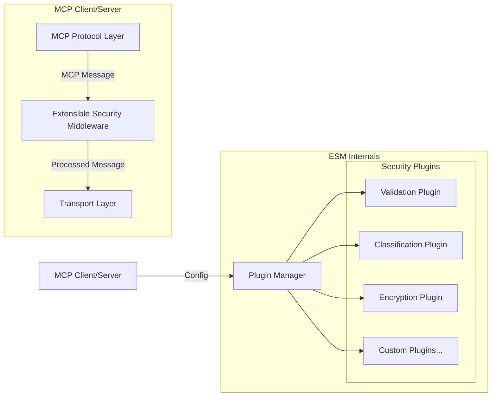
```mermaid
flowchart LR
    subgraph "MCP Client/Server"
        direction TB
        MP[MCP Protocol Layer]
        ESM[Extensible Security Middleware]
        TL[Transport Layer]

        MP -- "MCP Message" --> ESM
        ESM -- "Processed Message" --> TL
    end

    subgraph "ESM Internals"
        direction TB
        PM[Plugin Manager]
        subgraph "Security Plugins"
            SP1[Validation Plugin]
            SP2[Classification Plugin]
            SP3[Encryption Plugin]
            SP4[Custom Plugins...]
        end
        PM --> SP1
        PM --> SP2
        PM --> SP3
        PM --> SP4
    end
    MC[MCP Client/Server] -- "Config" --> PM
```

*   **Key Features:**
    *   **Pluggable Modules:**  Security functions are implemented as independent modules that conform to a standard interface (e.g., `validate`, `transform`, `preSend`, `postReceive`).
    *   **Module Chaining:** Modules can be chained together in a configurable sequence, allowing for complex security workflows.
    *   **Asynchronous Operation:**  Middleware operations are asynchronous to avoid blocking the main MCP thread.
    *   **Context-Aware:**  Modules have access to the MCP context (client/server IDs, capabilities, etc.) and the Dynamic Security Context (see below).
    *   **Policy-Driven:**  Module behavior is controlled by declarative policies (e.g., JSON-based) that can be updated dynamically.

*   **Benefits:**
    *   **Flexibility:**  Allows organizations to tailor security to their specific needs.
    *   **Extensibility:**  New security features can be added easily without modifying core MCP code.
    *   **Performance:**  Only necessary modules are loaded and executed.
    *   **Testability:**  Individual modules and chains can be thoroughly tested in isolation.

### 10.4 Dynamic Security Context (DSC) <a name="dsc-new"></a>

The DSC is a *shared, mutable* object that maintains security-relevant information about an MCP connection.  It enables *adaptive security* by dynamically adjusting access controls and security policies based on observed behavior and environmental factors.

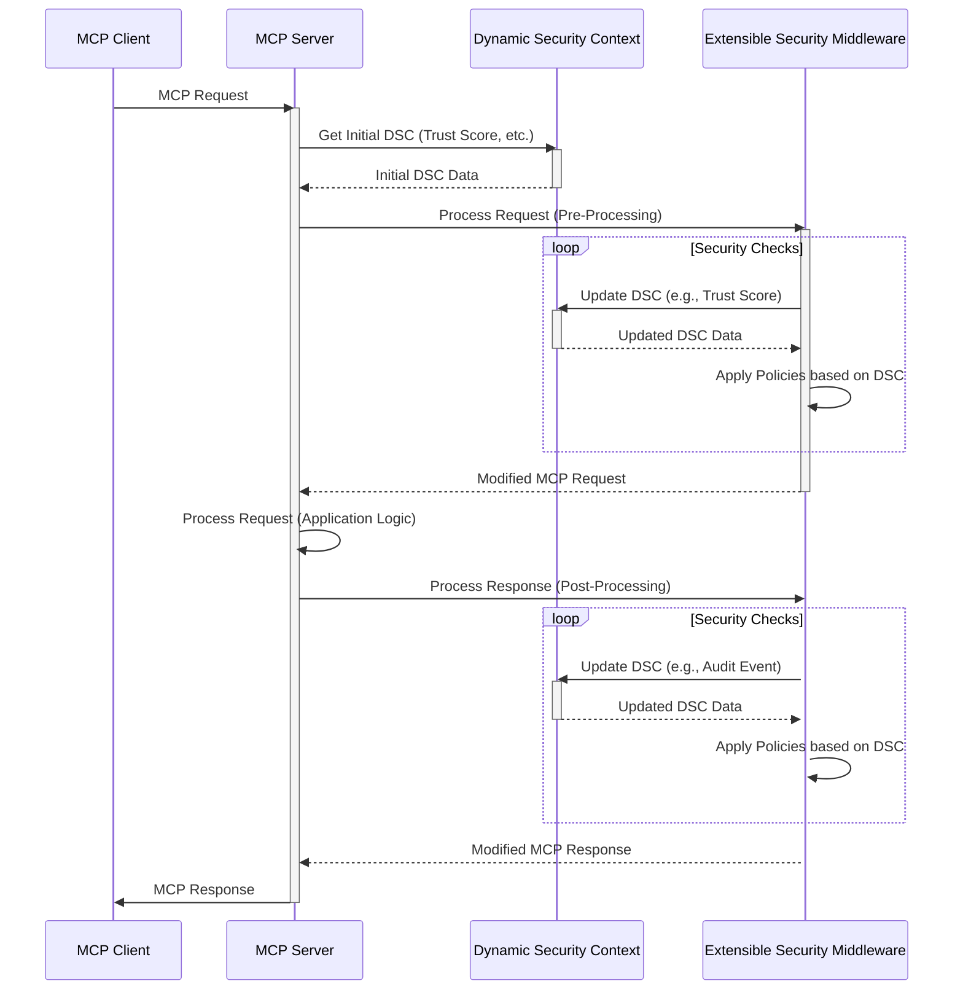
```mermaid
sequenceDiagram
    participant Client as MCP Client
    participant Server as MCP Server
    participant DSC as Dynamic Security Context
    participant ESM as Extensible Security Middleware

    Client->>Server: MCP Request
    activate Server
    Server->>DSC: Get Initial DSC (Trust Score, etc.)
    activate DSC
    DSC-->>Server: Initial DSC Data
    deactivate DSC
    Server->>ESM: Process Request (Pre-Processing)
    activate ESM

    loop Security Checks
        ESM->>DSC: Update DSC (e.g., Trust Score)
        activate DSC
        DSC-->>ESM: Updated DSC Data
        deactivate DSC
        ESM->>ESM: Apply Policies based on DSC
    end
    
    ESM-->>Server: Modified MCP Request
    deactivate ESM

    Server->>Server: Process Request (Application Logic)

    Server->>ESM: Process Response (Post-Processing)
    activate ESM
      loop Security Checks
        ESM->>DSC: Update DSC (e.g., Audit Event)
        activate DSC
        DSC-->>ESM: Updated DSC Data
        deactivate DSC
        ESM->>ESM: Apply Policies based on DSC
    end
    ESM-->>Server: Modified MCP Response

    Server->>Client: MCP Response
    deactivate Server
```

*   **Key Features:**
    *   **Trust Score:**  A numerical representation of the trustworthiness of the client/server, adjusted based on events (e.g., successful authentication increases the score, security violations decrease it).
    *   **Threat Level:** A categorical indicator of the current risk level (e.g., "low," "medium," "high," "critical").
    *   **Capability Attenuation:**  The capabilities initially granted to a client/server can be dynamically restricted based on the trust score and threat level.
    *   **Session Data:**  Securely stores session-specific information, such as encryption keys.
    *   **Event History:**  Maintains a limited history of security-relevant events for auditing and decision-making.

*   **Benefits:**
    *   **Adaptive Security:** Enables real-time adjustments to security posture.
    *   **Zero-Trust Foundation:**  Continuously verifies trust rather than assuming it.
    *   **Fine-Grained Control:** Allows for nuanced responses to security events.
    *   **Improved Resilience:**  Limits the impact of compromised components.

### 10.5 Protocol-Level Security Annotations <a name="protocol-security"></a>

This innovation introduces *optional* security metadata fields *within* the MCP message structure itself, providing standardized information for security processing.  This is *not* a replacement for transport-layer security (like TLS), but complements it.

```json
code[json]
{
  "jsonrpc": "2.0",
  "method": "someMethod",
  "params": {
    "data": "..."
  },
  "security": { // OPTIONAL security metadata
    "classification": "INTERNAL", // PUBLIC, INTERNAL, SENSITIVE, RESTRICTED
    "integrity": "sha256:...",  // Hash of the message content (excluding 'security')
    "source": "client:123",       // Identifier of the sender
    "sequence": 42,              // Monotonically increasing sequence number
    "transformations": [        // OPTIONAL array of applied transformations
        "redacted:pii"
    ]
  },
  "id": 1
}
```

*   **Key Features:**
    *   **`classification`:**  Indicates the sensitivity level of the message content.  This informs data handling policies.
    *   **`integrity`:**  A cryptographic hash or HMAC of the message content (excluding the `security` field itself), allowing recipients to verify that the message has not been tampered with.
    *   **`source`:**  Identifies the sender of the message (client or server).
    *   **`sequence`:**  A monotonically increasing sequence number (per sender) to prevent replay attacks.
    *   **`transformations` (optional):** An array of strings describing any transformations that have been applied to the message content by ESM modules (e.g., "redacted:pii," "encrypted:aes256").

*   **Benefits:**
    *   **Increased Transparency:** Makes security-relevant information explicit within the protocol.
    *   **Simplified Security Processing:** ESM modules can easily access and act upon the security annotations.
    *   **Improved Interoperability:** Provides a standard way to communicate security metadata between different MCP implementations.
    *   **Defense in Depth:** Complements transport-layer security by providing message-level protection.

### 10.6 Lightweight Attestation Protocol (LAP) <a name="lap-new"></a>

LAP provides a mechanism for MCP clients and servers to *verify each other's identity and environment integrity* before establishing a secure connection.  It's a simplified attestation protocol built on top of MCP, using custom message types.

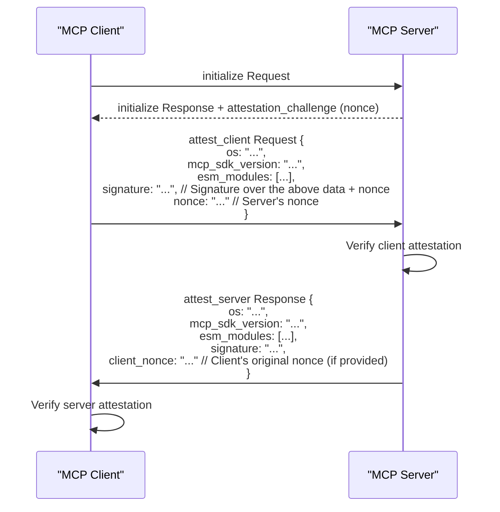
```mermaid
sequenceDiagram
    participant Client as "MCP Client"
    participant Server as "MCP Server"

    Client->>Server: initialize Request
    Server-->>Client: initialize Response + attestation_challenge (nonce)

    Client->>Server: attest_client Request {<br>    os: "...",<br>    mcp_sdk_version: "...",<br>    esm_modules: [...],<br>    signature: "...", // Signature over the above data + nonce<br>    nonce: "..." // Server's nonce<br>}
    Server->>Server: Verify client attestation

    Server->>Client: attest_server Response {<br>    os: "...",<br>    mcp_sdk_version: "...",<br>    esm_modules: [...],<br>    signature: "...",<br>    client_nonce: "..." // Client's original nonce (if provided)<br>}

    Client->>Client: Verify server attestation
```

*   **Key Features:**
    *   **Mutual Attestation:** Both the client and server verify each other's integrity.
    *   **Challenge-Response:** Uses nonces to prevent replay attacks.
    *   **Environment Information:** Exchanges information about the operating system, MCP SDK version, and loaded ESM modules.
    *   **Cryptographic Signatures:** Uses digital signatures to ensure the authenticity of the attestation data.
    *   **Periodic Re-attestation:**  Attestation can be performed periodically to detect changes in the environment.
    * **Trust Score Integration**: Integrates the attestation into the trust score

*   **Benefits:**
    *   **Enhanced Trust:**  Establishes a higher level of confidence in the communicating parties.
    *   **Reduced Attack Surface:**  Helps prevent connections to compromised or malicious clients/servers.
    *   **Improved Security Posture:**  Provides a foundation for stronger security policies.
    *   **Relatively Lightweight:** Compared to hardware-based attestation, LAP is easier to implement and deploy.

### 10.7 Adaptive Resource Quotas (ARQ) <a name="arq-new"></a>

ARQ allows MCP servers to *dynamically adjust resource quotas* (CPU, memory, network bandwidth, requests per second) for each client, based on the client's trust score (from the DSC) and the overall threat level.

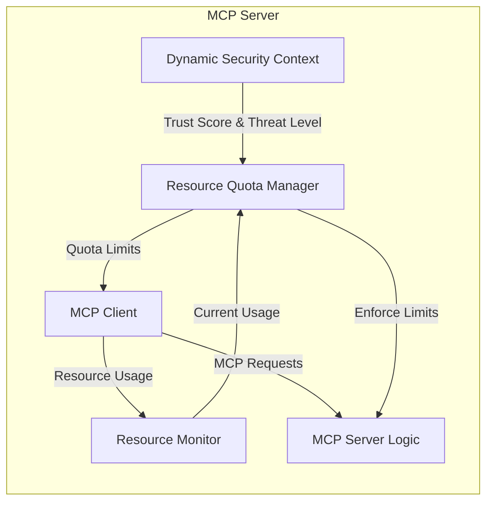
```mermaid
flowchart LR
    subgraph "MCP Server"
        DSC[Dynamic Security Context]
        RQ[Resource Quota Manager]
        RM[Resource Monitor]
        MC[MCP Client]

        DSC -- "Trust Score & Threat Level" --> RQ
        MC -- "Resource Usage" --> RM
        RM -- "Current Usage" --> RQ
        RQ -- "Quota Limits" --> MC
        MC -- "MCP Requests" --> MS[MCP Server Logic]
        RQ --"Enforce Limits"--> MS
    end
```

*   **Key Features:**
    *   **Baseline Quotas:**  Each resource has a default quota.
    *   **Dynamic Adjustment:**  Quotas are adjusted in real-time based on the DSC.
    *   **Per-Client Quotas:**  Quotas are tracked and enforced individually for each connected client.
    *   **Graduated Enforcement:**  Instead of simply blocking requests, ARQ can use techniques like throttling and rate limiting.
    *   **Feedback to Clients:**  Clients can be informed about their current quota limits and usage.

*   **Benefits:**
    *   **Resource Protection:**  Prevents denial-of-service attacks and resource exhaustion.
    *   **Adaptive Security:**  Tightens resource restrictions when threats are detected.
    *   **Fairness:**  Ensures that well-behaved clients are not impacted by malicious ones.
    *   **Improved Stability:**  Protects the overall stability of the MCP server.

### 10.8 Security Event Correlation and Reporting (SECR) <a name="secr-new"></a>

SECR builds upon MCP's notification system to create a comprehensive security event reporting and analysis framework.

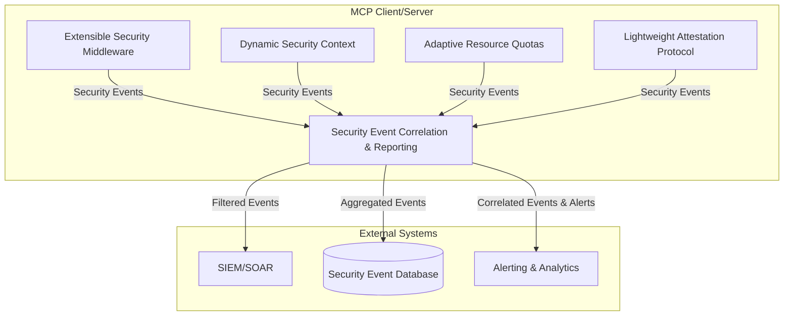
```mermaid
flowchart TB
    subgraph "MCP Client/Server"
        ESM[Extensible Security Middleware]
        DSC[Dynamic Security Context]
        ARQ[Adaptive Resource Quotas]
        LAP[Lightweight Attestation Protocol]

        ESM -- "Security Events" --> SECR[Security Event Correlation & Reporting]
        DSC -- "Security Events" --> SECR
        ARQ -- "Security Events" --> SECR
        LAP -- "Security Events" --> SECR
    end

    subgraph "External Systems"
        SIEM[SIEM/SOAR]
        DB[(Security Event Database)]
        AA[Alerting & Analytics]
    end

        SECR -- "Filtered Events" --> SIEM
    SECR -- "Aggregated Events" --> DB
    SECR -- "Correlated Events & Alerts" --> AA
```

*   **Key Features:**
    *   **Standardized Event Formats:** Defines a common schema for security events generated by different components (ESM modules, DSC, ARQ, LAP).  Examples: `event.security.authentication.failed`, `event.security.flow_control.blocked`, `event.security.resource_quota.exceeded`.
    *   **Event Filtering and Routing:**  Allows clients and servers to subscribe to specific event types and severities.
    *   **Event Correlation:**  Identifies patterns of suspicious activity by correlating events from multiple sources.
    *   **External Integration:**  Exports security events to external SIEM (Security Information and Event Management) and SOAR (Security Orchestration, Automation, and Response) systems.
    *   **Auditing and Reporting:**  Provides a centralized view of security events for auditing and compliance purposes.

*   **Benefits:**
    *   **Improved Visibility:**  Provides a comprehensive view of the security posture of the MCP ecosystem.
    *   **Faster Incident Response:**  Enables quicker detection and response to security threats.
    *   **Proactive Threat Hunting:**  Facilitates the identification of subtle attack patterns.
    *   **Compliance Reporting:**  Simplifies the process of generating audit trails and compliance reports.

**10.9 Integration Diagram**
An overall integration diagram for all these new directions.

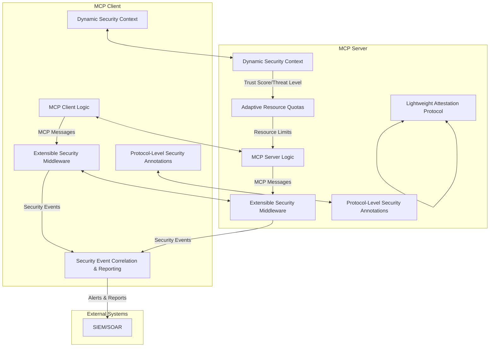
```mermaid
flowchart TB
    subgraph "MCP Client"
        MC[MCP Client Logic]
        ESM1[Extensible Security Middleware]
        DSC1[Dynamic Security Context]
        PSA1[Protocol-Level Security Annotations]

        MC -- "MCP Messages" --> ESM1
        ESM1 -- "Security Events" --> SECR[Security Event Correlation & Reporting]
    end

     subgraph "MCP Server"
        MS[MCP Server Logic]
        ESM2[Extensible Security Middleware]
        DSC2[Dynamic Security Context]
        PSA2[Protocol-Level Security Annotations]
        ARQ[Adaptive Resource Quotas]
        LAP[Lightweight Attestation Protocol]

        MS -- "MCP Messages" --> ESM2
        ESM2 -- "Security Events" --> SECR
        DSC2 -- "Trust Score/Threat Level" --> ARQ
        ARQ -- "Resource Limits" --> MS
     end
  
  MC <--> MS
  ESM1 <--> ESM2
  DSC1 <--> DSC2
  PSA1 <--> PSA2
  LAP <--> LAP
  
    subgraph "External Systems"
        SIEM[SIEM/SOAR]
    end

    SECR -- "Alerts & Reports" --> SIEM
```


## 99. License <a name="license"></a>

This project is licensed under the [MIT License](./LICENSE).
