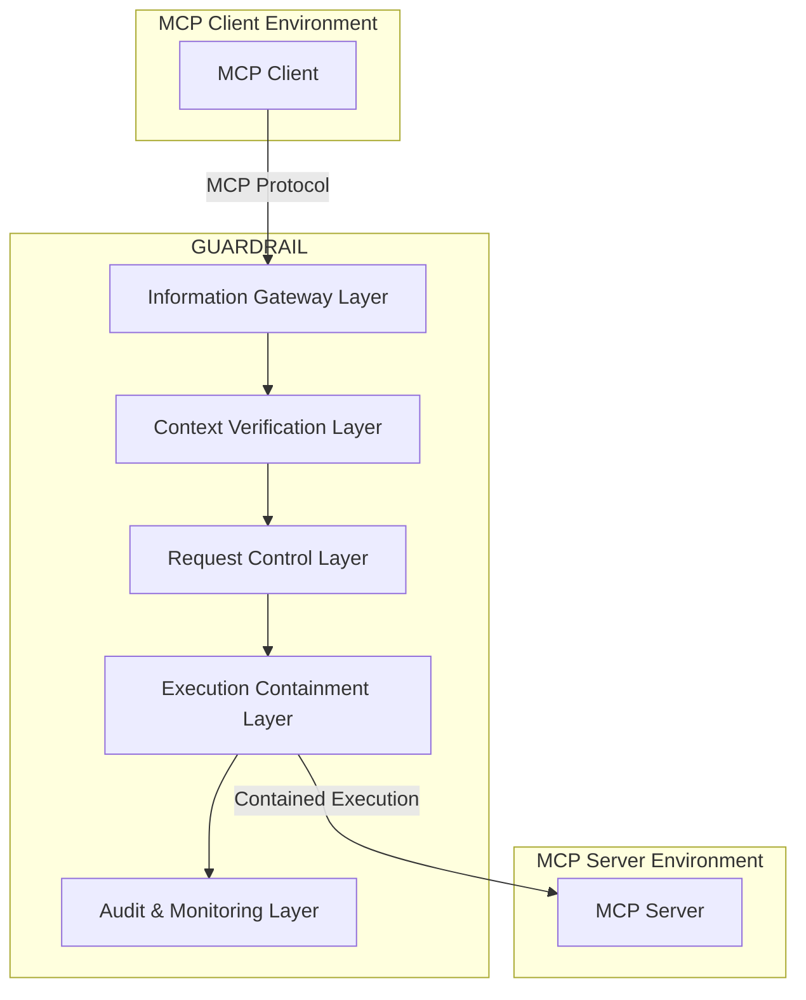
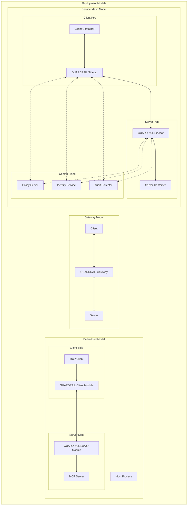
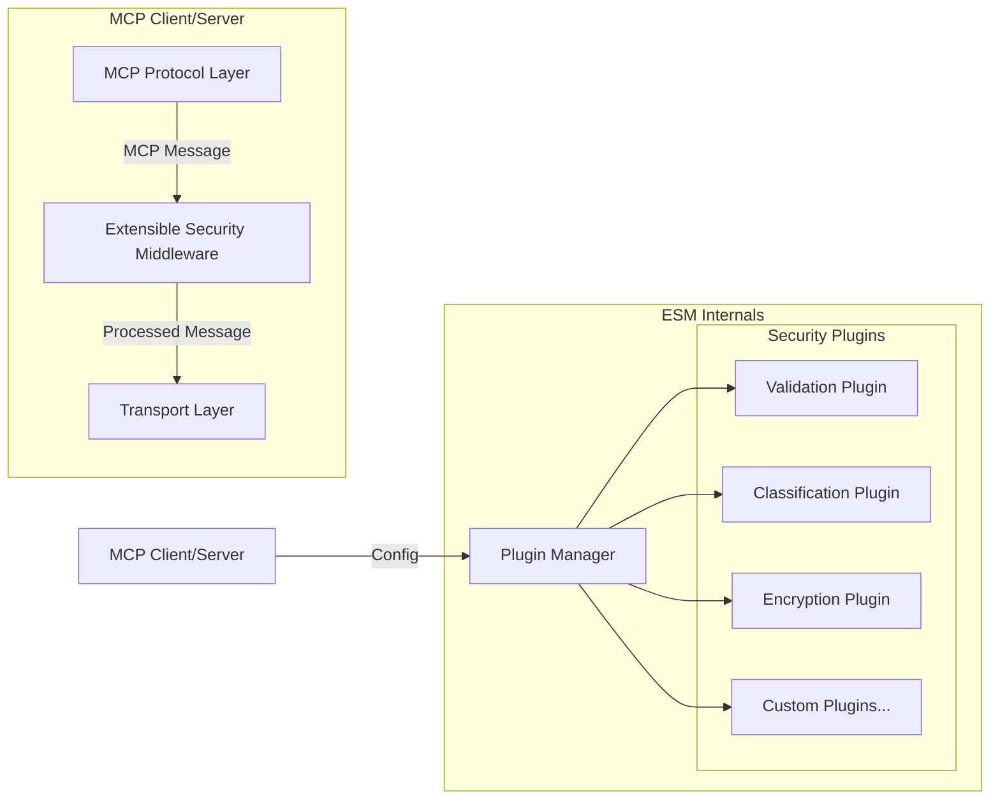
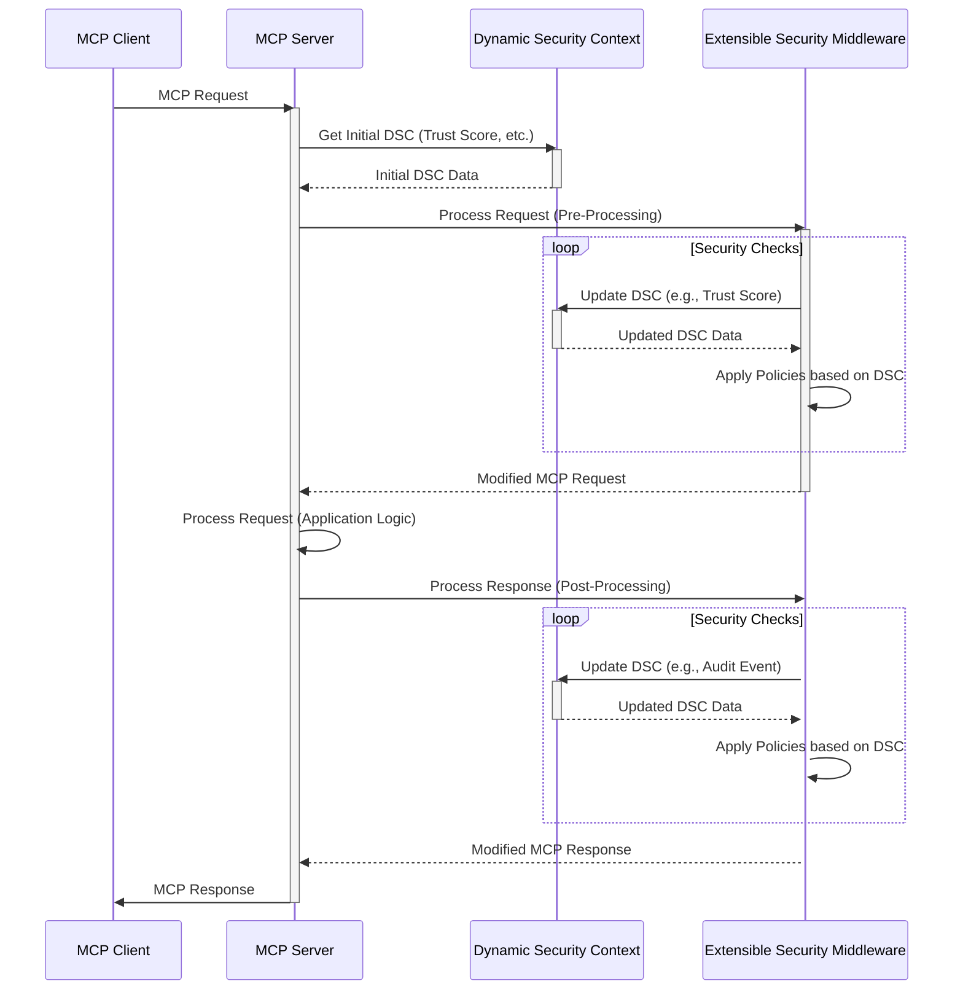
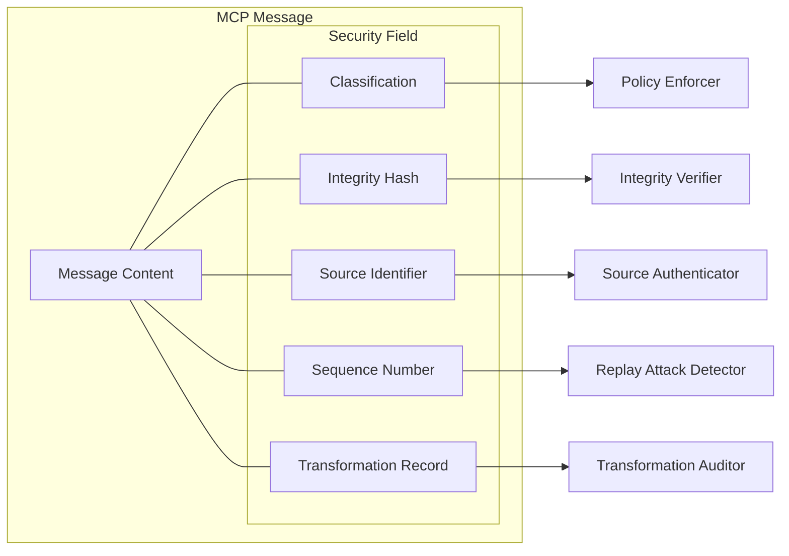
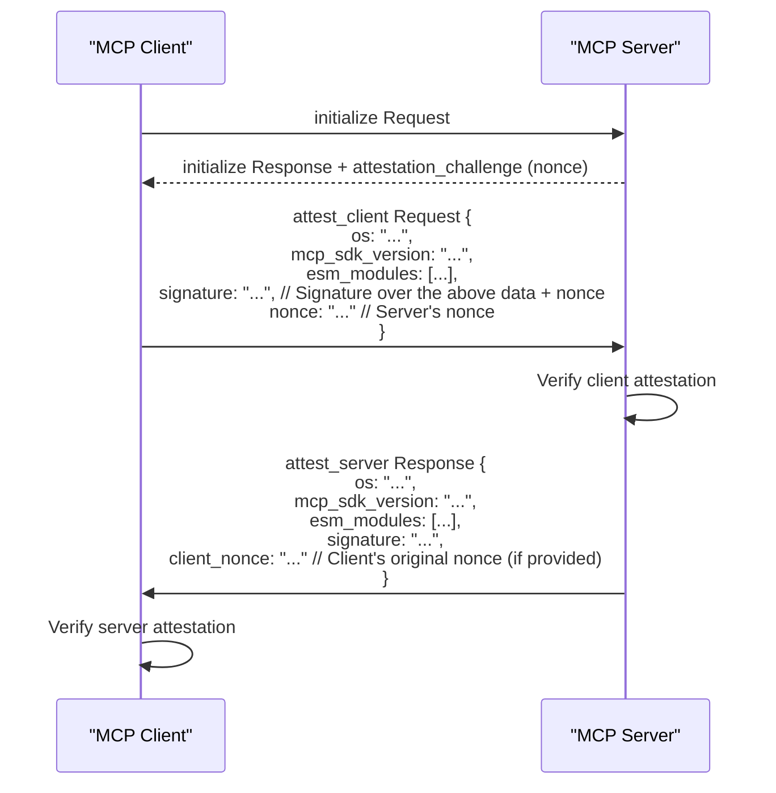
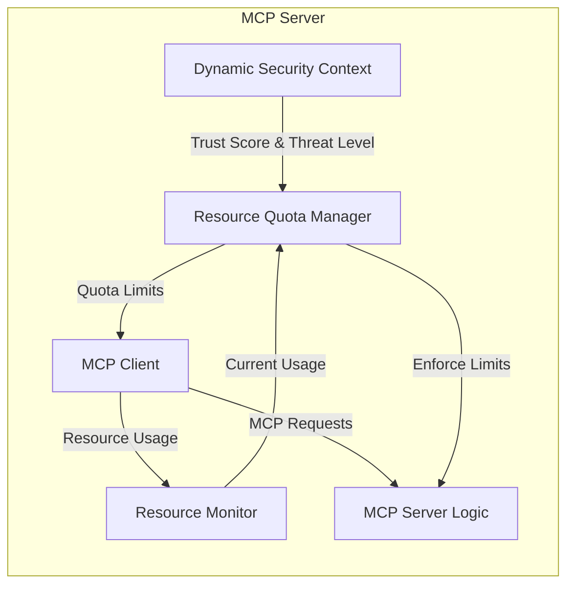
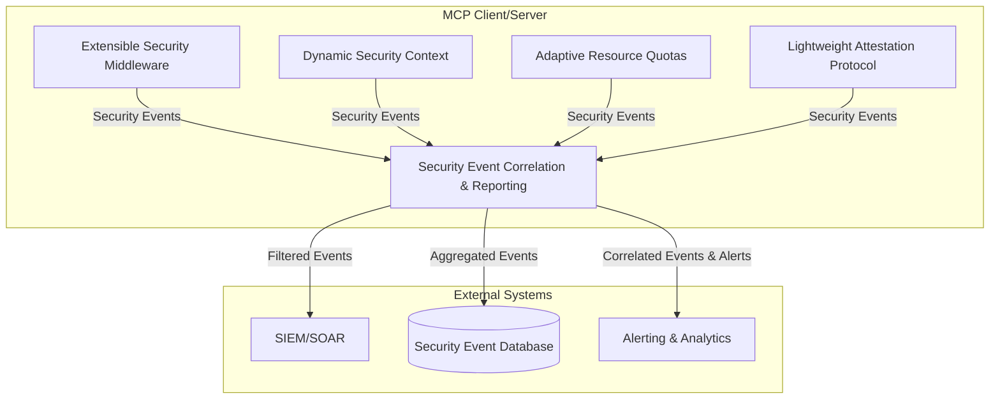

# GUARDRAIL: Security Framework for Large Language Model Applications

## Executive Summary

GUARDRAIL is a comprehensive security framework designed to protect Large Language Model (LLM) application ecosystems, particularly those built using the Model Context Protocol (MCP). It addresses critical security vulnerabilities inherent in LLM applications, focusing on preventing data exfiltration, data infiltration, unauthorized access, and resource abuse. GUARDRAIL provides a modular, layered, and extensible architecture, offering robust protection without sacrificing performance or usability. It prioritizes *practical, incremental adoption*, allowing developers to enhance security progressively.

## Project Status

GUARDRAIL is currently in active development. This repository contains the architectural design, technical specifications, and implementation documentation. Production-ready code components and reference implementations will be released incrementally. This README serves as the central hub for understanding the project.

## Table of Contents

- [GUARDRAIL: Security Framework for Large Language Model Applications](#guardrail-security-framework-for-large-language-model-applications)
  - [Executive Summary](#executive-summary)
  - [Project Status](#project-status)
  - [Table of Contents](#table-of-contents)
  - [1. Introduction ](#1-introduction-)
  - [2. Core Principles ](#2-core-principles-)
  - [3. Architecture Overview ](#3-architecture-overview-)
    - [3.1 Security Layers ](#31-security-layers-)
    - [3.2 Deployment Models ](#32-deployment-models-)
  - [4. Key Benefits ](#4-key-benefits-)
  - [5. Integration with MCP ](#5-integration-with-mcp-)
  - [6. Practical Security Innovations ](#6-practical-security-innovations-)
    - [6.1 Extensible Security Middleware (ESM) ](#61-extensible-security-middleware-esm-)
    - [6.2 Dynamic Security Context (DSC) ](#62-dynamic-security-context-dsc-)
    - [6.3 Protocol-Level Security Annotations ](#63-protocol-level-security-annotations-)
    - [6.4 Lightweight Attestation Protocol (LAP) ](#64-lightweight-attestation-protocol-lap-)
    - [6.5 Adaptive Resource Quotas (ARQ) ](#65-adaptive-resource-quotas-arq-)
    - [6.6 Security Event Correlation and Reporting (SECR) ](#66-security-event-correlation-and-reporting-secr-)
  - [7. Visualizations and Diagrams ](#7-visualizations-and-diagrams-)
  - [8. Detailed Documentation ](#8-detailed-documentation-)
  - [9. Emergency Response Framework ](#9-emergency-response-framework-)
  - [10. License ](#10-license-)

## 1. Introduction <a name="introduction"></a>

Large Language Models (LLMs) are rapidly transforming various industries, but their power and complexity introduce significant security risks. The Model Context Protocol (MCP) aims to standardize communication between LLM applications and services. GUARDRAIL addresses the inherent security challenges by providing a comprehensive and *incrementally adoptable* security framework specifically tailored for MCP and other LLM application ecosystems.  It is designed to be practical and easy to integrate, starting with simple enhancements and progressing to more advanced security measures.

## 2. Core Principles <a name="core-principles"></a>

GUARDRAIL is built on the following core principles:

1.  **Information Flow Control:** Strict policies govern the movement of information, preventing unauthorized data exfiltration and infiltration. This includes data classification and fine-grained control over data access.
2.  **Contextual Security:** Security decisions are made based on the *dynamic* execution context, including continuous trust assessment.
3.  **Transport-Agnostic Protection:** Security guarantees are provided *regardless* of the underlying transport mechanism.
4.  **Least-Privilege Execution:** All components operate with the *minimum* necessary permissions, granted just-in-time and revoked when no longer needed.
5. **Zero Trust:** No component or user is inherently trusted. Continuous verification is required.

## 3. Architecture Overview <a name="architecture-overview"></a>

### 3.1 Security Layers <a name="security-layers"></a>

GUARDRAIL implements a multi-layered architecture, with each layer providing distinct security controls.  These layers can be implemented *incrementally*, starting with the most critical.



*   **Information Gateway Layer (IGL):**  Manages information flows, content classification, flow policy enforcement, and transport security. *This is a primary focus for initial implementations.*
*   **Context Verification Layer (CVL):** Establishes trust through attestation and client/server verification. *Can be added after the IGL is established.*
*   **Request Control Layer (RCL):** Implements fine-grained access control, request filtering, and action limiting. *Adds another layer of defense on top of context verification.*
*   **Execution Containment Layer (ECL):** Ensures code execution within secure, isolated boundaries (e.g., using containers or sandboxes). *This is for more advanced deployments with higher security needs.*
*   **Audit and Monitoring Layer (AML):** Provides visibility into system operations and security events.  *Essential for monitoring and incident response.*

### 3.2 Deployment Models <a name="deployment-models"></a>

GUARDRAIL can be deployed in several configurations:

1.  **Embedded Model:** GUARDRAIL components are integrated directly into the host process (both client and server). This is suitable for standalone applications or development/testing environments.

2.  **Gateway Model:** GUARDRAIL operates as a standalone security gateway, mediating *all* MCP traffic. This is ideal for enterprise deployments with strict security requirements.

3.  **Service Mesh Model:** GUARDRAIL components are deployed as sidecars within a Kubernetes environment (or similar). This is best suited for cloud-native and microservices architectures.



## 4. Key Benefits <a name="key-benefits"></a>

GUARDRAIL provides:

1.  **Comprehensive Information Flow Control:** Prevents unauthorized data exfiltration and infiltration.
2.  **Contextual Security:** Security adapts to the execution environment.
3.  **Compatibility:** Works with existing MCP implementations.
4.  **Attack Prevention:** Protects against common LLM-specific vulnerabilities (e.g., prompt injection, resource abuse).
5.  **Auditability:** Provides visibility into information flows for investigations and compliance.
6.  **Incremental Adoption:** Allows organizations to start with basic security and add more layers as needed.

## 5. Integration with MCP <a name="integration-with-mcp"></a>

GUARDRAIL is designed for seamless integration with MCP. It provides wrapper classes for MCP Clients and Servers and can also hook in at a lower level, using the ESM.

```typescript
// Client Integration Example
import { Client } from "@modelcontextprotocol/sdk/client";
import { GuardrailClient } from "@guardrail/sdk/client";

// Initialize standard MCP client
const mcpClient = new Client({
  name: "example-client",
  version: "1.0.0"
});

// Wrap with Guardrail protection (Basic)
const client = new GuardrailClient(mcpClient, {
  security: {
    classification_level: "INTERNAL", // Start with basic classification
    // Add more options later as needed.
  }
});

// Normal MCP operations now protected by Guardrail
await client.connect(transport);
```

## 6. Practical Security Innovations <a name="practical-security-innovations"></a>

GUARDRAIL incorporates key innovations designed for *practical implementation and incremental adoption*. These are the building blocks of a secure MCP ecosystem.

### 6.1 Extensible Security Middleware (ESM) <a name="extensible-security-middleware-esm"></a>

The ESM provides a pluggable architecture *within* MCP client and server implementations, allowing for customized security processing of MCP messages. It sits between the MCP protocol layer and the transport layer.



*   **Key Features:**
    *   **Pluggable Modules:** Security functions are implemented as modules (e.g., `validate`, `transform`, `preSend`, `postReceive`).
    *   **Module Chaining:** Modules can be chained in a configurable sequence.
    *   **Asynchronous Operation:** Avoids blocking the main MCP thread.
    *   **Context-Aware:** Modules access the MCP context and the Dynamic Security Context (DSC).
    *   **Policy-Driven:** Module behavior is controlled by declarative policies.

*   **Benefits:** Flexibility, extensibility, performance, and testability.

### 6.2 Dynamic Security Context (DSC) <a name="dynamic-security-context-dsc"></a>

The DSC is a *shared, mutable* object that maintains security-relevant information about an MCP connection. It enables *adaptive security* based on observed behavior.



*   **Key Features:**
    *   **Trust Score:** A numerical representation of trustworthiness, adjusted by events.
    *   **Threat Level:** A categorical indicator of risk (e.g., "low," "medium," "high").
    *   **Capability Attenuation:** Capabilities can be dynamically restricted.
    *   **Session Data:** Securely stores session-specific information.
    *   **Event History:** Maintains a history of security-relevant events.

* **Benefits:** Adaptive security, zero-trust foundation, fine-grained control, improved resilience.

### 6.3 Protocol-Level Security Annotations <a name="protocol-security"></a>

This introduces *optional* security metadata fields *within* the MCP message structure itself.

```json
{
  "jsonrpc": "2.0",
  "method": "someMethod",
  "params": {
    "data": "..."
  },
  "security": { // OPTIONAL security metadata
    "classification": "INTERNAL", // e.g., PUBLIC, INTERNAL, SENSITIVE
    "integrity": "sha256:...",  // Hash of message content
    "source": "client:123",       // Identifier of sender
    "sequence": 42,              // Sequence number
    "transformations": [        // OPTIONAL array of transformations
        "redacted:pii"
    ]
  },
  "id": 1
}
```


*   **Key Features:**
    *   `classification`: Sensitivity level of the message content.
    *   `integrity`: Cryptographic hash to verify message integrity.
    *   `source`: Identifies the sender.
    *   `sequence`: Prevents replay attacks.
    *   `transformations` (optional): Describes transformations applied to the message.

*   **Benefits:** Increased transparency, simplified security processing, improved interoperability, and defense in depth.

### 6.4 Lightweight Attestation Protocol (LAP) <a name="lap-new"></a>

LAP provides a mechanism for MCP clients and servers to *verify each other's identity and environment integrity*. It's built on top of MCP, using custom message types.



*   **Key Features:**
    *   **Mutual Attestation:** Both client and server verify each other.
    *   **Challenge-Response:** Uses nonces to prevent replay attacks.
    *   **Environment Information:** Exchanges OS, SDK version, and loaded ESM modules.
    *   **Cryptographic Signatures:** Ensures authenticity of attestation data.
    *   **Periodic Re-attestation:**  Can be performed periodically.
    *   **Trust Score Integration:**  Results affect the DSC trust score.

*   **Benefits:** Enhanced trust, reduced attack surface, and improved security posture.

### 6.5 Adaptive Resource Quotas (ARQ) <a name="arq-new"></a>

ARQ allows MCP servers to *dynamically adjust resource quotas* (CPU, memory, network, requests/second) for each client, based on the DSC.



*   **Key Features:**
    *   **Baseline Quotas:** Default quotas for each resource.
    *   **Dynamic Adjustment:** Quotas adjusted in real-time based on the DSC.
    *   **Per-Client Quotas:** Tracked individually for each client.
    *   **Graduated Enforcement:** Throttling and rate limiting.
    *   **Feedback to Clients:** Clients informed about their quotas.

*   **Benefits:** Resource protection, adaptive security, fairness, and improved stability.

### 6.6 Security Event Correlation and Reporting (SECR) <a name="secr-new"></a>

SECR builds upon MCP's notification system to create a comprehensive security event reporting and analysis framework.



*   **Key Features:**
    *   **Standardized Event Formats:** Common schema for security events (e.g., `event.security.authentication.failed`).
    *   **Event Filtering and Routing:** Subscribe to specific event types.
    *   **Event Correlation:** Identifies patterns of suspicious activity.
    *   **External Integration:** Exports events to SIEM/SOAR systems.
    *   **Auditing and Reporting:** Centralized view of security events.

*   **Benefits:** Improved visibility, faster incident response, proactive threat hunting, and compliance reporting.

## 7. Visualizations and Diagrams <a name="visualizations-and-diagrams"></a>

The following diagrams provide visual representations of GUARDRAIL's architecture, deployment models, and internal components:

- **Embedded Deployment Model:**
  

- **Gateway Deployment Model:**
  

- **Service Mesh Deployment Model:**
  

- **Gateway - Internal Architecture:**
  

- **Gateway - 19" Rack Appliance**
  

- **Gateway - Data Flow Architecture:**
  

- **Service Mesh - Containerized Architecture:**
  

- **Service Mesh Sidecar - Internal Architecture:**
  

- **Service Mesh - Control Plane Architecture:**
  

## 8. Detailed Documentation <a name="detailed-documentation"></a>

While this README serves as the primary, definitive source for understanding the GUARDRAIL framework, several supplementary documents exist that capture various stages of brainstorming, design iterations, and more detailed technical explorations. These documents should be considered *supporting material* and may contain ideas that are still under development, have been superseded, or represent alternative approaches. However, they can be valuable for understanding the evolution of the design and for exploring specific aspects in greater depth.

**Important Note:** The documents referenced below represent different points in the GUARDRAIL design process. This README reflects the *current, prioritized, and more practical approach*. If discrepancies exist between the README and these supplementary documents, the README should be considered the authoritative source.

Here's a guide to the supplementary documents:

*   [**Technical Specification (2-technical-spec.md)**](./2-technical-spec.md): This document is the most comprehensive technical deep-dive, representing an *early, expansive vision* of GUARDRAIL. It includes detailed specifications for all layers, components, configurations, and algorithms. While the core principles remain valid, the implementation details and overall architecture have been streamlined in this README (especially in Section 6). Use this for:
    *   **Detailed Component Requirements:** Granular specifications for each layer.
    *   **Configuration Schemas:** JSON schemas for all configurable aspects.
    *   **Algorithm Descriptions:** In-depth explanations of core algorithms.
    *   **Threat Model:** A detailed threat model and countermeasures.
    *   **Conformance Levels:** Definitions of different conformance levels.

*   [**Architecture Diagrams (6-diags-mermaid.md)**](./6-diags-mermaid.md): A collection of Mermaid diagrams visualizing various aspects of GUARDRAIL, including some earlier, more complex design ideas. Use this for:
    *   **Alternative Workflow Diagrams:** Different perspectives on core workflows.
    *   **Detailed Component Interactions:** Granular views of internal component relationships.
    *   **Deployment Model Variations:** More detailed diagrams of deployment options.
    *   **Emergency Response Flows:** Visualizations of emergency response procedures.
    *   **Exploration of Earlier Concepts:** Diagrams of earlier design iterations.

*   [**Initial GUARDRAIL Proposal (1-GUARDRAIL-mcp-security-claude.md)**](./1-GUARDRAIL-mcp-security-claude.md): This document represents an *initial proposal* for the GUARDRAIL framework, generated by Claude. It provides a good overview of the initial problem statement and proposed solution, but it predates the refinements and practical considerations outlined in this README.  It's useful for understanding the *original motivation and conceptual basis* for GUARDRAIL.

*    **[Emergency Response Framework](./SHIELD-7-emergency-response-framework.md)**. This doc details the emergency response plan, a key compoennt of the overall security strategy. Note that this doc still uses the SHIELD naming convention, which is a historical artifact.

*   **Synthesis and Innovation Documents (various `*-synthesis-*.md` files):** These documents (e.g., `7-synthesis-gemini.md`, `9-new-innovations-diags-claude.md`, `10-new-innovations-claude.md`) represent *intermediate brainstorming and synthesis steps*. They explore various new innovations and enhancements to GUARDRAIL, combining ideas from different sources and iterating on the design. These are useful for understanding the *thought process* behind the "Practical Security Innovations" presented in Section 6 of this README.  However, the final, refined versions of these innovations are described in *this* README.

*   **Critical Analysis Documents (15-CRITICAL-ANALYSIS-claude-and-gemini.md):** This document provides a *critical review* of the GUARDRAIL framework and explores alternative approaches to securing MCP. It highlights the strengths and weaknesses of GUARDRAIL and discusses the trade-offs of different design choices. This is valuable for understanding the *rationale* behind the move towards a more practical, incremental approach.

*   **Diagram Source Files (various `SVG-*.svg.txt` files):** These files contain the source code (in SVG format) for the diagrams included in this README and in `6-diags-mermaid.md`. They are primarily useful for developers who want to modify or extend the diagrams.

*   **Mermaid Diagram Source Files (various `SHIELD-*.md` files):** These files represent the *original* SHIELD-related Mermaid diagram source, from a prior, related project. These predate the extracted and refactored diagrams in `6-diags-mermaid.md` and `README.md`, and should generally be considered historical artifacts.

This collection of documents provides a comprehensive view of the GUARDRAIL project, from its initial conception to its current, refined state.  By understanding the evolution of the design and the rationale behind different choices, developers and stakeholders can gain a deeper appreciation for the framework and its capabilities. Remember to always prioritize the information in this README as the definitive source.


## 9. Emergency Response Framework <a name="emergency-response-framework"></a>

GUARDRAIL incorporates an Emergency Response Framework providing comprehensive procedures to detect, respond to, and recover from security incidents.  See [Emergency Response Framework](./SHIELD-7-emergency-response-framework.md) for details.

## 10. License <a name="license"></a>
This project is licensed under the MIT License. See [LICENSE](./LICENSE) for details.
